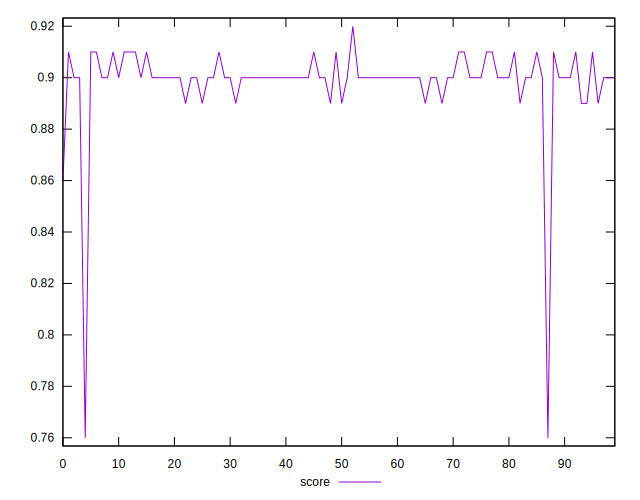

# //mainthread-work-breakdown/samples/music

[→ Parent](../..)


## Raw


```yaml
p90min: 1942.1560000000025
p90max: 2094.8640000000028
p90range: 152.7080000000003
p90mean: 2011.4683829787255
median: 2010.1160000000032
p90stdev: 31.329253300453395
mad: 22.04399999999987
stdevBySn: 34.40412479999954
lfitCenter: 2017.9805237687722
lfitStdev: 35.35548188322165
mfitCenter: 2017.9805237687722
mfitStdev: 44.31152532043188
mfitConfidence: 4.431152532043188
p90skewness: 0.15973101788464167
p90eccentricity: 0.9999999999999992
p90discretization: 1
outlandishness: 1.0144109455604606

```


## Score


```yaml
p90min: 0.89
p90max: 0.91
p90range: 0.020000000000000018
p90mean: 0.9007446808510637
median: 0.9
p90stdev: 0.0055042269447985286
mad: 0
stdevBySn: 0
lfitCenter: 0.8991953831937315
lfitStdev: 0.0052427482878042095
mfitCenter: 0.8991953831937315
mfitStdev: 0.006570810554103477
mfitConfidence: 0.0006570810554103478
p90skewness: 0.038207381844124075
p90eccentricity: 0.9999999999999992
p90discretization: 31.333333333333332
outlandishness: 0.9936936871092463

```


## Raw Estimate


## Score Estimate


## P Score


```yaml
p90min: 0.8869860698179417
p90max: 0.9118645731112125
p90range: 0.024878503293270793
p90mean: 0.9008434400296628
median: 0.9011183402054637
p90stdev: 0.005090340969390483
mad: 0.003572459410317752
stdevBySn: 0.0055622085740935
lfitCenter: 0.8995757051643499
lfitStdev: 0.006121239113826528
mfitCenter: 0.8995757051643499
mfitStdev: 0.0076718355269671185
mfitConfidence: 0.0007671835526967118
p90skewness: -0.22400823431333955
p90eccentricity: 1.0000000000000002
p90discretization: 1
outlandishness: 0.9937199136037753

```


## Score Difference


```yaml
p90min: 0
p90max: 0
p90range: 0
p90mean: 0
median: 0
p90stdev: 0
mad: 0
stdevBySn: 0
lfitCenter: 0
lfitStdev: 0
mfitCenter: 0
mfitStdev: 0
mfitConfidence: 0
p90skewness: .nan
p90eccentricity: .nan
p90discretization: 94
outlandishness: .nan

```


## P Score Difference


```yaml
p90min: -0.004757386084572768
p90max: 0.004762941716833002
p90range: 0.00952032780140577
p90mean: 0.00011714762896072105
median: 0.00021642461094140142
p90stdev: 0.0026789973188227935
mad: 0.0021852390856285653
stdevBySn: 0.003183579393814719
lfitCenter: 0.0001408616908025829
lfitStdev: 0.0023337548300663533
mfitCenter: 0.0001408616908025829
mfitStdev: 0.0029249279244936803
mfitConfidence: 0.00029249279244936805
p90skewness: -0.06209097330807251
p90eccentricity: 1
p90discretization: 1
outlandishness: 0.886472403324785

```

