# //max-potential-fid/samples/agenda

[→ Parent](../..)


## Raw


```yaml
p90min: 16
p90max: 16
p90range: 0
p90mean: 16
median: 16
p90stdev: 0
mad: 0
stdevBySn: 0
lfitCenter: 16.2356532586623
lfitStdev: 0.5851242254710317
mfitCenter: 16.2356532586623
mfitStdev: 0.7333444646065488
mfitConfidence: 0.07333444646065487
p90skewness: .nan
p90eccentricity: .nan
p90discretization: 94
outlandishness: 1.0634765625

```

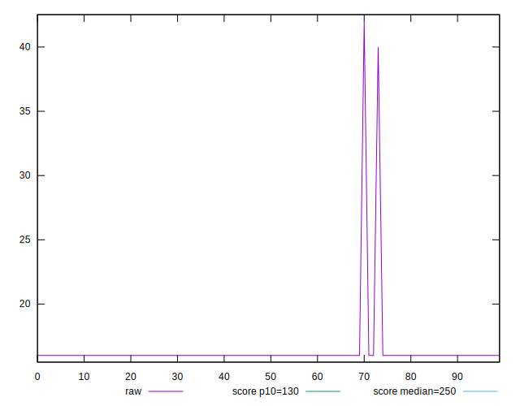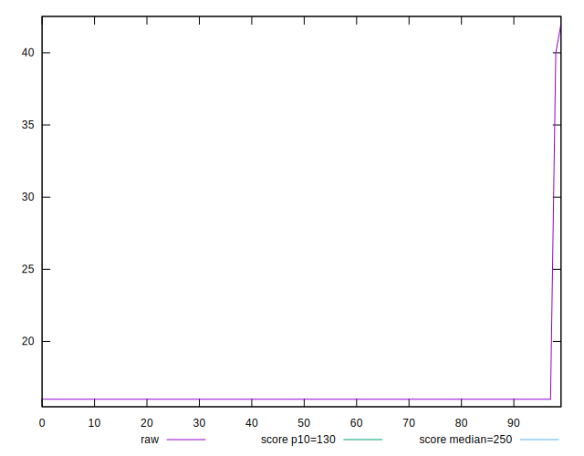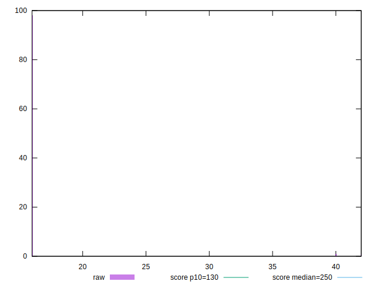
## Score


```yaml
p90min: 1
p90max: 1
p90range: 0
p90mean: 1
median: 1
p90stdev: 0
mad: 0
stdevBySn: 0
lfitCenter: 1
lfitStdev: 0
mfitCenter: 1
mfitStdev: 0
mfitConfidence: 0
p90skewness: .nan
p90eccentricity: .nan
p90discretization: 94
outlandishness: 1

```


## Raw Estimate

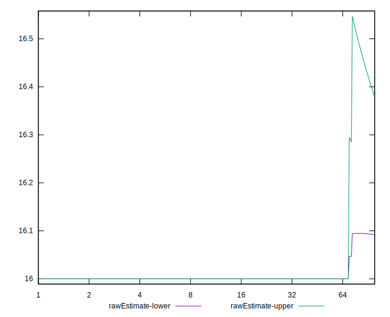
## Score Estimate

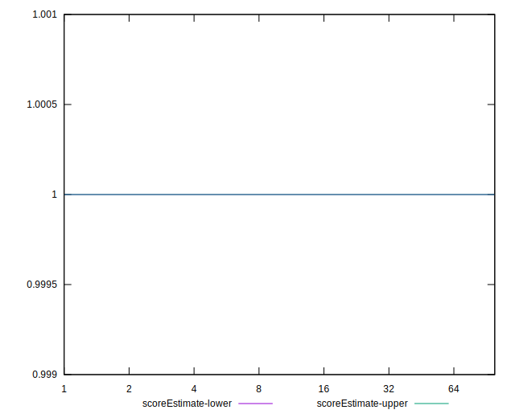
## P Score


```yaml
p90min: 0.9999999641342965
p90max: 0.9999999641342965
p90range: 0
p90mean: 0.9999999641342945
median: 0.9999999641342965
p90stdev: 1.9984014443252818e-15
mad: 0
stdevBySn: 0
lfitCenter: 0.9999980789868078
lfitStdev: 0.0000046807986891997735
mfitCenter: 0.9999980789868078
mfitStdev: 0.000005866511177005071
mfitConfidence: 5.866511177005071e-7
p90skewness: 1
p90eccentricity: 1
p90discretization: 94
outlandishness: 0.9999919856695115

```

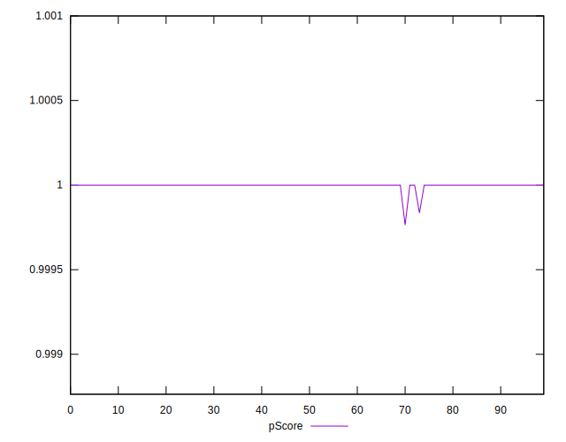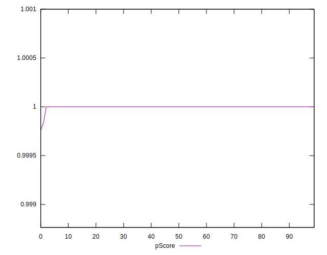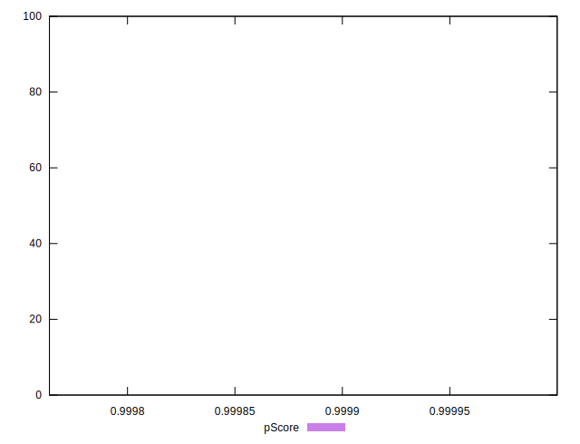
## Score Difference


```yaml
p90min: 0
p90max: 0
p90range: 0
p90mean: 0
median: 0
p90stdev: 0
mad: 0
stdevBySn: 0
lfitCenter: 0
lfitStdev: 0
mfitCenter: 0
mfitStdev: 0
mfitConfidence: 0
p90skewness: .nan
p90eccentricity: .nan
p90discretization: 94
outlandishness: .nan

```


## P Score Difference


```yaml
p90min: -3.5865703518211944e-8
p90max: -3.5865703518211944e-8
p90range: 0
p90mean: -3.5865703518211944e-8
median: -3.5865703518211944e-8
p90stdev: 0
mad: 0
stdevBySn: 0
lfitCenter: -0.000001921013192344876
lfitStdev: 0.000004680798689395871
mfitCenter: -0.000001921013192344876
mfitStdev: 0.000005866511177250843
mfitConfidence: 5.866511177250843e-7
p90skewness: .nan
p90eccentricity: .nan
p90discretization: 94
outlandishness: 12707.412183674527

```

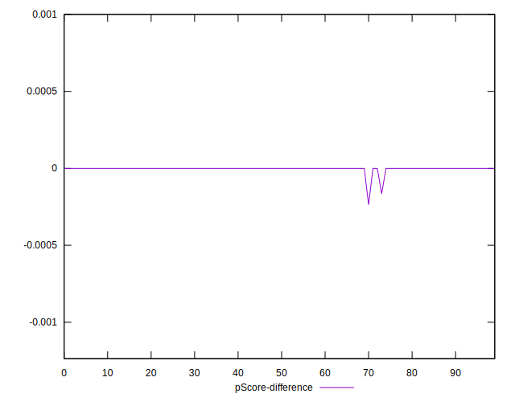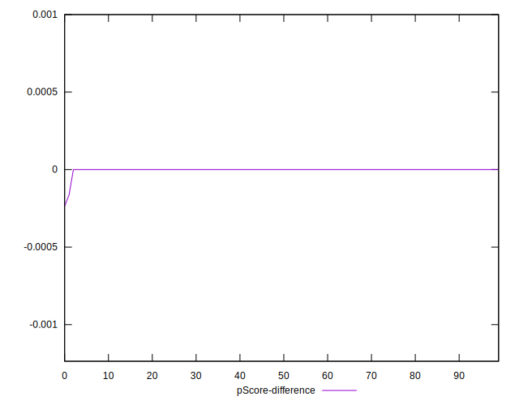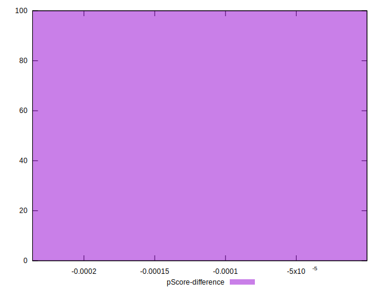