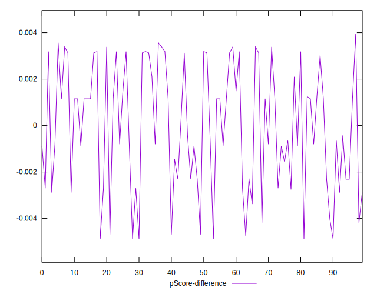

# //max-potential-fid/samples/astro

[→ Parent](../..)


## Raw


```yaml
p90min: 326.0000000000009
p90max: 354
p90range: 27.99999999999909
p90mean: 335.79787234042556
median: 334.50000000000045
p90stdev: 6.377453282203014
mad: 4.500000000000455
stdevBySn: 7.155599999999458
lfitCenter: 335.6785483211988
lfitStdev: 5.739076931570629
mfitCenter: 335.6785483211988
mfitStdev: 7.1928662607164995
mfitConfidence: 0.71928662607165
p90skewness: 0.8505478137648357
p90eccentricity: 0.999999999999998
p90discretization: 2.9375
outlandishness: 1.00466374908898

```


## Score


```yaml
p90min: 0.25
p90max: 0.3
p90range: 0.04999999999999999
p90mean: 0.2819148936170212
median: 0.28500000000000003
p90stdev: 0.012486298511592506
mad: 0.0050000000000000044
stdevBySn: 0.011925999999999945
lfitCenter: 0.2822922991405475
lfitStdev: 0.011568579082291955
mfitCenter: 0.2822922991405475
mfitStdev: 0.014499063727078458
mfitConfidence: 0.0014499063727078459
p90skewness: -0.725994085697731
p90eccentricity: 1.0000000000000002
p90discretization: 15.666666666666666
outlandishness: 0.9913997032965468

```


## Raw Estimate


## Score Estimate


## P Score


```yaml
p90min: 0.24772002510289765
p90max: 0.3014631638422881
p90range: 0.05374313873939046
p90mean: 0.2818069776639902
median: 0.28412317229928963
p90stdev: 0.012356659702950057
mad: 0.00906418825269717
stdevBySn: 0.013723021464050548
lfitCenter: 0.2821265687369297
lfitStdev: 0.01097750335747587
mfitCenter: 0.2821265687369297
mfitStdev: 0.013758260164197024
mfitConfidence: 0.0013758260164197023
p90skewness: -0.7665452821205927
p90eccentricity: 0.9999999999999996
p90discretization: 2.9375
outlandishness: 0.9916445532216437

```


## Score Difference


```yaml
p90min: 0
p90max: 0
p90range: 0
p90mean: 0
median: 0
p90stdev: 0
mad: 0
stdevBySn: 0
lfitCenter: 0
lfitStdev: 0
mfitCenter: 0
mfitStdev: 0
mfitConfidence: 0
p90skewness: .nan
p90eccentricity: .nan
p90discretization: 94
outlandishness: .nan

```


## P Score Difference


```yaml
p90min: -0.004883752116671913
p90max: 0.0033866443527755252
p90range: 0.008270396469447439
p90mean: -0.000039454169006959664
median: -0.00008164134694735314
p90stdev: 0.0026039026859714775
mad: 0.002618868868793006
stdevBySn: 0.0031232630129225396
lfitCenter: 0.00002028869684635085
lfitStdev: 0.0024094975561488267
mfitCenter: 0.00002028869684635085
mfitStdev: 0.0030198573539871815
mfitConfidence: 0.00030198573539871816
p90skewness: -0.2457021928796451
p90eccentricity: 1.0000000000000002
p90discretization: 2.764705882352941
outlandishness: 3.4050131873970284

```

