# //max-potential-fid/samples/card

[→ Parent](../..)


## Raw


```yaml
p90min: 16
p90max: 43
p90range: 27
p90mean: 21.26595744680851
median: 16
p90stdev: 10.096529350938345
mad: 0
stdevBySn: 0
lfitCenter: 19.65226048558353
lfitStdev: 7.725316133628462
mfitCenter: 19.65226048558353
mfitStdev: 9.68224793525076
mfitConfidence: 0.9682247935250761
p90skewness: 1.467410402014767
p90eccentricity: 0.9999999999999987
p90discretization: 13.428571428571429
outlandishness: 1.050855753039101

```

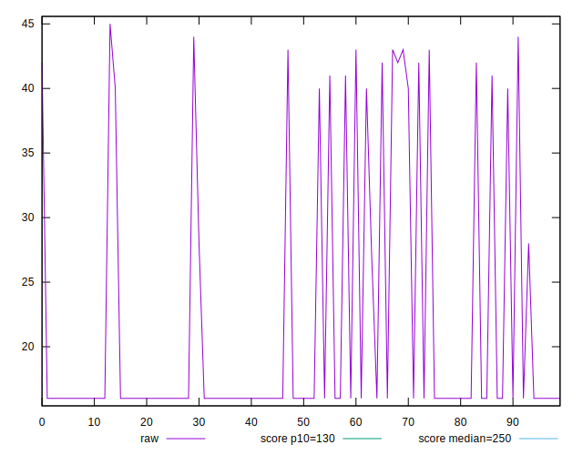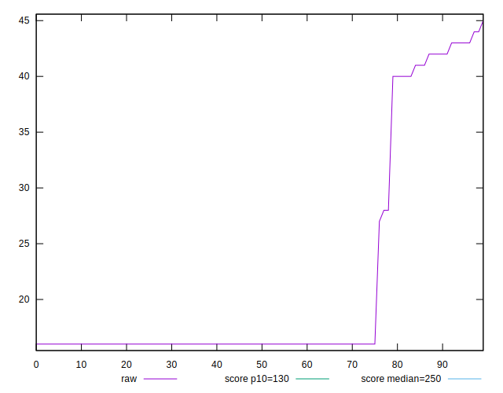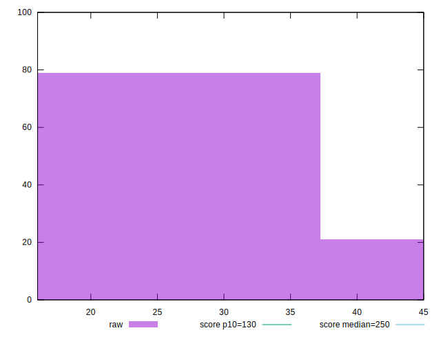
## Score


```yaml
p90min: 1
p90max: 1
p90range: 0
p90mean: 1
median: 1
p90stdev: 0
mad: 0
stdevBySn: 0
lfitCenter: 1
lfitStdev: 0
mfitCenter: 1
mfitStdev: 0
mfitConfidence: 0
p90skewness: .nan
p90eccentricity: .nan
p90discretization: 94
outlandishness: 1

```


## Raw Estimate

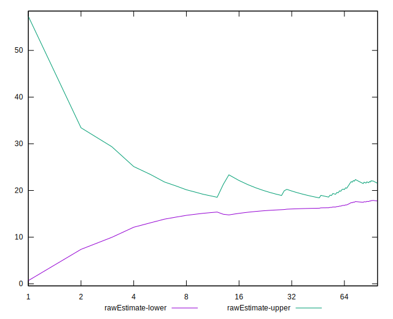
## Score Estimate

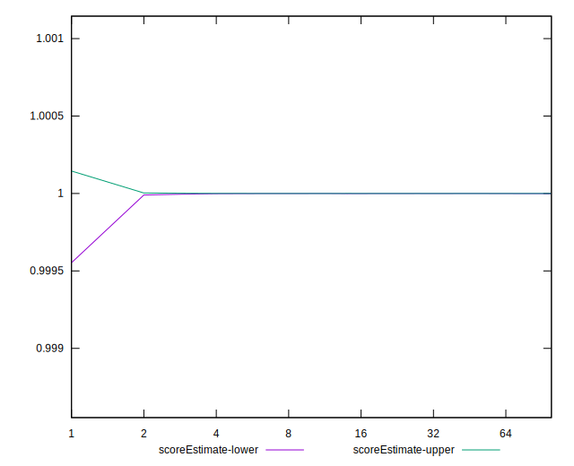
## P Score


```yaml
p90min: 0.9997193707068333
p90max: 0.9999999641342965
p90range: 0.00028059342746322713
p90mean: 0.9999571553704488
median: 0.9999999641342965
p90stdev: 0.0000895186216748614
mad: 0
stdevBySn: 0
lfitCenter: 0.999969699191371
lfitStdev: 0.00006545558968343755
mfitCenter: 0.999969699191371
mfitStdev: 0.00008203641599912343
mfitConfidence: 0.000008203641599912343
p90skewness: -1.746090683907392
p90eccentricity: 1.0000000000000022
p90discretization: 13.428571428571429
outlandishness: 0.9999841099664827

```

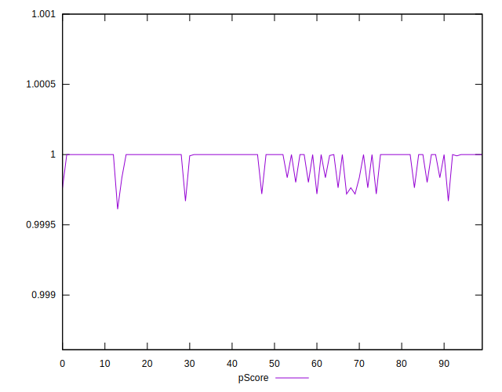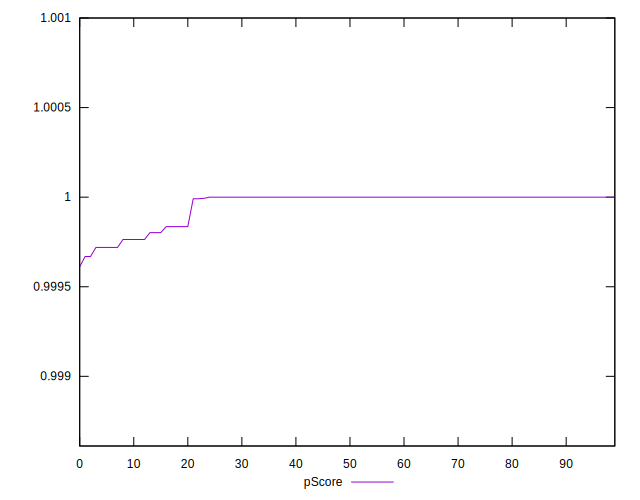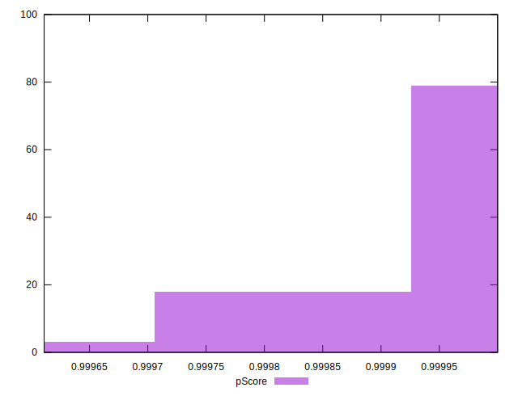
## Score Difference


```yaml
p90min: 0
p90max: 0
p90range: 0
p90mean: 0
median: 0
p90stdev: 0
mad: 0
stdevBySn: 0
lfitCenter: 0
lfitStdev: 0
mfitCenter: 0
mfitStdev: 0
mfitConfidence: 0
p90skewness: .nan
p90eccentricity: .nan
p90discretization: 94
outlandishness: .nan

```


## P Score Difference


```yaml
p90min: -0.00028062929316674534
p90max: -3.5865703518211944e-8
p90range: 0.00028059342746322713
p90mean: -0.000042844629549613895
median: -3.5865703518211944e-8
p90stdev: 0.00008951862167486146
mad: 0
stdevBySn: 0
lfitCenter: -0.000030300808629194672
lfitStdev: 0.00006545558968363627
mfitCenter: -0.000030300808629194672
mfitStdev: 0.00008203641599937248
mfitConfidence: 0.000008203641599937247
p90skewness: -1.746090683967157
p90eccentricity: 1.000000000000001
p90discretization: 13.428571428571429
outlandishness: 1.4052458487136612

```

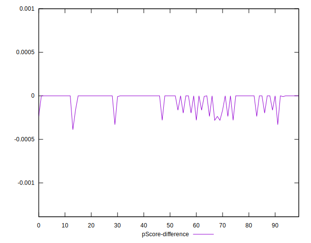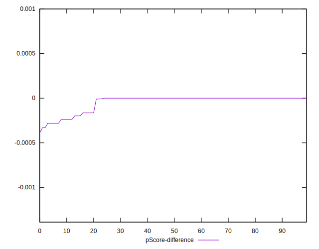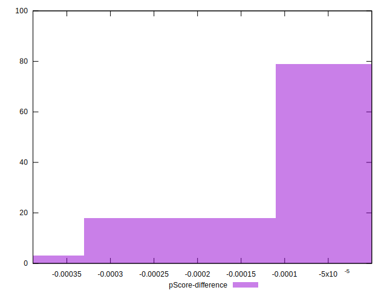