# //max-potential-fid/samples/music

[→ Parent](../..)


## Raw


```yaml
p90min: 364
p90max: 401
p90range: 37
p90mean: 377.93617021276594
median: 377
p90stdev: 8.156460056414101
mad: 6
stdevBySn: 8.944500000000001
lfitCenter: 378.40533111457455
lfitStdev: 7.811815826447885
mfitCenter: 378.40533111457455
mfitStdev: 9.79065922324388
mfitConfidence: 0.979065922324388
p90skewness: 0.7311398359870214
p90eccentricity: 1
p90discretization: 2.9375
outlandishness: 1.0098343401924943

```

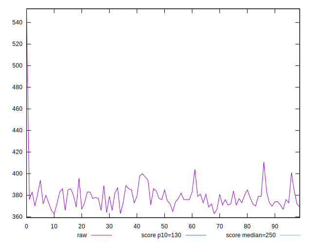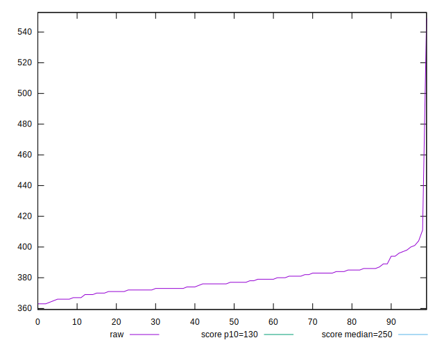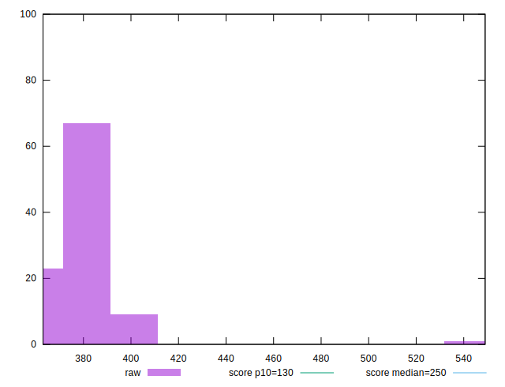
## Score


```yaml
p90min: 0.18
p90max: 0.23
p90range: 0.05000000000000002
p90mean: 0.20968085106382986
median: 0.21
p90stdev: 0.012501244845212249
mad: 0.009999999999999995
stdevBySn: 0.011926000000000003
lfitCenter: 0.20914852884371757
lfitStdev: 0.010957561612226907
mfitCenter: 0.20914852884371757
mfitStdev: 0.013733266892928605
mfitConfidence: 0.0013733266892928604
p90skewness: -0.42979712615961274
p90eccentricity: 0.9999999999999984
p90discretization: 15.666666666666666
outlandishness: 0.9830858322386937

```

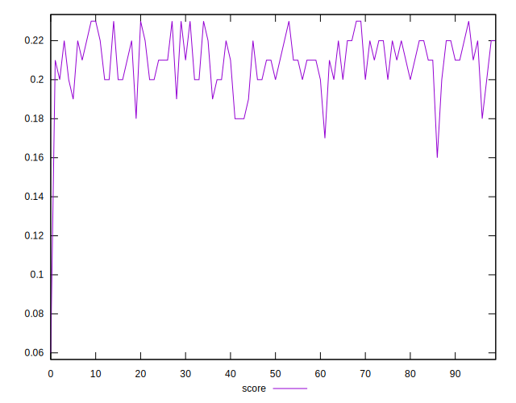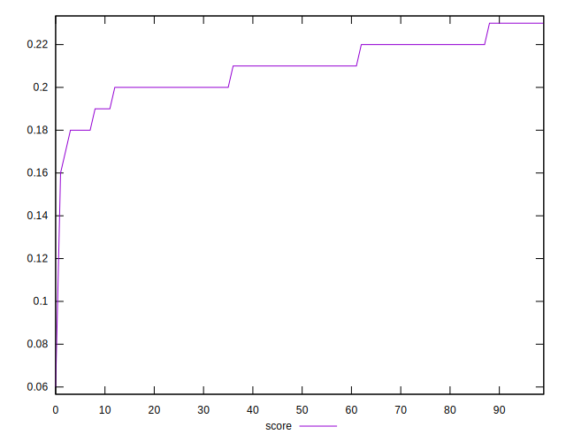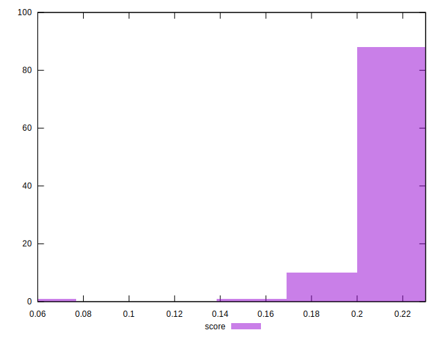
## Raw Estimate

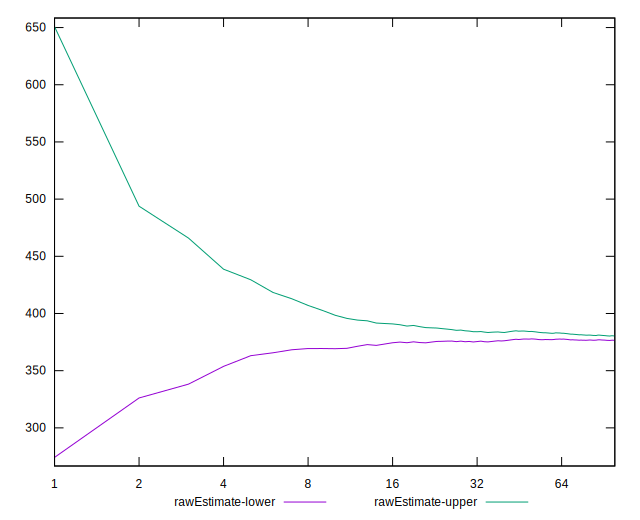
## Score Estimate

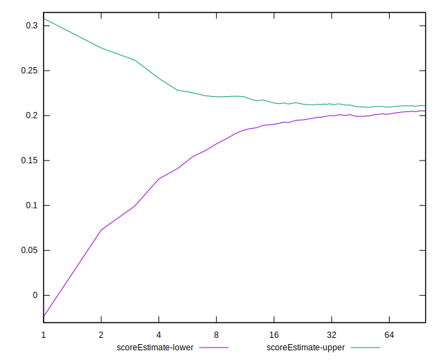
## P Score


```yaml
p90min: 0.1772238216819071
p90max: 0.23078152685278286
p90range: 0.05355770517087577
p90mean: 0.20933238249130037
median: 0.21039636018097208
p90stdev: 0.011932121953523974
mad: 0.008816439684876665
stdevBySn: 0.013012355894778137
lfitCenter: 0.20906439725372583
lfitStdev: 0.010775998877432556
mfitCenter: 0.20906439725372583
mfitStdev: 0.013505711750372204
mfitConfidence: 0.0013505711750372205
p90skewness: -0.5853017989092091
p90eccentricity: 0.9999999999999987
p90discretization: 2.9375
outlandishness: 0.9848928048977313

```

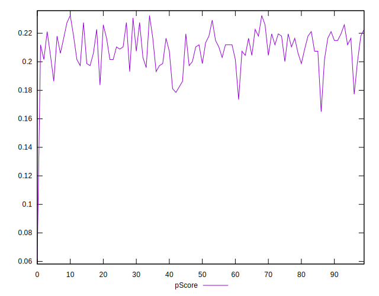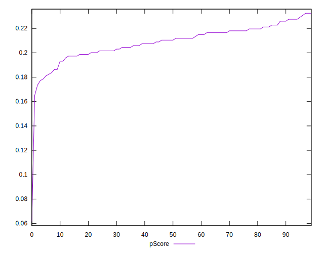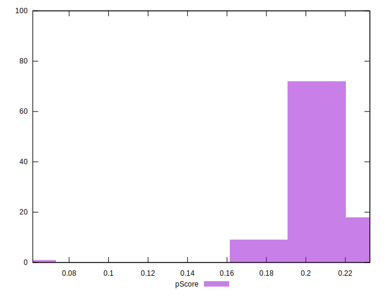
## Score Difference


```yaml
p90min: 0
p90max: 0
p90range: 0
p90mean: 0
median: 0
p90stdev: 0
mad: 0
stdevBySn: 0
lfitCenter: 0
lfitStdev: 0
mfitCenter: 0
mfitStdev: 0
mfitConfidence: 0
p90skewness: .nan
p90eccentricity: .nan
p90discretization: 94
outlandishness: .nan

```


## P Score Difference


```yaml
p90min: -0.0040831018723639645
p90max: 0.004942257760971763
p90range: 0.009025359633335728
p90mean: -0.00019218900471456042
median: -0.00041801480798633883
p90stdev: 0.002522035967600109
mad: 0.0022756666233582357
stdevBySn: 0.0031779232146594547
lfitCenter: -0.0002117440836817972
lfitStdev: 0.0023479928120102305
mfitCenter: -0.0002117440836817972
mfitStdev: 0.0029427725885687404
mfitConfidence: 0.00029427725885687405
p90skewness: 0.1593202787915375
p90eccentricity: 1
p90discretization: 2.764705882352941
outlandishness: 0.6491597093549616

```

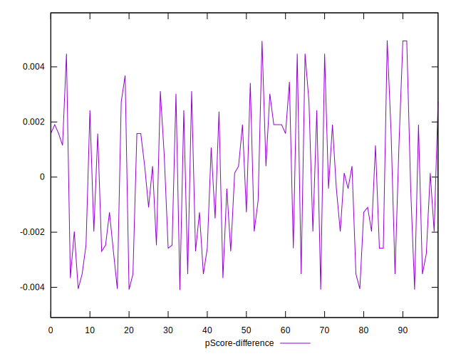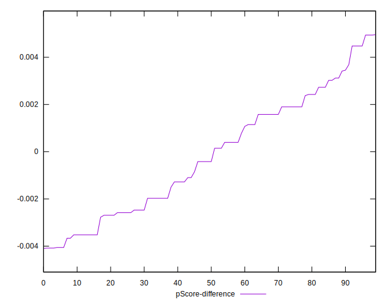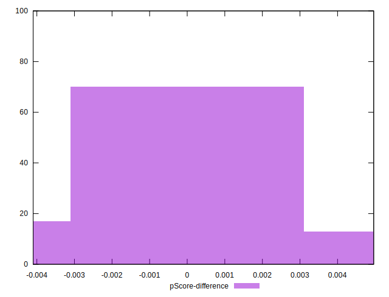