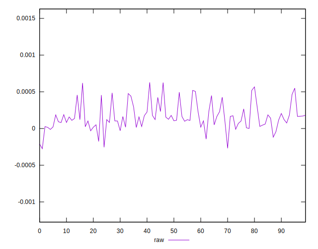
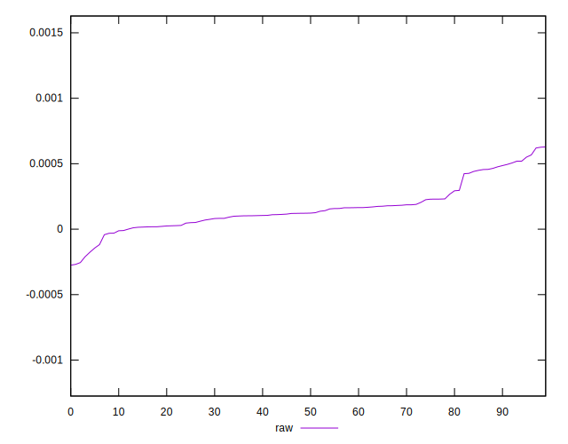
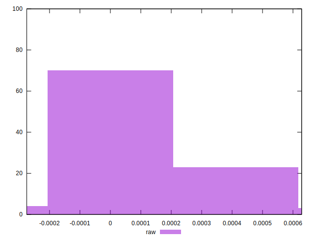

# //meta/pScore-difference/samples/agenda

[→ Parent](../..)


## Raw


```yaml
p90min: -0.0002102538828302858
p90max: 0.0005671784949858371
p90range: 0.000777432377816123
p90mean: 0.00016092922569863383
median: 0.00012229344023235723
p90stdev: 0.00016717193476158175
mad: 0.00008813248721896705
stdevBySn: 0.0001516344921423162
lfitCenter: 0.0001506257515525954
lfitStdev: 0.0001227894033138538
mfitCenter: 0.0001506257515525954
mfitStdev: 0.00015389369524064207
mfitConfidence: 0.000015389369524064208
p90skewness: 0.7162331105037991
p90eccentricity: 1.0000000000000007
p90discretization: 1
outlandishness: 1.0137428717886665

```

