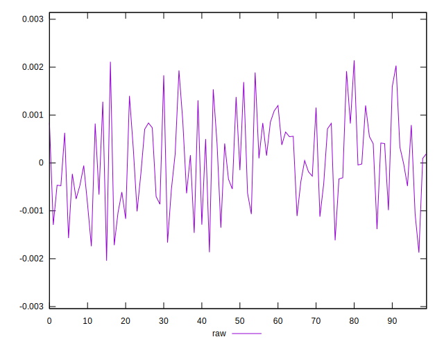
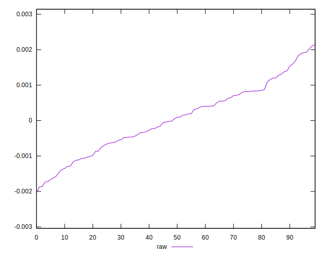
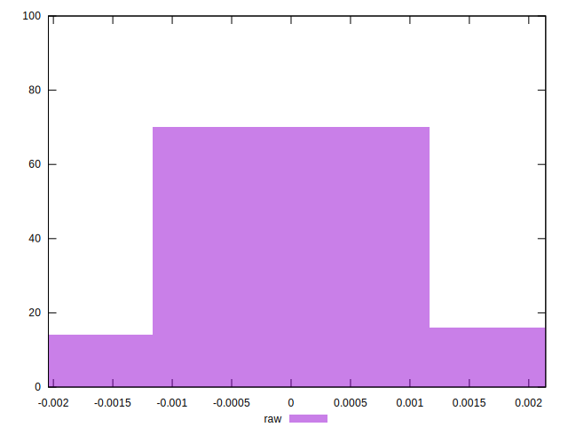

# //meta/pScore-difference/samples/astro

[→ Parent](../..)


## Raw


```yaml
p90min: -0.0017391376215834765
p90max: 0.001931400127275779
p90range: 0.0036705377488592556
p90mean: 0.00004358739746043153
median: 0.0000722583999506403
p90stdev: 0.0009472152528363965
mad: 0.0007503783147806582
stdevBySn: 0.0011684632813644769
lfitCenter: 0.00004567834773504999
lfitStdev: 0.0008180277770657453
mfitCenter: 0.00004567834773504999
mfitStdev: 0.0010252457787449168
mfitConfidence: 0.00010252457787449168
p90skewness: 0.036214754968461826
p90eccentricity: 1.0000000000000002
p90discretization: 1
outlandishness: 1.1150997610175897

```

