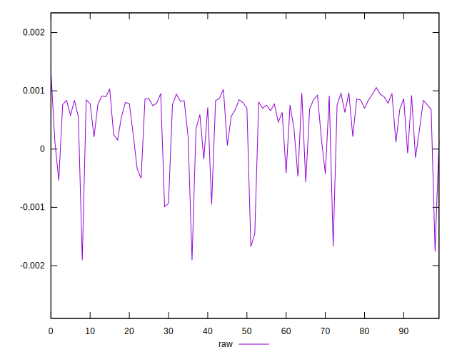
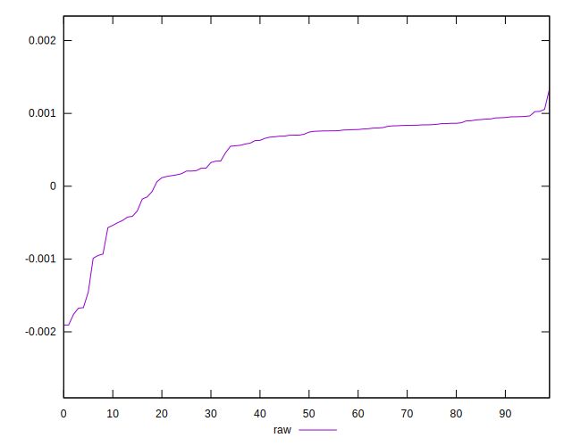
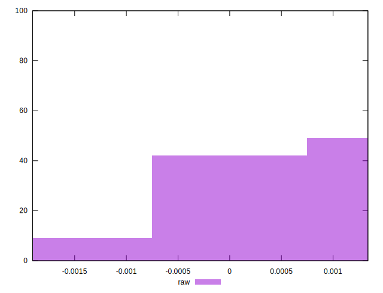

# //meta/pScore-difference/samples/card

[→ Parent](../..)


## Raw


```yaml
p90min: -0.0016747377950680875
p90max: 0.0010241320240609365
p90range: 0.0026988698191290237
p90mean: 0.0004508015182132091
median: 0.0007290064614237479
p90stdev: 0.0006089004917133648
mad: 0.0001807051921771857
stdevBySn: 0.0002887394607857631
lfitCenter: 0.0005166184746661598
lfitStdev: 0.000478833162778916
mfitCenter: 0.0005166184746661598
mfitStdev: 0.0006001283729301842
mfitConfidence: 0.00006001283729301843
p90skewness: -1.758124542268677
p90eccentricity: 1
p90discretization: 1
outlandishness: 0.7961560099881839

```

