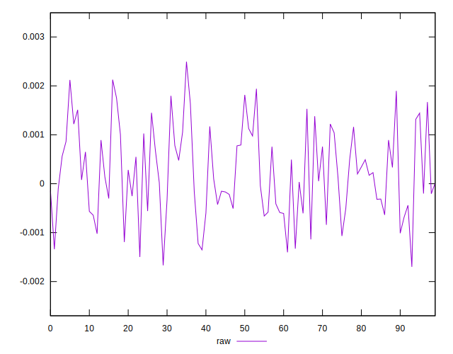
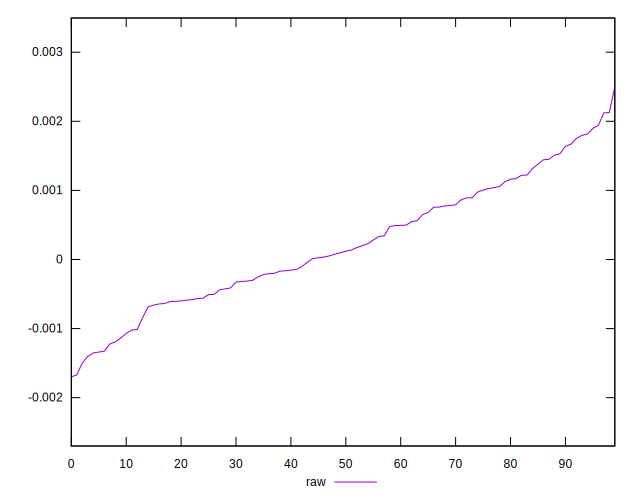
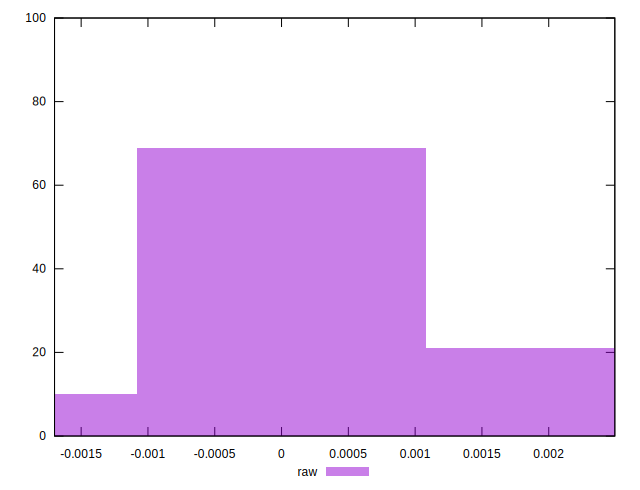

# //meta/pScore-difference/samples/music

[→ Parent](../..)


## Raw


```yaml
p90min: -0.0014024183467641852
p90max: 0.0019409372737934916
p90range: 0.0033433556205576765
p90mean: 0.00021608383883642748
median: 0.00010896176418601563
p90stdev: 0.0008770461320571432
mad: 0.0007030278747725605
stdevBySn: 0.000998807834545362
lfitCenter: 0.00020052555764058704
lfitStdev: 0.0007709264151340121
mfitCenter: 0.00020052555764058704
mfitStdev: 0.0009662129758896602
mfitConfidence: 0.00009662129758896602
p90skewness: 0.1236220205989089
p90eccentricity: 1.0000000000000002
p90discretization: 1
outlandishness: 1.054492629211258

```

