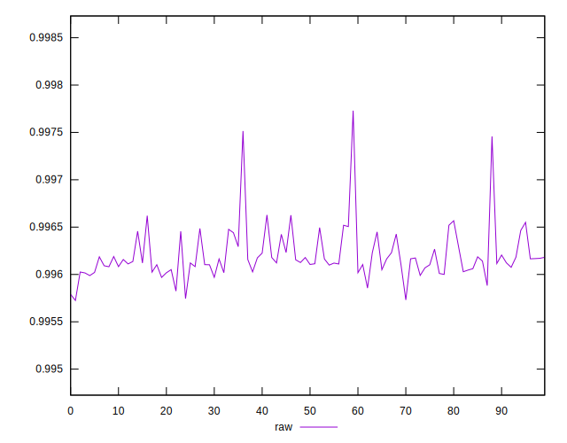
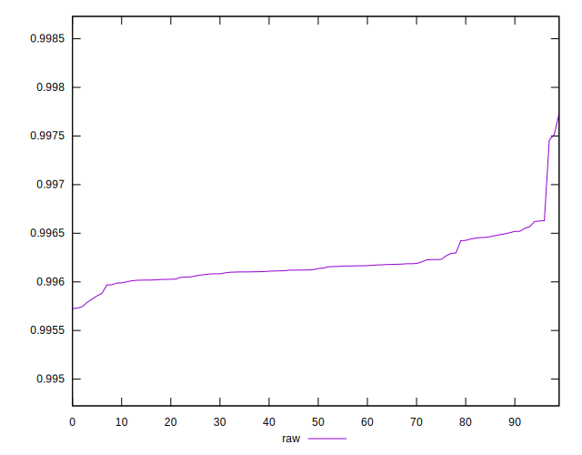
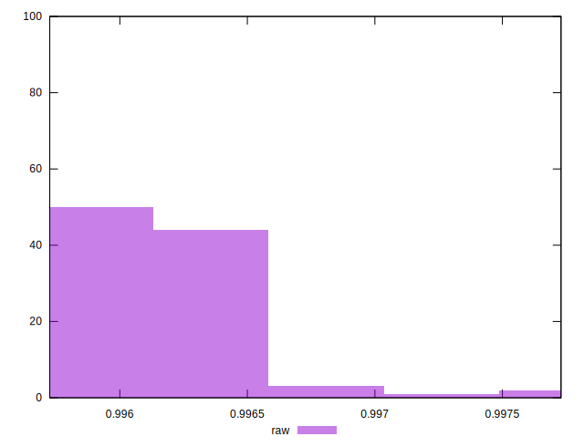

# //meta/pScore/samples/agenda

[→ Parent](../..)


## Raw


```yaml
p90min: 0.9957897461171697
p90max: 0.996628513085114
p90range: 0.0008387669679442711
p90mean: 0.9961787273612199
median: 0.9961315388283747
p90stdev: 0.0001838036269244756
mad: 0.0000894335367025989
stdevBySn: 0.00015396024037625235
lfitCenter: 0.9961778622081112
lfitStdev: 0.00015628234496906874
mfitCenter: 0.9961778622081112
mfitStdev: 0.0001958708725596454
mfitConfidence: 0.00001958708725596454
p90skewness: 0.7803499617705418
p90eccentricity: 0.9999999999999999
p90discretization: 1
outlandishness: 1.0000568257628228

```

