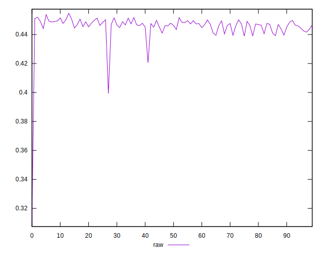
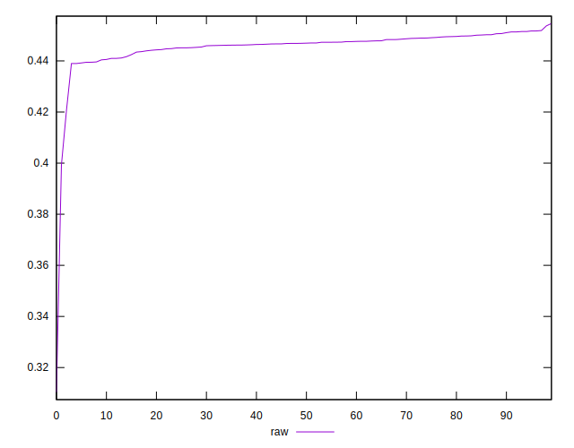
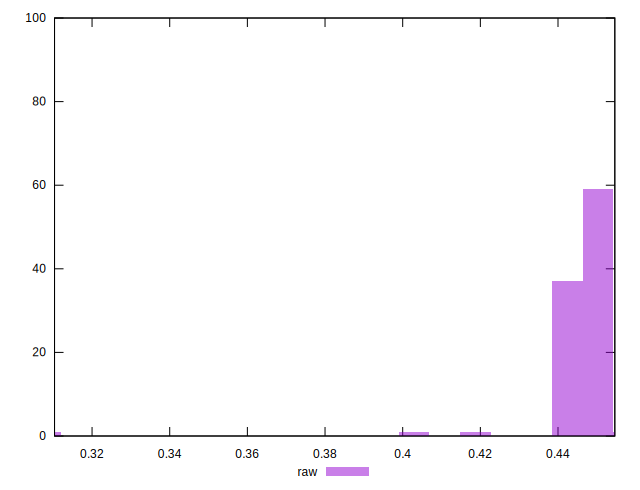

# //meta/pScore/samples/astro

[→ Parent](../..)


## Raw


```yaml
p90min: 0.4389722676425442
p90max: 0.4517266030512747
p90range: 0.0127543354087305
p90mean: 0.44660756136827845
median: 0.44691598737452465
p90stdev: 0.0032106852078043367
mad: 0.0020251385821814516
stdevBySn: 0.0031795619941000926
lfitCenter: 0.44587943719016104
lfitStdev: 0.0038831389700586913
mfitCenter: 0.44587943719016104
mfitStdev: 0.0048667929732324824
mfitConfidence: 0.0004866792973232482
p90skewness: -0.7239465548517338
p90eccentricity: 0.9999999999999997
p90discretization: 1
outlandishness: 0.9915393935350054

```

