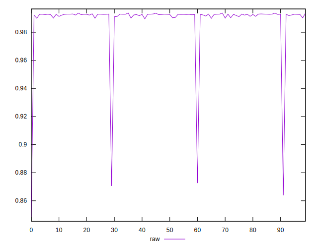

# //meta/pScore/samples/card

[→ Parent](../..)


## Raw


```yaml
p90min: 0.8725865420150544
p90max: 0.9936454322296164
p90range: 0.12105889021456206
p90mean: 0.9910469476435674
median: 0.9927484149662358
p90stdev: 0.012319930424751734
mad: 0.00019420933827912767
stdevBySn: 0.0003382924381598916
lfitCenter: 0.9899875590610034
lfitStdev: 0.006120493697428953
mfitCenter: 0.9899875590610034
mfitStdev: 0.0076709012860569125
mfitConfidence: 0.0007670901286056912
p90skewness: -9.45505687427483
p90eccentricity: 1.0000000000000002
p90discretization: 1
outlandishness: 0.9922963728048848

```

