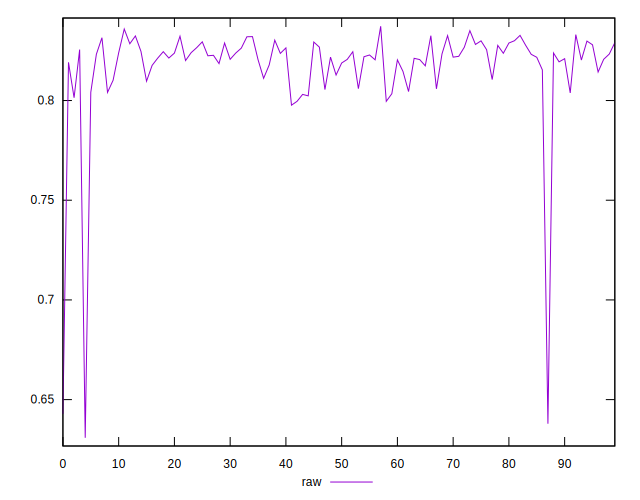
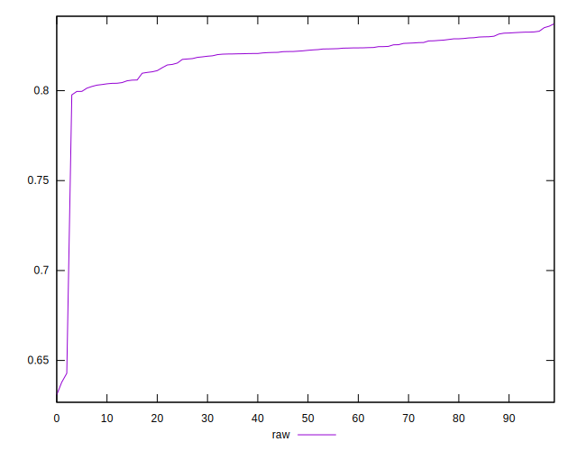
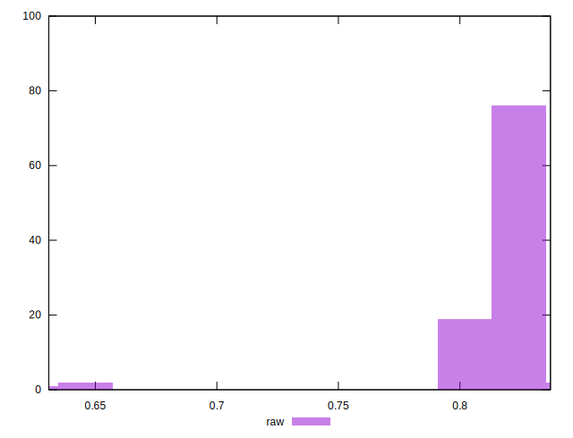

# //meta/pScore/samples/music

[→ Parent](../..)


## Raw


```yaml
p90min: 0.7976709188962703
p90max: 0.8330598349541046
p90range: 0.03538891605783434
p90mean: 0.8205098327824837
median: 0.8223046623610174
p90stdev: 0.009052894999365409
mad: 0.0053895192586421725
stdevBySn: 0.0083610065800703
lfitCenter: 0.818803587159008
lfitStdev: 0.010991208061494558
mfitCenter: 0.818803587159008
mfitStdev: 0.013775436463508654
mfitConfidence: 0.0013775436463508654
p90skewness: -0.8673009246717238
p90eccentricity: 0.9999999999999999
p90discretization: 1
outlandishness: 0.9877697901238389

```

