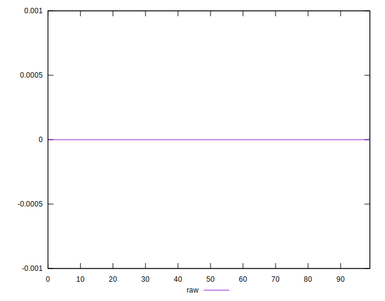
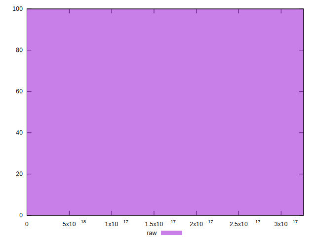

# //meta/score-difference/samples/astro

[→ Parent](../..)


## Raw


```yaml
p90min: 0
p90max: 0
p90range: 0
p90mean: 0
median: 0
p90stdev: 0
mad: 0
stdevBySn: 0
lfitCenter: 1.5195692261841787e-19
lfitStdev: 3.791269646270426e-19
mfitCenter: 1.5195692261841787e-19
mfitStdev: 4.751651850827175e-19
mfitConfidence: 4.751651850827175e-20
p90skewness: .nan
p90eccentricity: .nan
p90discretization: 94
outlandishness: .inf

```

