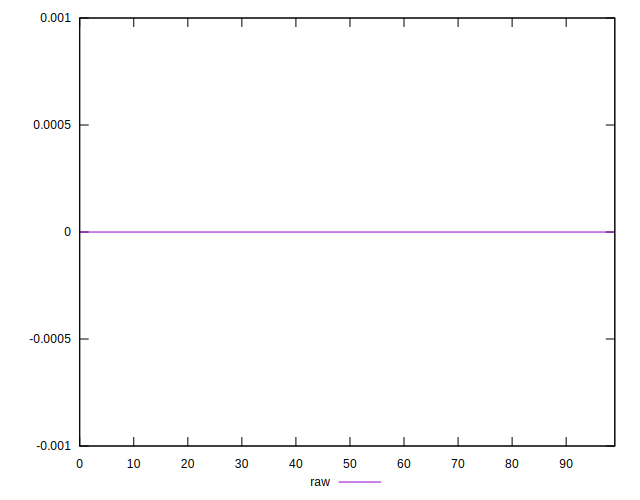
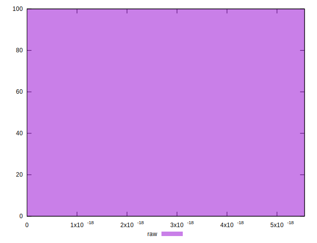

# //meta/score-difference/samples/card

[→ Parent](../..)


## Raw


```yaml
p90min: 0
p90max: 5.551115123125783e-18
p90range: 5.551115123125783e-18
p90mean: 5.905441620346577e-20
median: 0
p90stdev: 5.695001657605493e-19
mad: 0
stdevBySn: 0
lfitCenter: 1.0755152514005353e-19
lfitStdev: 2.64368419702406e-19
mfitCenter: 1.0755152514005353e-19
mfitStdev: 3.3133667820618814e-19
mfitConfidence: 3.313366782061881e-20
p90skewness: 9.539955591519822
p90eccentricity: 0.999999999999994
p90discretization: 47
outlandishness: 14.137600000000003

```

