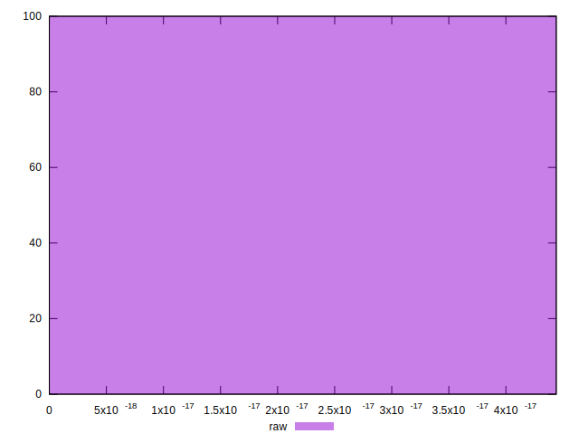

# //meta/score-difference/samples/music

[→ Parent](../..)


## Raw


```yaml
p90min: 0
p90max: 4.4408920985006264e-17
p90range: 4.4408920985006264e-17
p90mean: 1.7421052780022408e-17
median: 2.7755575615628914e-17
p90stdev: 1.413178472620896e-17
mad: 1.1102230246251566e-17
stdevBySn: 1.3240519791679619e-17
lfitCenter: 1.8506813149049255e-17
lfitStdev: 1.4519202206541942e-17
mfitCenter: 1.8506813149049255e-17
mfitStdev: 1.8197121406312137e-17
mfitConfidence: 1.819712140631214e-18
p90skewness: -0.11993366237684142
p90eccentricity: 1.000000000000003
p90discretization: 23.5
outlandishness: 1.033220564205688

```

