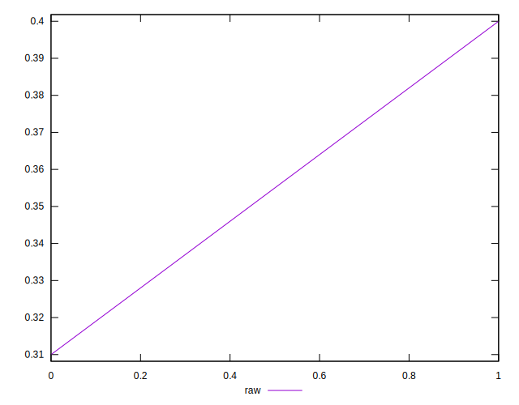
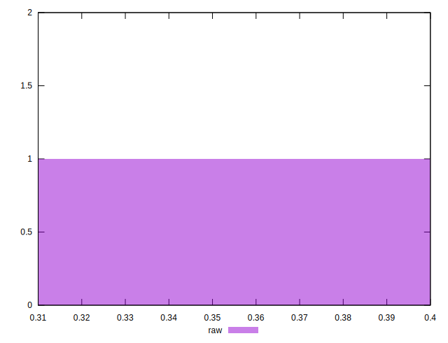

# //meta/score/samples/astro

[→ Parent](../..)


## Raw


```yaml
p90min: 0.31
p90max: 0.4
p90range: 0.09000000000000002
p90mean: 0.355
median: 0.355
p90stdev: 0.04500000000000001
mad: 0.04500000000000001
stdevBySn: 0.05366700000000002
lfitCenter: 0.35500000000000004
lfitStdev: 0.056399136235948735
mfitCenter: 0.35500000000000004
mfitStdev: 0.07068583484802456
mfitConfidence: 0.04998243315487053
p90skewness: 1.9984014443252818e-15
p90eccentricity: 1
p90discretization: 1
outlandishness: 1

```

