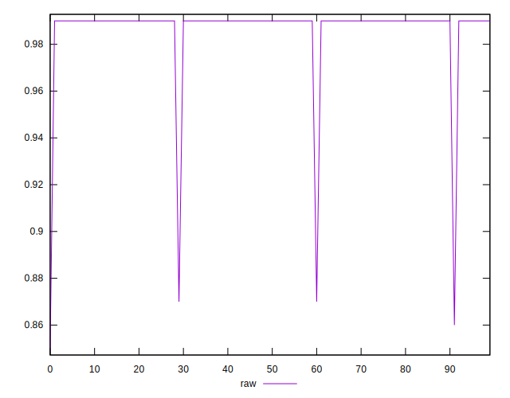
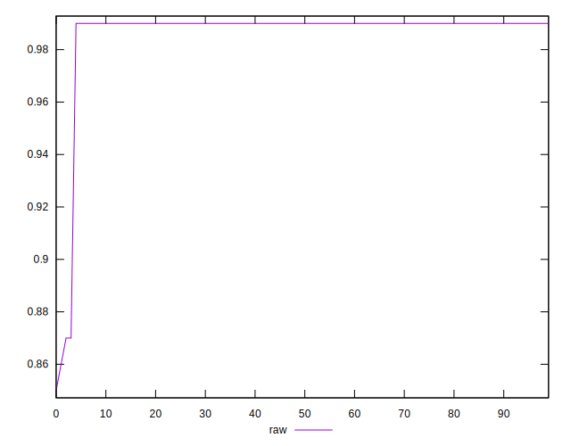
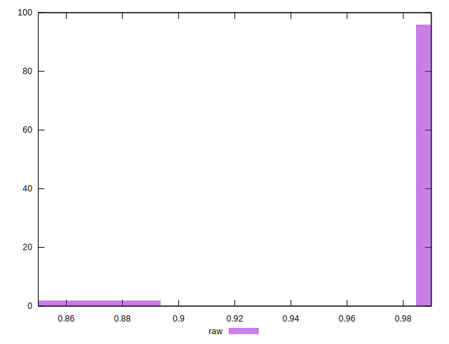

# //meta/score/samples/card

[→ Parent](../..)


## Raw


```yaml
p90min: 0.87
p90max: 0.99
p90range: 0.12
p90mean: 0.988723404255318
median: 0.99
p90stdev: 0.012311043524671854
mad: 0
stdevBySn: 0
lfitCenter: 0.9875341818888153
lfitStdev: 0.0060611361529148075
mfitCenter: 0.9875341818888153
mfitStdev: 0.007596507636286141
mfitConfidence: 0.0007596507636286141
p90skewness: -9.53995559151963
p90eccentricity: 1.0000000000000002
p90discretization: 47
outlandishness: 0.992280931824234

```

