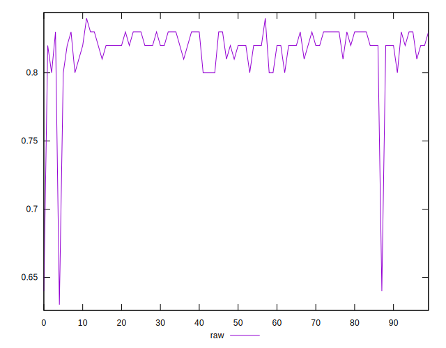
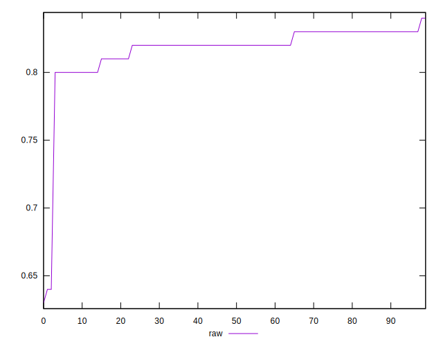
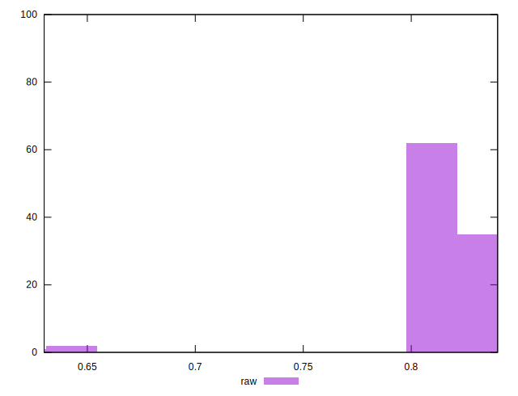

# //meta/score/samples/music

[→ Parent](../..)


## Raw


```yaml
p90min: 0.8
p90max: 0.83
p90range: 0.029999999999999916
p90mean: 0.819999999999999
median: 0.82
p90stdev: 0.009675588936937901
mad: 0.009999999999999953
stdevBySn: 0.011925999999999978
lfitCenter: 0.8181577860745247
lfitStdev: 0.011007810761977788
mfitCenter: 0.8181577860745247
mfitStdev: 0.01379624486276284
mfitConfidence: 0.0013796244862762839
p90skewness: -0.8456144876700119
p90eccentricity: 1.0000000000000002
p90discretization: 23.5
outlandishness: 0.9878420582986316

```

