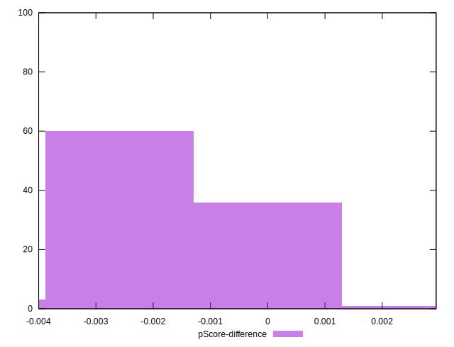

# //render-blocking-resources/samples/astro

[→ Parent](../..)


## Raw


```yaml
p90min: 1686
p90max: 1718
p90range: 32
p90mean: 1702.223404255319
median: 1705
p90stdev: 9.143250336117799
mad: 8
stdevBySn: 11.3297
lfitCenter: 1699.1541954886836
lfitStdev: 15.239591381285834
mfitCenter: 1699.1541954886836
mfitStdev: 19.099995344296214
mfitConfidence: 1.9099995344296214
p90skewness: -0.2012065388119301
p90eccentricity: 0.9999999999999974
p90discretization: 3.4814814814814814
outlandishness: 0.9913671988184477

```


## Score


```yaml
p90min: 0.39
p90max: 0.39
p90range: 0
p90mean: 0.3900000000000004
median: 0.39
p90stdev: 3.885780586188048e-16
mad: 0
stdevBySn: 0
lfitCenter: 0.3903710492786061
lfitStdev: 0.0011621566403794321
mfitCenter: 0.3903710492786061
mfitStdev: 0.0014565473486282678
mfitConfidence: 0.00014565473486282678
p90skewness: -1
p90eccentricity: 1
p90discretization: 94
outlandishness: 1.0041067718606183

```


## Raw Estimate


## Score Estimate


## P Score


```yaml
p90min: 0.3861176470588235
p90max: 0.38988235294117646
p90range: 0.003764705882352948
p90mean: 0.3879737171464331
median: 0.3876470588235294
p90stdev: 0.0010756765101315056
mad: 0.0009411764705882231
stdevBySn: 0.0013329058823529406
lfitCenter: 0.3883348005307432
lfitStdev: 0.0017928931036807155
mfitCenter: 0.3883348005307432
mfitStdev: 0.002247058275799591
mfitConfidence: 0.0002247058275799591
p90skewness: 0.20120653881151224
p90eccentricity: 1.0000000000000002
p90discretization: 3.4814814814814814
outlandishness: 1.0044706636058929

```


## Score Difference


```yaml
p90min: 0
p90max: 0
p90range: 0
p90mean: 0
median: 0
p90stdev: 0
mad: 0
stdevBySn: 0
lfitCenter: 0
lfitStdev: 0
mfitCenter: 0
mfitStdev: 0
mfitConfidence: 0
p90skewness: .nan
p90eccentricity: .nan
p90discretization: 94
outlandishness: .nan

```


## P Score Difference


```yaml
p90min: -0.003764705882352948
p90max: -0.00011764705882355564
p90range: 0.003647058823529392
p90mean: -0.0019899874843554597
median: -0.002352941176470613
p90stdev: 0.001050819360296578
mad: 0.0009411764705882231
stdevBySn: 0.0012627529411764875
lfitCenter: -0.002016950665860733
lfitStdev: 0.0010677187258750663
mfitCenter: -0.002016950665860733
mfitStdev: 0.0013381869751622544
mfitConfidence: 0.00013381869751622545
p90skewness: 0.22108711059335381
p90eccentricity: 1.0000000000000004
p90discretization: 3.4814814814814814
outlandishness: 0.9700887154780273

```

