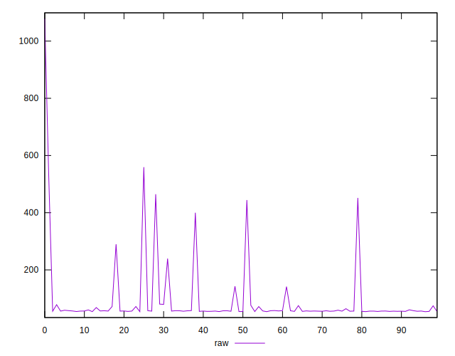
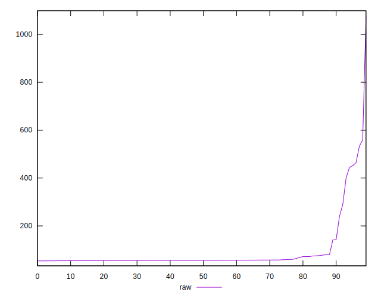
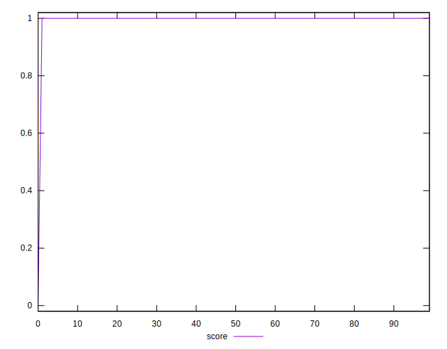
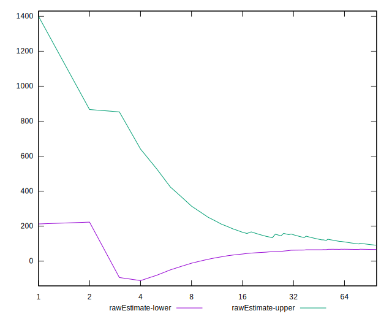

# //server-response-time/samples/astro

[→ Parent](../..)


## Raw


```yaml
p90min: 54.059
p90max: 464.685
p90range: 410.626
p90mean: 80.75347872340427
median: 56.114000000000004
p90stdev: 82.64890568295488
mad: 1.206500000000009
stdevBySn: 1.9460250500000047
lfitCenter: 78.50135799775427
lfitStdev: 49.26845951810217
mfitCenter: 78.50135799775427
mfitStdev: 61.74885689992819
mfitConfidence: 6.174885689992819
p90skewness: 3.7815100750359036
p90eccentricity: 1.0000000000000002
p90discretization: 1
outlandishness: 1.510040295447562

```


## Score


```yaml
p90min: 1
p90max: 1
p90range: 0
p90mean: 1
median: 1
p90stdev: 0
mad: 0
stdevBySn: 0
lfitCenter: 0.9953463986474514
lfitStdev: 0.01161056518501907
mfitCenter: 0.9953463986474514
mfitStdev: 0.01455168550325008
mfitConfidence: 0.001455168550325008
p90skewness: .nan
p90eccentricity: .nan
p90discretization: 94
outlandishness: 0.9801

```


## Raw Estimate


## Score Estimate


## P Score


```yaml
p90min: 1
p90max: 1
p90range: 0
p90mean: 1
median: 1
p90stdev: 0
mad: 0
stdevBySn: 0
lfitCenter: 0.9953463986474514
lfitStdev: 0.01161056518501907
mfitCenter: 0.9953463986474514
mfitStdev: 0.01455168550325008
mfitConfidence: 0.001455168550325008
p90skewness: .nan
p90eccentricity: .nan
p90discretization: 94
outlandishness: 0.9801

```


## Score Difference


```yaml
p90min: 0
p90max: 0
p90range: 0
p90mean: 0
median: 0
p90stdev: 0
mad: 0
stdevBySn: 0
lfitCenter: 0
lfitStdev: 0
mfitCenter: 0
mfitStdev: 0
mfitConfidence: 0
p90skewness: .nan
p90eccentricity: .nan
p90discretization: 94
outlandishness: .nan

```


## P Score Difference


```yaml
p90min: 0
p90max: 0
p90range: 0
p90mean: 0
median: 0
p90stdev: 0
mad: 0
stdevBySn: 0
lfitCenter: 0
lfitStdev: 0
mfitCenter: 0
mfitStdev: 0
mfitConfidence: 0
p90skewness: .nan
p90eccentricity: .nan
p90discretization: 94
outlandishness: .nan

```

