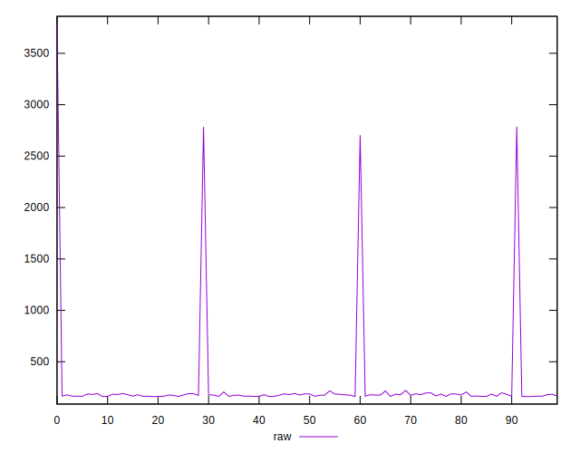
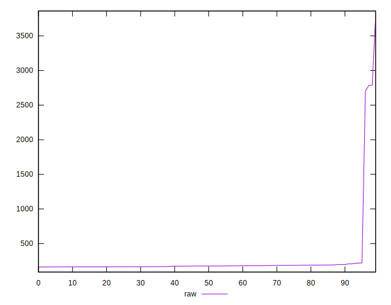
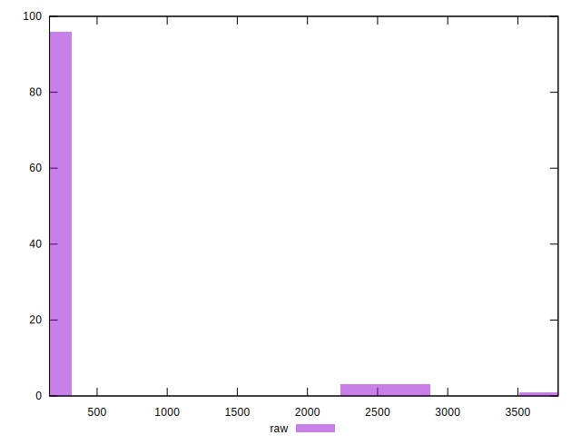
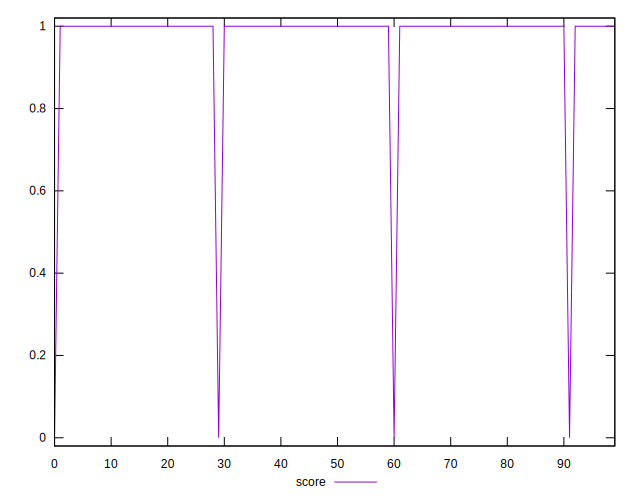
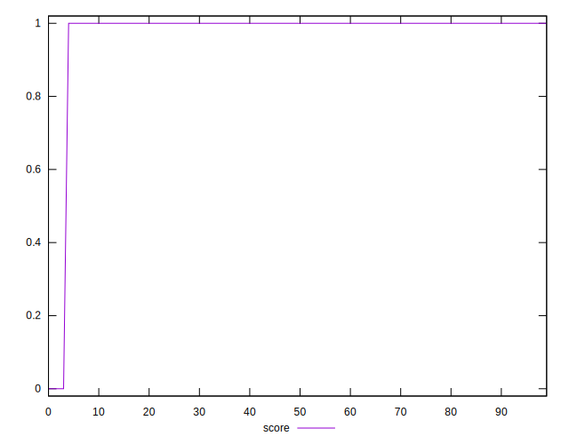
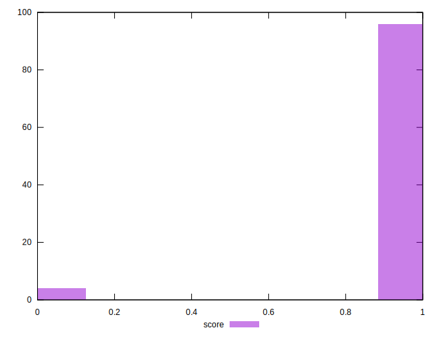
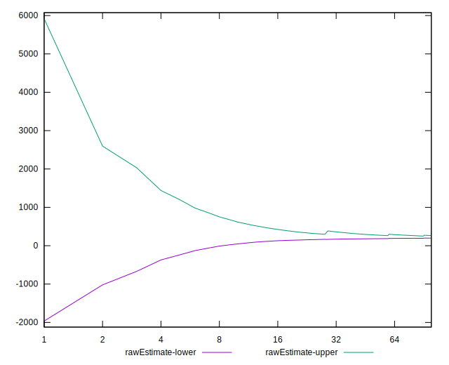
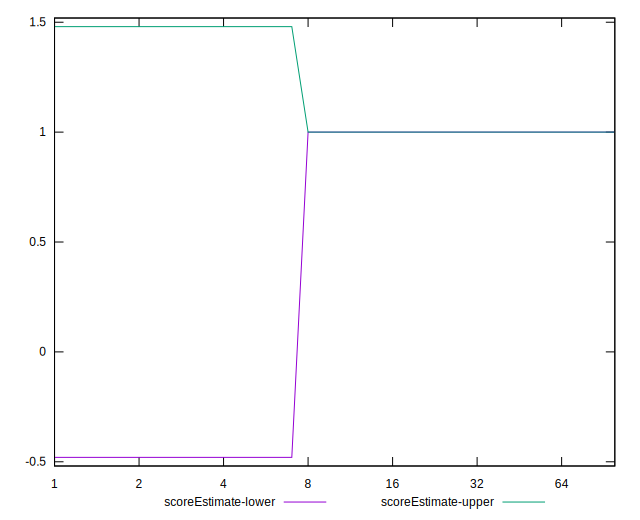
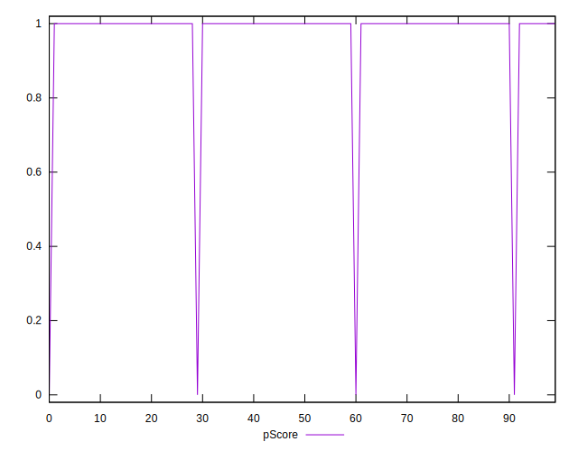
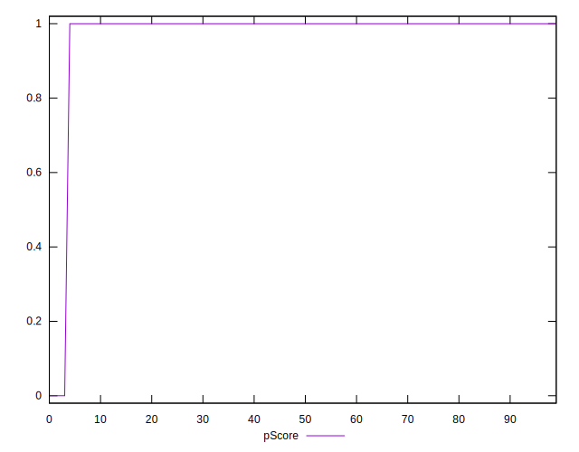

# //server-response-time/samples/card

[→ Parent](../..)


## Raw


```yaml
p90min: 161.876
p90max: 2703.501
p90range: 2541.625
p90mean: 203.63462765957445
median: 175.75799999999998
p90stdev: 259.5584511883137
mad: 10.785999999999973
stdevBySn: 14.744113800000017
lfitCenter: 230.59025839469135
lfitStdev: 134.72703903688085
mfitCenter: 230.59025839469135
mfitStdev: 168.85530287348942
mfitConfidence: 16.885530287348942
p90skewness: 9.502480640412786
p90eccentricity: 1.0000000000000002
p90discretization: 1
outlandishness: 2.025808533811235

```


## Score


```yaml
p90min: 0
p90max: 1
p90range: 1
p90mean: 0.9893617021276596
median: 1
p90stdev: 0.10259202937226548
mad: 0
stdevBySn: 0
lfitCenter: 0.9806252396582452
lfitStdev: 0.047624380658411104
mfitCenter: 0.9806252396582452
mfitStdev: 0.059688309620142425
mfitConfidence: 0.005968830962014242
p90skewness: -9.53995559151989
p90eccentricity: 1.0000000000000044
p90discretization: 47
outlandishness: 0.9415259105098853

```


## Raw Estimate


## Score Estimate


## P Score


```yaml
p90min: 0
p90max: 1
p90range: 1
p90mean: 0.9893617021276596
median: 1
p90stdev: 0.10259202937226548
mad: 0
stdevBySn: 0
lfitCenter: 0.9806252396582452
lfitStdev: 0.047624380658411104
mfitCenter: 0.9806252396582452
mfitStdev: 0.059688309620142425
mfitConfidence: 0.005968830962014242
p90skewness: -9.53995559151989
p90eccentricity: 1.0000000000000044
p90discretization: 47
outlandishness: 0.9415259105098853

```


## Score Difference


```yaml
p90min: 0
p90max: 0
p90range: 0
p90mean: 0
median: 0
p90stdev: 0
mad: 0
stdevBySn: 0
lfitCenter: 0
lfitStdev: 0
mfitCenter: 0
mfitStdev: 0
mfitConfidence: 0
p90skewness: .nan
p90eccentricity: .nan
p90discretization: 94
outlandishness: .nan

```


## P Score Difference


```yaml
p90min: 0
p90max: 0
p90range: 0
p90mean: 0
median: 0
p90stdev: 0
mad: 0
stdevBySn: 0
lfitCenter: 0
lfitStdev: 0
mfitCenter: 0
mfitStdev: 0
mfitConfidence: 0
p90skewness: .nan
p90eccentricity: .nan
p90discretization: 94
outlandishness: .nan

```

