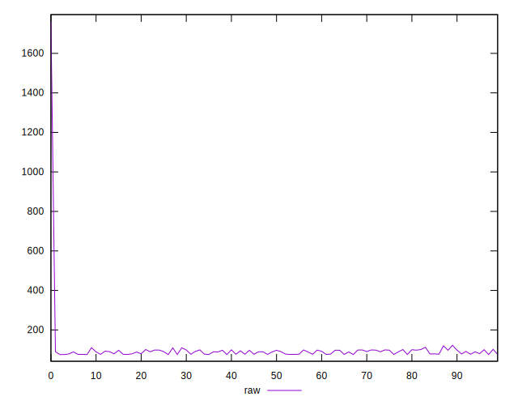
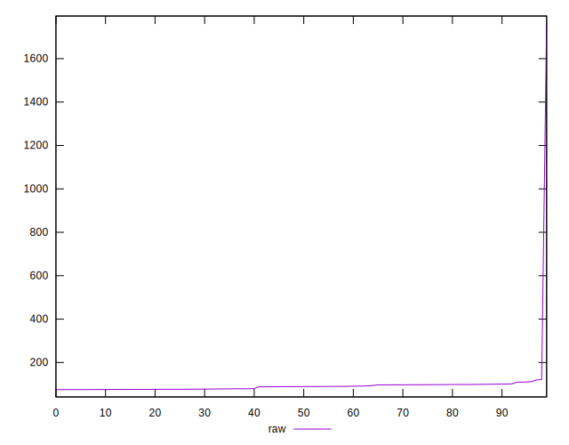
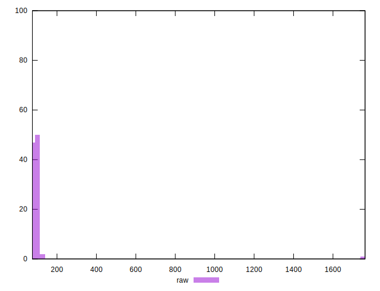
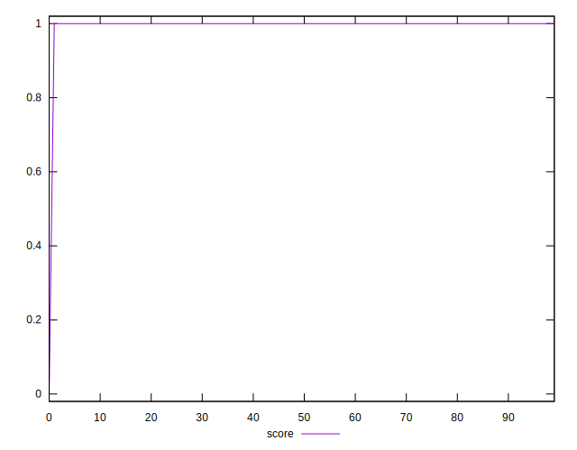
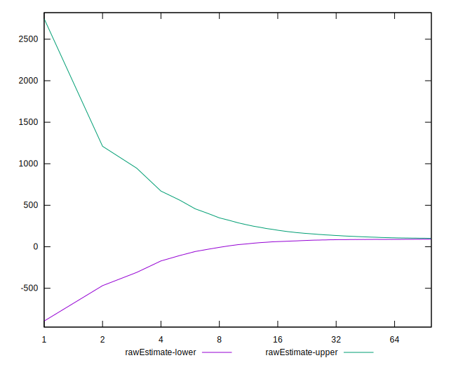
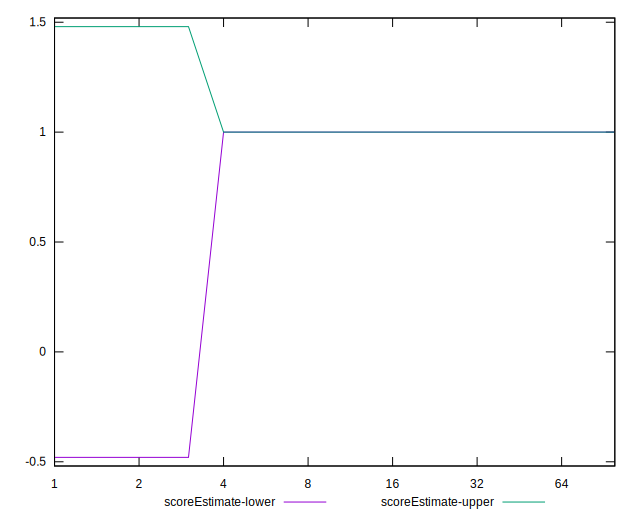

# //server-response-time/samples/music

[→ Parent](../..)


## Raw


```yaml
p90min: 75.42999999999999
p90max: 112.32900000000001
p90range: 36.899000000000015
p90mean: 88.11039361702126
median: 89.1635
p90stdev: 10.315206637938163
mad: 10.215499999999999
stdevBySn: 12.732793899999997
lfitCenter: 95.87575539537107
lfitStdev: 22.25343041730456
mfitCenter: 95.87575539537107
mfitStdev: 27.890538973839224
mfitConfidence: 2.7890538973839223
p90skewness: 0.2363975197569868
p90eccentricity: 1
p90discretization: 1
outlandishness: 1.423508987897533

```


## Score


```yaml
p90min: 1
p90max: 1
p90range: 0
p90mean: 1
median: 1
p90stdev: 0
mad: 0
stdevBySn: 0
lfitCenter: 0.9953463986474514
lfitStdev: 0.01161056518501907
mfitCenter: 0.9953463986474514
mfitStdev: 0.01455168550325008
mfitConfidence: 0.001455168550325008
p90skewness: .nan
p90eccentricity: .nan
p90discretization: 94
outlandishness: 0.9801

```


## Raw Estimate


## Score Estimate


## P Score


```yaml
p90min: 1
p90max: 1
p90range: 0
p90mean: 1
median: 1
p90stdev: 0
mad: 0
stdevBySn: 0
lfitCenter: 0.9953463986474514
lfitStdev: 0.01161056518501907
mfitCenter: 0.9953463986474514
mfitStdev: 0.01455168550325008
mfitConfidence: 0.001455168550325008
p90skewness: .nan
p90eccentricity: .nan
p90discretization: 94
outlandishness: 0.9801

```


## Score Difference


```yaml
p90min: 0
p90max: 0
p90range: 0
p90mean: 0
median: 0
p90stdev: 0
mad: 0
stdevBySn: 0
lfitCenter: 0
lfitStdev: 0
mfitCenter: 0
mfitStdev: 0
mfitConfidence: 0
p90skewness: .nan
p90eccentricity: .nan
p90discretization: 94
outlandishness: .nan

```


## P Score Difference


```yaml
p90min: 0
p90max: 0
p90range: 0
p90mean: 0
median: 0
p90stdev: 0
mad: 0
stdevBySn: 0
lfitCenter: 0
lfitStdev: 0
mfitCenter: 0
mfitStdev: 0
mfitConfidence: 0
p90skewness: .nan
p90eccentricity: .nan
p90discretization: 94
outlandishness: .nan

```

