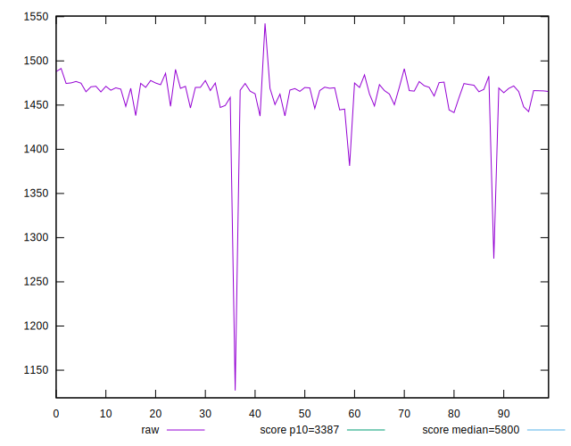
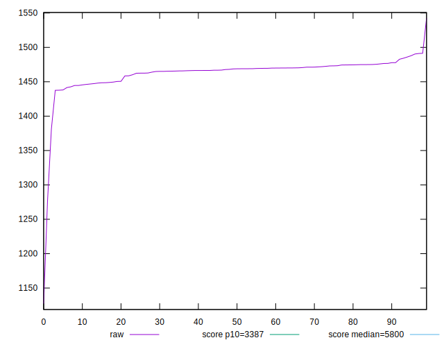
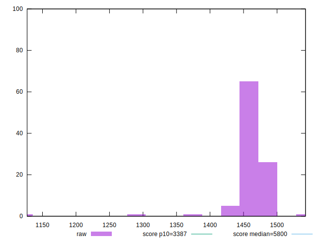
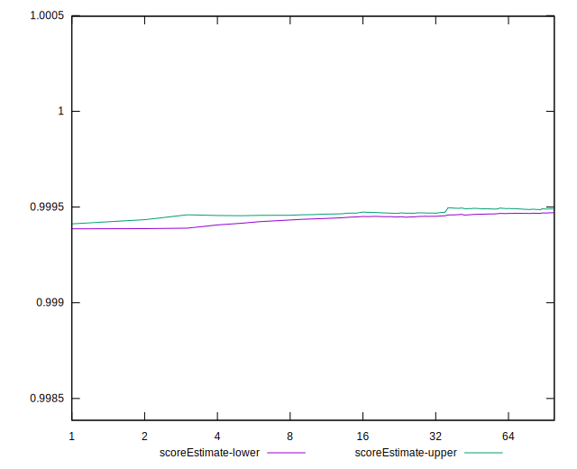
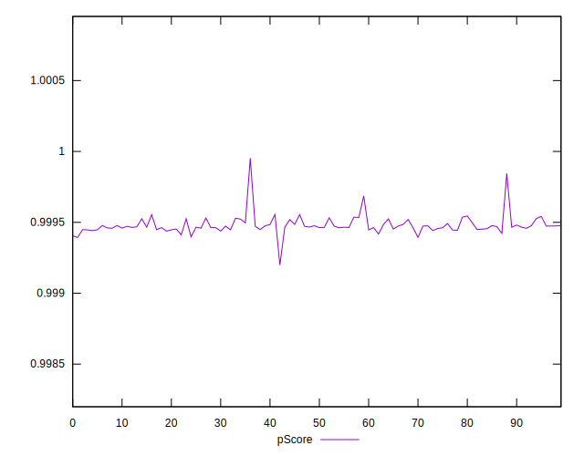
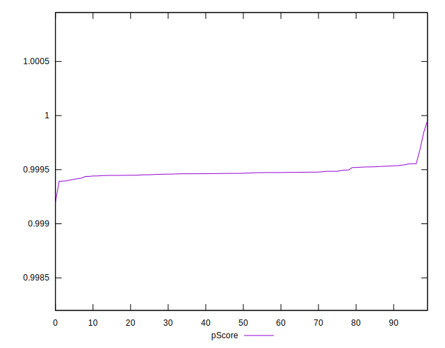
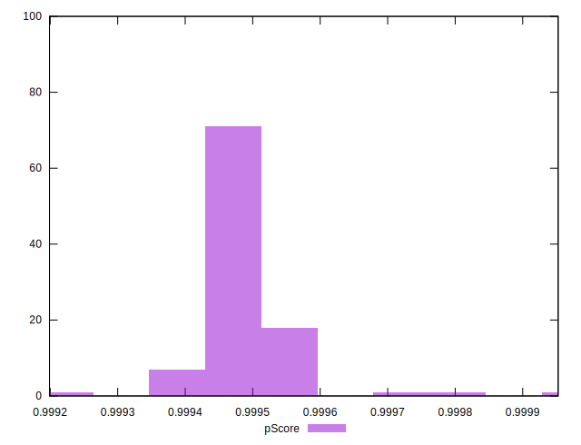
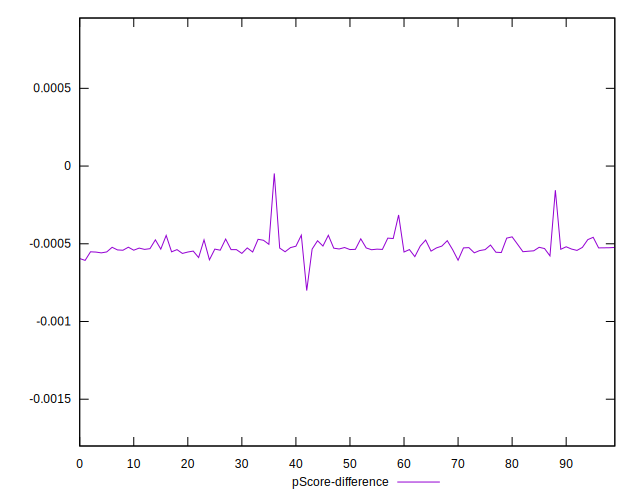
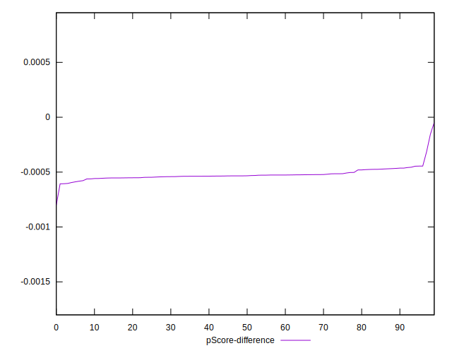
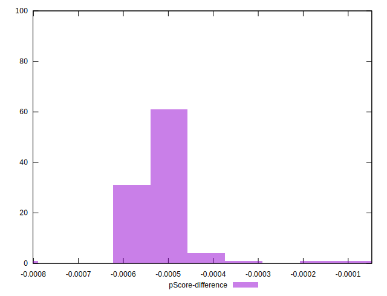

# //speed-index/samples/agenda

[→ Parent](../..)


## Raw


```yaml
p90min: 1437.5549999999998
p90max: 1490.3613
p90range: 52.80630000000019
p90mean: 1465.6254414893613
median: 1468.7759999999998
p90stdev: 11.397536625810108
mad: 5.630550000000085
stdevBySn: 9.49780676999981
lfitCenter: 1464.2115016423988
lfitStdev: 12.99671276126658
mfitCenter: 1464.2115016423988
mfitStdev: 16.288963858714823
mfitConfidence: 1.6288963858714822
p90skewness: -0.7531841905315957
p90eccentricity: 1.0000000000000009
p90discretization: 1
outlandishness: 0.9934021583734026

```


## Score


```yaml
p90min: 1
p90max: 1
p90range: 0
p90mean: 1
median: 1
p90stdev: 0
mad: 0
stdevBySn: 0
lfitCenter: 1
lfitStdev: 0
mfitCenter: 1
mfitStdev: 0
mfitConfidence: 0
p90skewness: .nan
p90eccentricity: .nan
p90discretization: 94
outlandishness: 1

```


## Raw Estimate


## Score Estimate


## P Score


```yaml
p90min: 0.999396746152384
p90max: 0.999555167967083
p90range: 0.00015842181469893912
p90mean: 0.9994749030957409
median: 0.9994662270989133
p90stdev: 0.00003376715138863102
mad: 0.000017468096590089743
stdevBySn: 0.000029308308858349288
lfitCenter: 0.99947554633088
lfitStdev: 0.000031612201491079926
mfitCenter: 0.99947554633088
mfitStdev: 0.00003962001908030396
mfitConfidence: 0.000003962001908030396
p90skewness: 0.6203349152435911
p90eccentricity: 1.0000000000000007
p90discretization: 1
outlandishness: 1.0000123989022123

```


## Score Difference


```yaml
p90min: 0
p90max: 0
p90range: 0
p90mean: 0
median: 0
p90stdev: 0
mad: 0
stdevBySn: 0
lfitCenter: 0
lfitStdev: 0
mfitCenter: 0
mfitStdev: 0
mfitConfidence: 0
p90skewness: .nan
p90eccentricity: .nan
p90discretization: 94
outlandishness: .nan

```


## P Score Difference


```yaml
p90min: -0.0006032538476159477
p90max: -0.00044483203291700857
p90range: 0.00015842181469893912
p90mean: -0.0005250969042591868
median: -0.0005337729010866932
p90stdev: 0.00003376715138863102
mad: 0.000017468096590089743
stdevBySn: 0.000029308308858349288
lfitCenter: -0.0005244536691200199
lfitStdev: 0.00003161220149107851
mfitCenter: -0.0005244536691200199
mfitStdev: 0.00003962001908030218
mfitConfidence: 0.000003962001908030218
p90skewness: 0.6203349152549285
p90eccentricity: 0.9999999999999999
p90discretization: 1
outlandishness: 0.976539115352522

```

