# //speed-index/samples/astro

[→ Parent](../..)


## Raw


```yaml
p90min: 9739.36698962195
p90max: 11024.27611131108
p90range: 1284.9091216891284
p90mean: 10381.821550466515
median: 10381.821550466515
p90stdev: 642.4545608445642
mad: 642.4545608445642
stdevBySn: 766.1913092632274
lfitCenter: 10381.821550466515
lfitStdev: 805.1973844995374
mfitCenter: 10381.821550466515
mfitStdev: 1009.1652663381999
mfitConfidence: 713.5876031656694
p90skewness: 0
p90eccentricity: 1
p90discretization: 1
outlandishness: 1

```

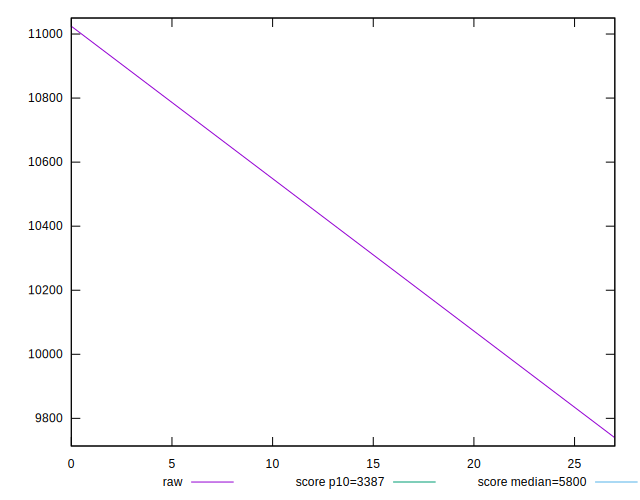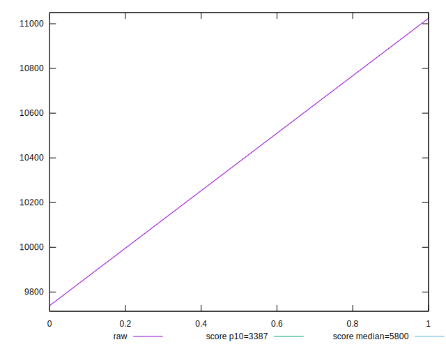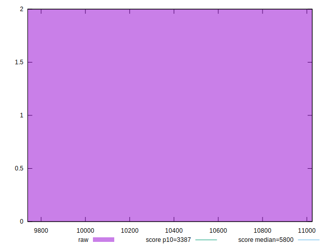
## Score


```yaml
p90min: 0.06
p90max: 0.11
p90range: 0.05
p90mean: 0.08499999999999999
median: 0.08499999999999999
p90stdev: 0.025
mad: 0.025
stdevBySn: 0.029815000000000005
lfitCenter: 0.08499999999999999
lfitStdev: 0.03133285346441596
mfitCenter: 0.08499999999999999
mfitStdev: 0.03926990824890252
mfitConfidence: 0.02776801841937251
p90skewness: 6.661338147750939e-16
p90eccentricity: 1
p90discretization: 1
outlandishness: 1

```

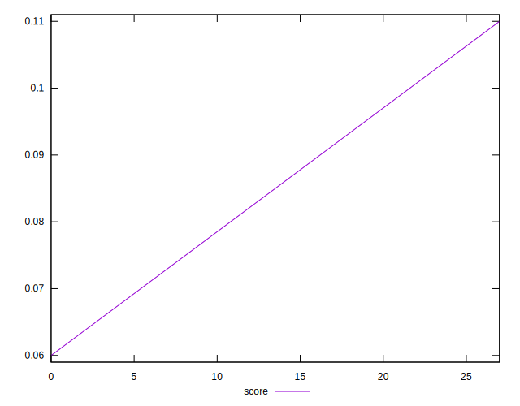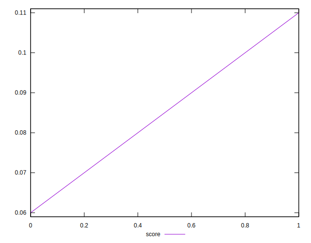
## Raw Estimate

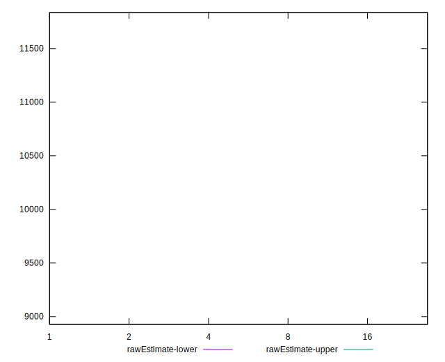
## Score Estimate

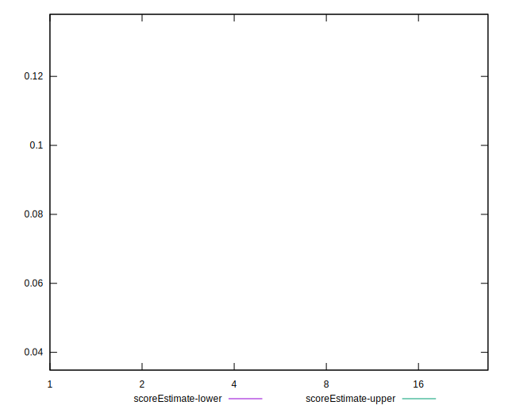
## P Score


```yaml
p90min: 0.06299489849182222
p90max: 0.10844004610020996
p90range: 0.04544514760838775
p90mean: 0.08571747229601609
median: 0.08571747229601609
p90stdev: 0.022722573804193874
mad: 0.022722573804193874
stdevBySn: 0.027098941518881616
lfitCenter: 0.08571747229601609
lfitStdev: 0.028478523013647332
mfitCenter: 0.08571747229601609
mfitStdev: 0.035692535538784376
mfitConfidence: 0.025238433917216273
p90skewness: 0
p90eccentricity: 1
p90discretization: 1
outlandishness: 1

```

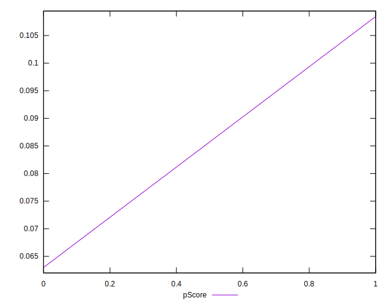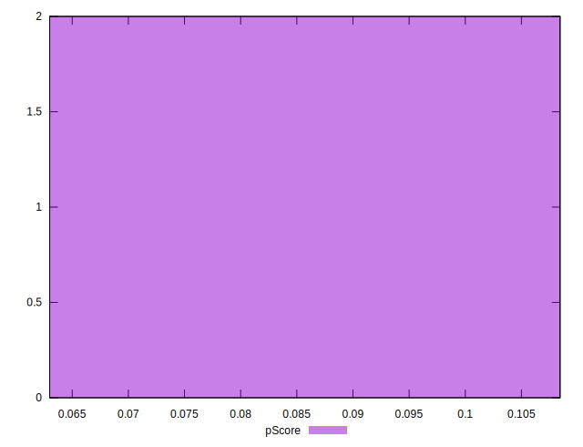
## Score Difference


```yaml
p90min: 0
p90max: 0
p90range: 0
p90mean: 0
median: 0
p90stdev: 0
mad: 0
stdevBySn: 0
lfitCenter: 0
lfitStdev: 0
mfitCenter: 0
mfitStdev: 0
mfitConfidence: 0
p90skewness: .nan
p90eccentricity: .nan
p90discretization: 2
outlandishness: .nan

```

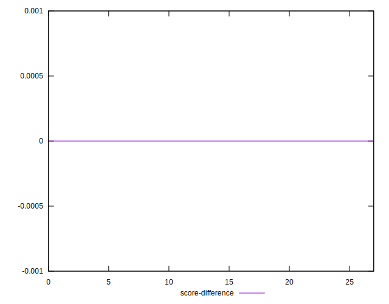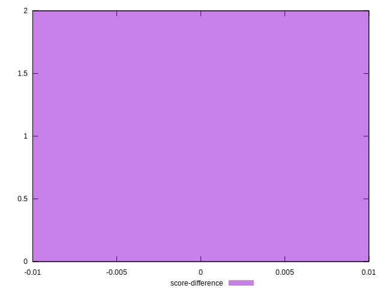
## P Score Difference


```yaml
p90min: -0.001559953899790037
p90max: 0.0029948984918222177
p90range: 0.004554852391612255
p90mean: 0.0007174722960160904
median: 0.0007174722960160904
p90stdev: 0.0022774261958061273
mad: 0.0022774261958061273
stdevBySn: 0.0027160584811183877
lfitCenter: 0.0007174722960160904
lfitStdev: 0.002854330450768627
mfitCenter: 0.0007174722960160904
mfitStdev: 0.003577372710118149
mfitConfidence: 0.0025295845021562403
p90skewness: 0
p90eccentricity: 1
p90discretization: 1
outlandishness: 1

```

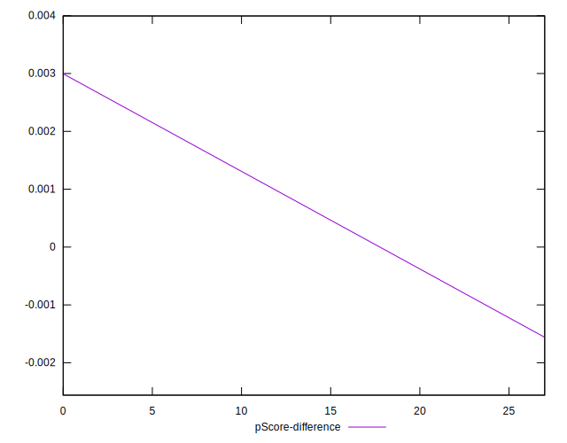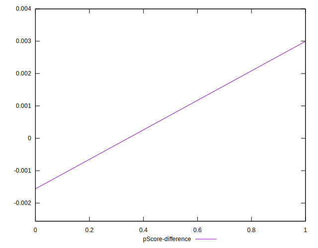