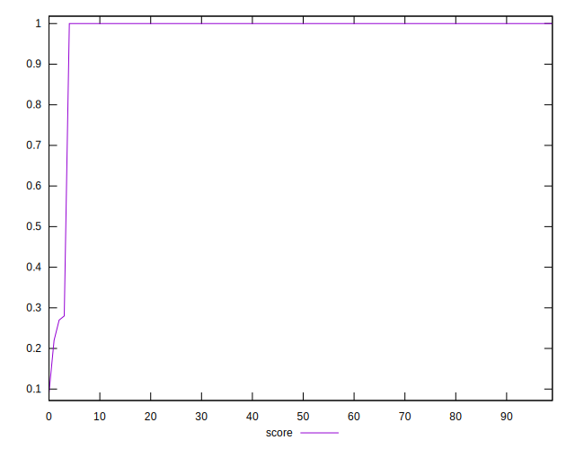
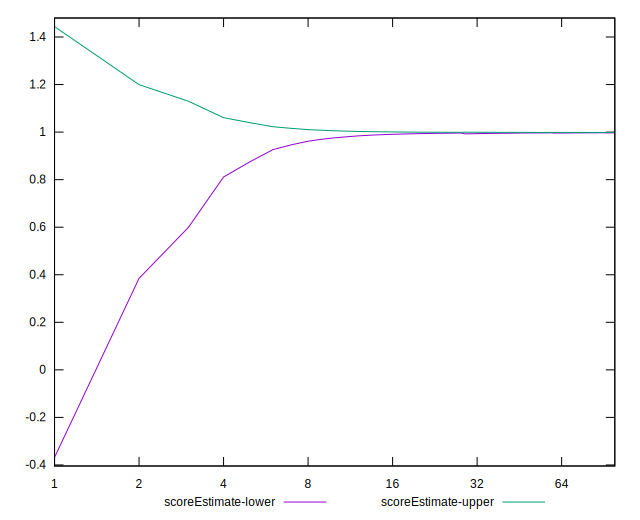

# //speed-index/samples/card

[→ Parent](../..)


## Raw


```yaml
p90min: 1589.4324
p90max: 7434.815632260516
p90range: 5845.383232260517
p90mean: 1715.9684261078658
median: 1624.5852
p90stdev: 596.3033204024074
mad: 7.213350000000219
stdevBySn: 12.063268260000253
lfitCenter: 1771.556917588106
lfitStdev: 316.661516151719
mfitCenter: 1771.556917588106
mfitStdev: 396.8763553360639
mfitConfidence: 39.68763553360639
p90skewness: 9.381736067061047
p90eccentricity: 1.0000000000000004
p90discretization: 1
outlandishness: 1.24809574259869

```


## Score


```yaml
p90min: 0.28
p90max: 1
p90range: 0.72
p90mean: 0.9923404255319149
median: 1
p90stdev: 0.07386626114803112
mad: 0
stdevBySn: 0
lfitCenter: 0.9848302833002474
lfitStdev: 0.03728811865777348
mfitCenter: 0.9848302833002474
mfitStdev: 0.04673372631471084
mfitConfidence: 0.004673372631471084
p90skewness: -9.539955591519915
p90eccentricity: 1.0000000000000027
p90discretization: 47
outlandishness: 0.9527250006803691

```


## Raw Estimate


## Score Estimate


## P Score


```yaml
p90min: 0.27705916021742705
p90max: 0.9989788669133723
p90range: 0.7219197066959453
p90mean: 0.9908697216025242
median: 0.9987849065020058
p90stdev: 0.07402052913450403
mad: 0.0000425632243609142
stdevBySn: 0.00007053111567293051
lfitCenter: 0.9834854225890575
lfitStdev: 0.03723410363636672
mfitCenter: 0.9834854225890575
mfitStdev: 0.04666602852468623
mfitConfidence: 0.004666602852468623
p90skewness: -9.539236702635028
p90eccentricity: 0.9999999999999997
p90discretization: 1
outlandishness: 0.9528152135445137

```


## Score Difference


```yaml
p90min: 0
p90max: 0
p90range: 0
p90mean: 0
median: 0
p90stdev: 0
mad: 0
stdevBySn: 0
lfitCenter: 0
lfitStdev: 0
mfitCenter: 0
mfitStdev: 0
mfitConfidence: 0
p90skewness: .nan
p90eccentricity: .nan
p90discretization: 94
outlandishness: .nan

```


## P Score Difference


```yaml
p90min: -0.0026041153274882767
p90max: -0.001015499821910848
p90range: 0.0015886155055774287
p90mean: -0.0014145948531588185
median: -0.0012129359700574494
p90stdev: 0.00042650634289087623
mad: 0.000041728812235741763
stdevBySn: 0.00007053111567293051
lfitCenter: -0.0013338669499946246
lfitStdev: 0.0003652959175796011
mfitCenter: -0.0013338669499946246
mfitStdev: 0.00045783053826684033
mfitConfidence: 0.000045783053826684035
p90skewness: -1.4716874960185524
p90eccentricity: 1.0000000000000004
p90discretization: 1
outlandishness: 0.9651546636978988

```

