# //speed-index/samples/music

[→ Parent](../..)


## Raw


```yaml
p90min: 3607.937913718059
p90max: 4809.103572940263
p90range: 1201.1656592222039
p90mean: 4066.9157846582207
median: 4054.0697364117104
p90stdev: 305.2178084489149
mad: 153.5227770784552
stdevBySn: 235.3278032454908
lfitCenter: 4068.447193013284
lfitStdev: 215.76247418770274
mfitCenter: 4068.447193013284
mfitStdev: 270.4181594737248
mfitConfidence: 27.04181594737248
p90skewness: 0.7889379736851895
p90eccentricity: 0.9999999999999996
p90discretization: 1
outlandishness: 1.0152901282278148

```

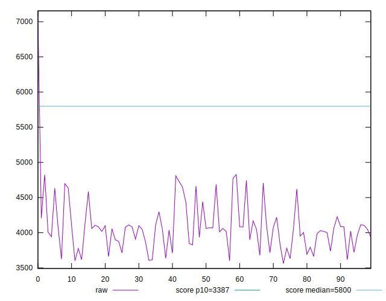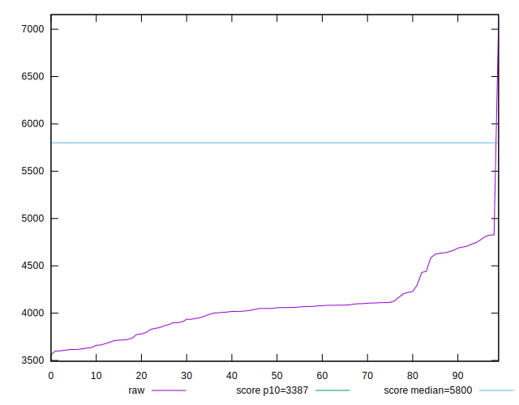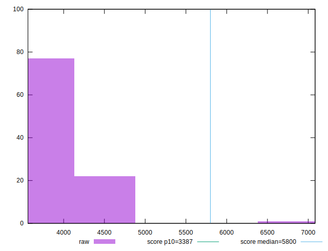
## Score


```yaml
p90min: 0.67
p90max: 0.87
p90range: 0.19999999999999996
p90mean: 0.7991489361702125
median: 0.8
p90stdev: 0.05108731729333581
mad: 0.024999999999999967
stdevBySn: 0.0357779999999999
lfitCenter: 0.799395259207185
lfitStdev: 0.03554501369896496
mfitCenter: 0.799395259207185
mfitStdev: 0.044549068224813075
mfitConfidence: 0.004454906822481308
p90skewness: -0.9181554228376982
p90eccentricity: 1.0000000000000007
p90discretization: 5.222222222222222
outlandishness: 0.9871554635763468

```

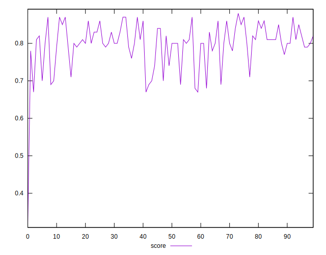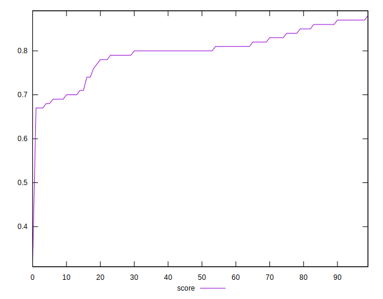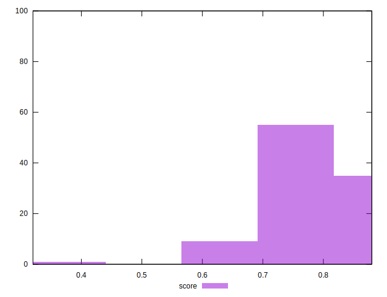
## Raw Estimate

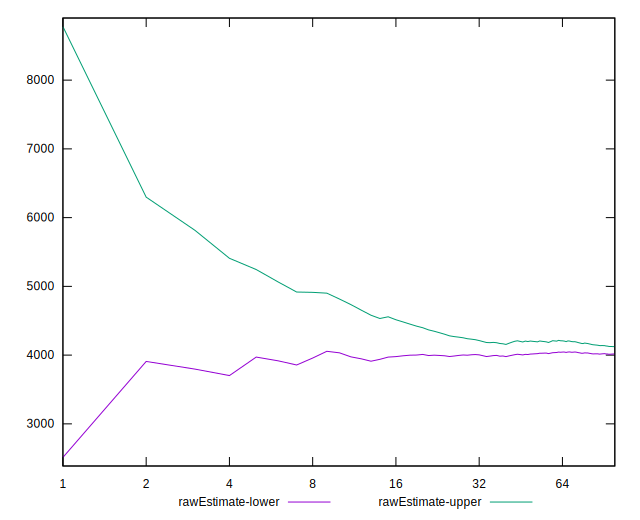
## Score Estimate

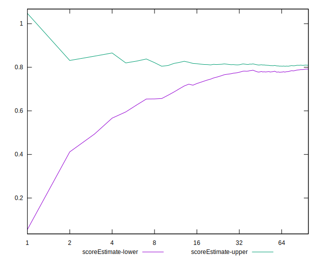
## P Score


```yaml
p90min: 0.6723260721489877
p90max: 0.8709724487709263
p90range: 0.19864637662193863
p90mean: 0.7994464460648121
median: 0.80323736973174
p90stdev: 0.05060609988470816
mad: 0.02471621234660054
stdevBySn: 0.03753836005537772
lfitCenter: 0.7997624954020094
lfitStdev: 0.03555077200574256
mfitCenter: 0.7997624954020094
mfitStdev: 0.0445562851921117
mfitConfidence: 0.00445562851921117
p90skewness: -0.9381184571121457
p90eccentricity: 0.9999999999999996
p90discretization: 1
outlandishness: 0.9870373996429538

```

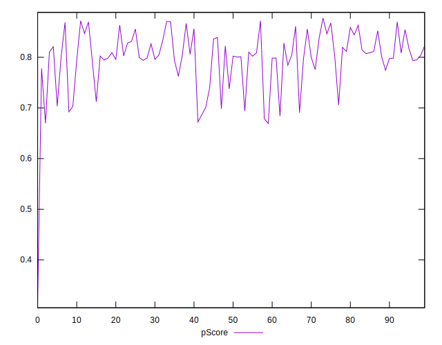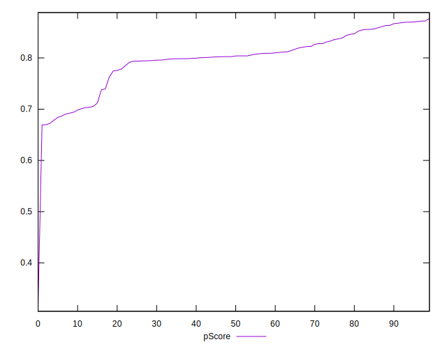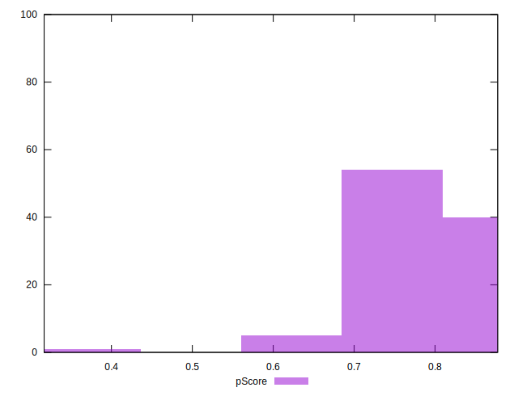
## Score Difference


```yaml
p90min: 0
p90max: 1.1102230246251565e-16
p90range: 1.1102230246251565e-16
p90mean: 1.7716324861039733e-17
median: 0
p90stdev: 4.065758244982898e-17
mad: 0
stdevBySn: 0
lfitCenter: 1.1841287445510115e-17
lfitStdev: 2.6515949121427835e-17
mfitCenter: 1.1841287445510115e-17
mfitStdev: 3.323281393166429e-17
mfitConfidence: 3.3232813931664293e-18
p90skewness: 1.8591772600772072
p90eccentricity: 1.000000000000001
p90discretization: 47
outlandishness: 1.2723839999999997

```

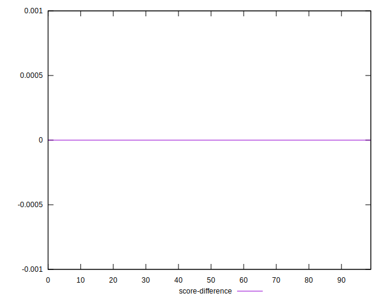
## P Score Difference


```yaml
p90min: -0.004281236149345391
p90max: 0.004463099949358673
p90range: 0.008744336098704064
p90mean: 0.00025400572656068615
median: 0.0002528924711481251
p90stdev: 0.002602039502475361
mad: 0.0022101585994145356
stdevBySn: 0.0030286003396847857
lfitCenter: 0.00025611129170113607
lfitStdev: 0.0023749021561126266
mfitCenter: 0.00025611129170113607
mfitStdev: 0.0029764984499920976
mfitConfidence: 0.00029764984499920975
p90skewness: -0.03618093724608716
p90eccentricity: 0.9999999999999997
p90discretization: 1
outlandishness: 0.9539835329844553

```

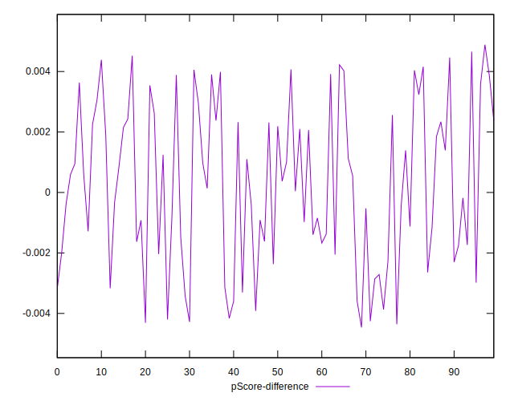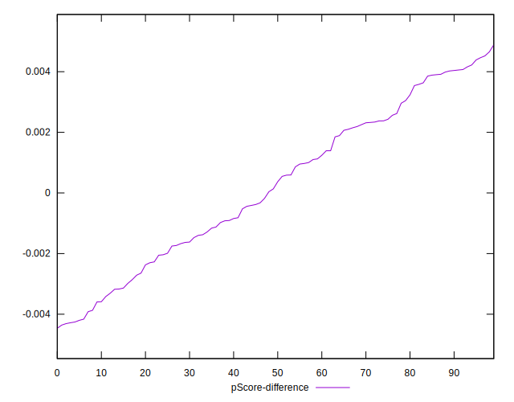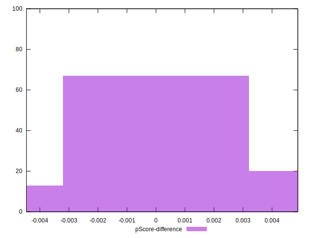