# //total-blocking-time/samples/astro

[→ Parent](../..)


## Raw


```yaml
p90min: 371
p90max: 402.49999999999864
p90range: 31.499999999998636
p90mean: 383.46276595744683
median: 382.5
p90stdev: 7.773810151037439
mad: 5.25
stdevBySn: 7.45375
lfitCenter: 384.54903808883415
lfitStdev: 8.099743147650697
mfitCenter: 384.54903808883415
mfitStdev: 10.15152260578986
mfitConfidence: 1.015152260578986
p90skewness: 0.6840155534820053
p90eccentricity: 0.9999999999999991
p90discretization: 1.88
outlandishness: 1.0159471424193869

```

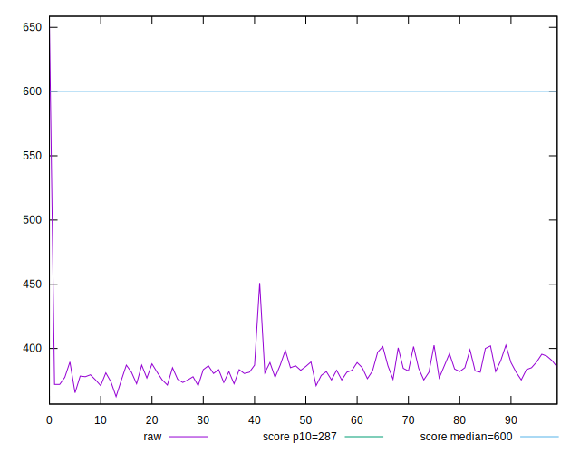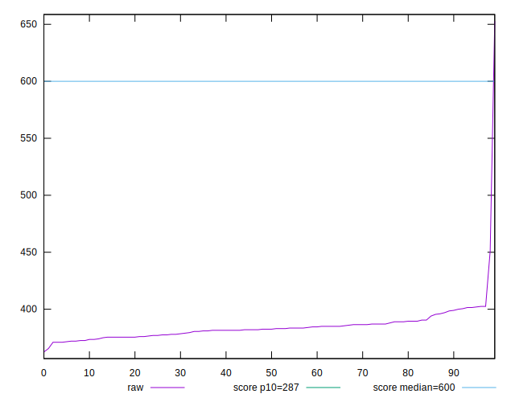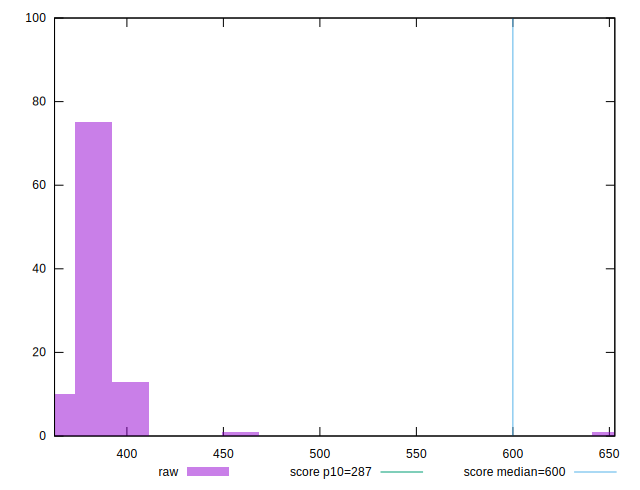
## Score


```yaml
p90min: 0.76
p90max: 0.8
p90range: 0.040000000000000036
p90mean: 0.7811702127659573
median: 0.78
p90stdev: 0.010503938772763524
mad: 0.010000000000000009
stdevBySn: 0.011926000000000011
lfitCenter: 0.779589704647105
lfitStdev: 0.00990333869814334
mfitCenter: 0.779589704647105
mfitStdev: 0.012411994409496205
mfitConfidence: 0.0012411994409496205
p90skewness: -0.3998598562370614
p90eccentricity: 0.9999999999999992
p90discretization: 18.8
outlandishness: 0.9903705633098622

```

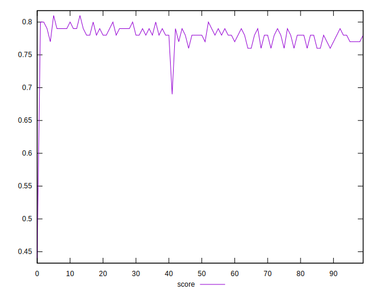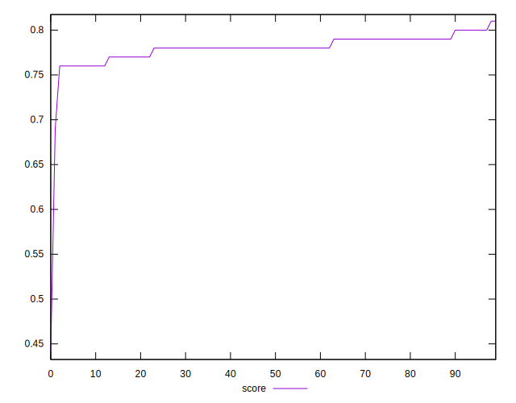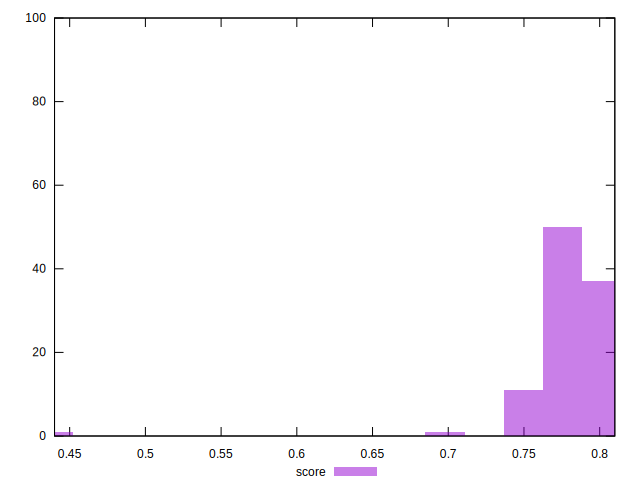
## Raw Estimate

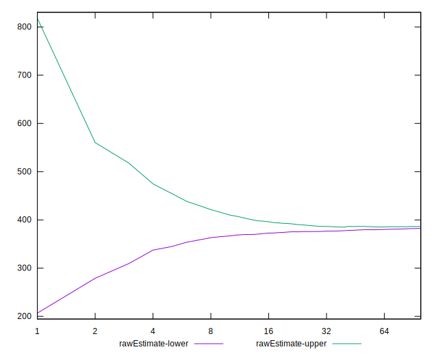
## Score Estimate

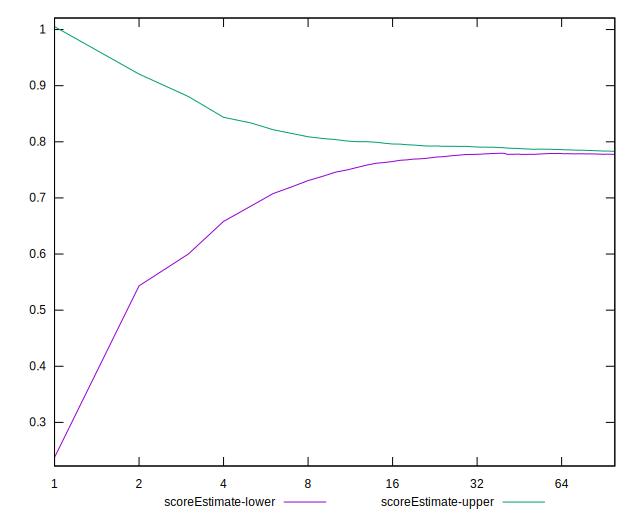
## P Score


```yaml
p90min: 0.7560956687801547
p90max: 0.7982589790964014
p90range: 0.04216331031624676
p90mean: 0.7816800258511081
median: 0.783001103708371
p90stdev: 0.010403105012764967
mad: 0.006988854963750624
stdevBySn: 0.009960393695876592
lfitCenter: 0.7803242615970603
lfitStdev: 0.010684946565494412
mfitCenter: 0.7803242615970603
mfitStdev: 0.013391594600470038
mfitConfidence: 0.0013391594600470039
p90skewness: -0.6997950098641547
p90eccentricity: 1.000000000000001
p90discretization: 1.88
outlandishness: 0.9900706618390198

```

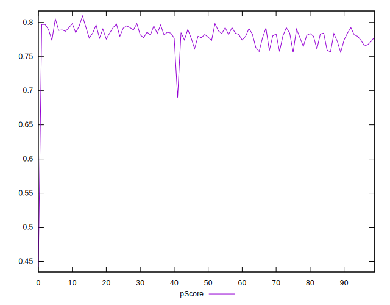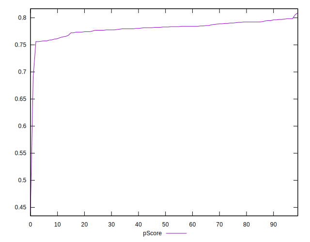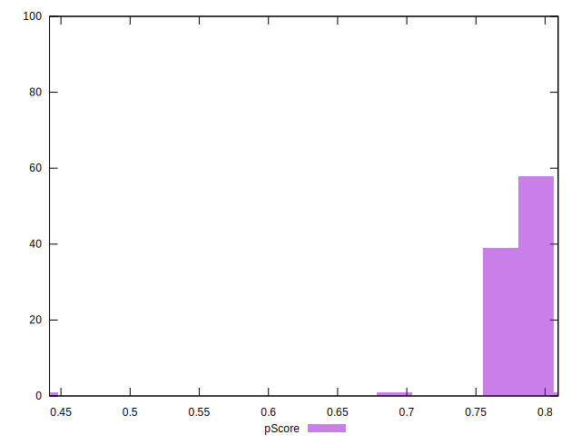
## Score Difference


```yaml
p90min: 0
p90max: 0
p90range: 0
p90mean: 0
median: 0
p90stdev: 0
mad: 0
stdevBySn: 0
lfitCenter: 5.166535369026208e-19
lfitStdev: 1.2890316797319448e-18
mfitCenter: 5.166535369026208e-19
mfitStdev: 1.6155616292812394e-18
mfitConfidence: 1.6155616292812395e-19
p90skewness: .nan
p90eccentricity: .nan
p90discretization: 94
outlandishness: .inf

```

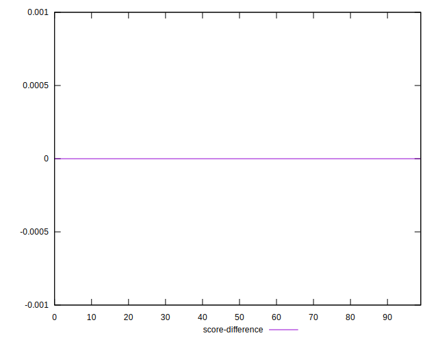
## P Score Difference


```yaml
p90min: -0.0044447016563466946
p90max: 0.004335121296051847
p90range: 0.008779822952398542
p90mean: 0.0004113926753921492
median: 0.0003293335015357446
p90stdev: 0.0027328382048835698
mad: 0.002671770206835178
stdevBySn: 0.003251735424763872
lfitCenter: 0.0004511445149570083
lfitStdev: 0.002549067601696674
mfitCenter: 0.0004511445149570083
mfitStdev: 0.003194782465394084
mfitConfidence: 0.0003194782465394084
p90skewness: -0.12754545962347352
p90eccentricity: 1.0000000000000002
p90discretization: 1.8076923076923077
outlandishness: 0.8966838065019567

```

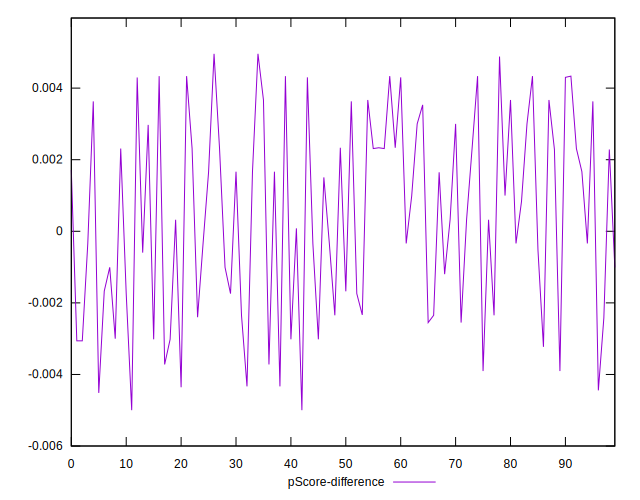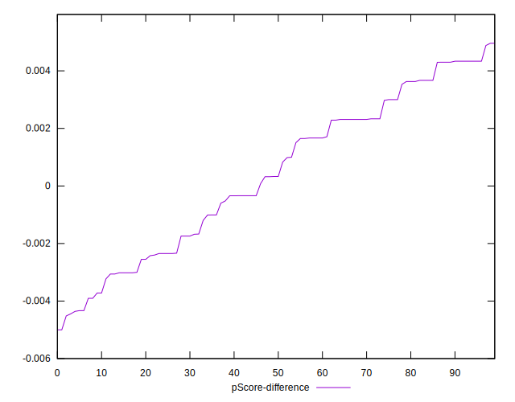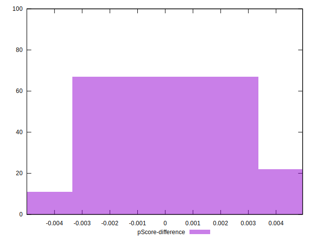