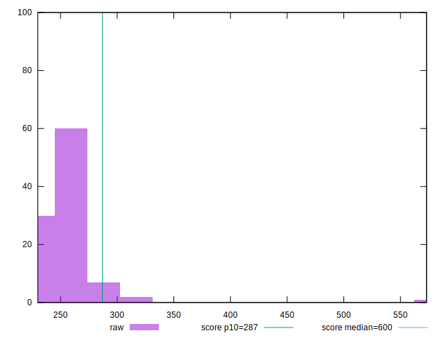
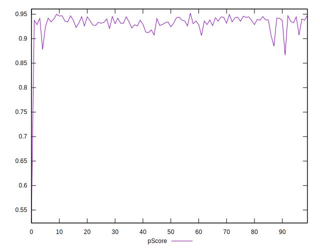

# //total-blocking-time/samples/music

[→ Parent](../..)


## Raw


```yaml
p90min: 235.9514999999992
p90max: 301
p90range: 65.04850000000079
p90mean: 252.14638297872324
median: 250
p90stdev: 11.710656914506774
mad: 7.973000000000411
stdevBySn: 11.144847000000848
lfitCenter: 253.2163411958624
lfitStdev: 11.339180566378186
mfitCenter: 253.2163411958624
mfitStdev: 14.211555323715233
mfitConfidence: 1.4211555323715233
p90skewness: 1.3222160562459115
p90eccentricity: 1.0000000000000002
p90discretization: 1.0444444444444445
outlandishness: 1.030447870658493

```


## Score


```yaml
p90min: 0.88
p90max: 0.95
p90range: 0.06999999999999995
p90mean: 0.9337234042553186
median: 0.94
p90stdev: 0.011107218522414246
mad: 0.009999999999999898
stdevBySn: 0.01192599999999988
lfitCenter: 0.9324089935043619
lfitStdev: 0.011986623594194184
mfitCenter: 0.9324089935043619
mfitStdev: 0.01502300482439989
mfitConfidence: 0.001502300482439989
p90skewness: -1.6100759755436975
p90eccentricity: 1.0000000000000009
p90discretization: 15.666666666666666
outlandishness: 0.98990823803329

```


## Raw Estimate


## Score Estimate


## P Score


```yaml
p90min: 0.8846936800115661
p90max: 0.9475891371021846
p90range: 0.0628954570906185
p90mean: 0.9336593260711707
median: 0.935921217732844
p90stdev: 0.010837076478288597
mad: 0.006908828086951646
stdevBySn: 0.00942761135847099
lfitCenter: 0.9322083800687887
lfitStdev: 0.011222150854054827
mfitCenter: 0.9322083800687887
mfitStdev: 0.01406488033062681
mfitConfidence: 0.001406488033062681
p90skewness: -1.6113002306890505
p90eccentricity: 0.9999999999999991
p90discretization: 1.0444444444444445
outlandishness: 0.9898580995796757

```


## Score Difference


```yaml
p90min: 0
p90max: 1.1102230246251565e-16
p90range: 1.1102230246251565e-16
p90mean: 5.905441620346577e-17
median: 1.1102230246251565e-16
p90stdev: 5.5397952889581605e-17
mad: 0
stdevBySn: 0
lfitCenter: 6.134595835866052e-17
lfitStdev: 6.880425346057831e-17
mfitCenter: 6.134595835866052e-17
mfitStdev: 8.623334365635339e-17
mfitConfidence: 8.623334365635339e-18
p90skewness: -0.1279204298133669
p90eccentricity: 0.9999999999999984
p90discretization: 47
outlandishness: 0.9928129600000001

```


## P Score Difference


```yaml
p90min: -0.004575416267845855
p90max: 0.004646061790926859
p90range: 0.009221478058772714
p90mean: -0.000091708235188807
median: -0.00042098655693817433
p90stdev: 0.00290953421479111
mad: 0.002703526102967424
stdevBySn: 0.003391432790436945
lfitCenter: -0.00014044493888097553
lfitStdev: 0.0028033294330269396
mfitCenter: -0.00014044493888097553
mfitStdev: 0.0035134524135006944
mfitConfidence: 0.00035134524135006946
p90skewness: 0.11214709159971395
p90eccentricity: 1
p90discretization: 1.0444444444444445
outlandishness: 0.9057479834385657

```

