# //unminified-javascript/samples/astro

[→ Parent](../..)


## Raw


```yaml
p90min: 0
p90max: 150
p90range: 150
p90mean: 106.91489361702128
median: 150
p90stdev: 67.87075633447897
mad: 0
stdevBySn: 0
lfitCenter: 118.43430920286157
lfitStdev: 63.85439506511077
mfitCenter: 118.43430920286157
mfitStdev: 80.02961614536164
mfitConfidence: 8.002961614536165
p90skewness: -0.9404608211447982
p90eccentricity: 0.9999999999999996
p90discretization: 47
outlandishness: 0.9922538650033415

```

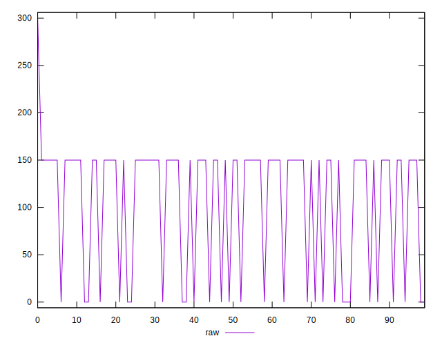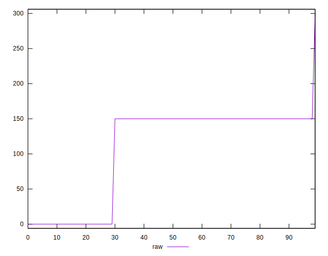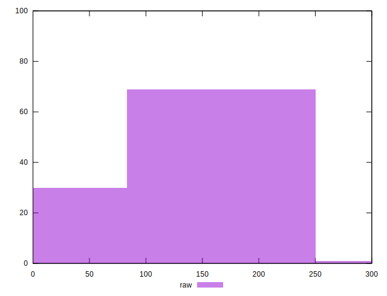
## Score


```yaml
p90min: 0.88
p90max: 1
p90range: 0.12
p90mean: 0.9144680851063829
median: 0.88
p90stdev: 0.05429660506758317
mad: 0
stdevBySn: 0
lfitCenter: 0.9052060166241855
lfitStdev: 0.051108606154884294
mfitCenter: 0.9052060166241855
mfitStdev: 0.06405513869686148
mfitConfidence: 0.0064055138696861484
p90skewness: 0.9404608211448205
p90eccentricity: 0.9999999999999996
p90discretization: 47
outlandishness: 1.0005072769732195

```

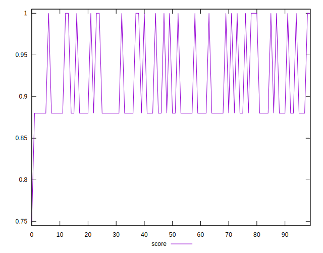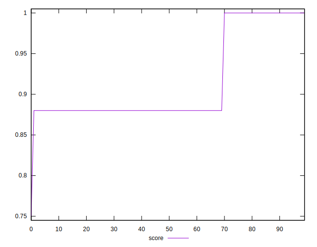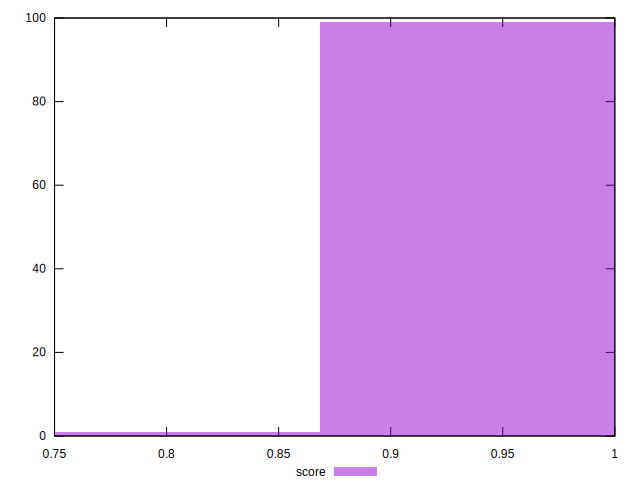
## Raw Estimate

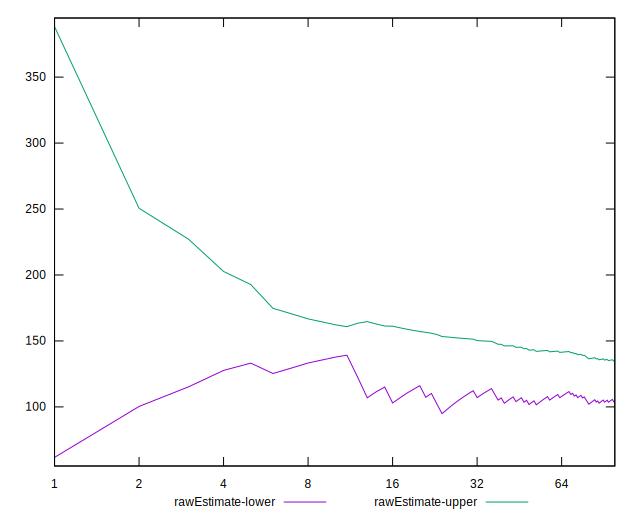
## Score Estimate

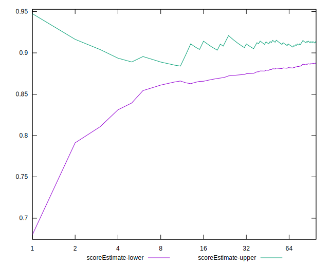
## P Score


```yaml
p90min: 0.875
p90max: 1
p90range: 0.125
p90mean: 0.910904255319149
median: 0.875
p90stdev: 0.056558963612065825
mad: 0
stdevBySn: 0
lfitCenter: 0.901304742330949
lfitStdev: 0.05321199588759256
mfitCenter: 0.901304742330949
mfitStdev: 0.06669134678780168
mfitConfidence: 0.0066691346787801685
p90skewness: 0.9404608211447935
p90eccentricity: 1.0000000000000002
p90discretization: 47
outlandishness: 1.0007592681549364

```

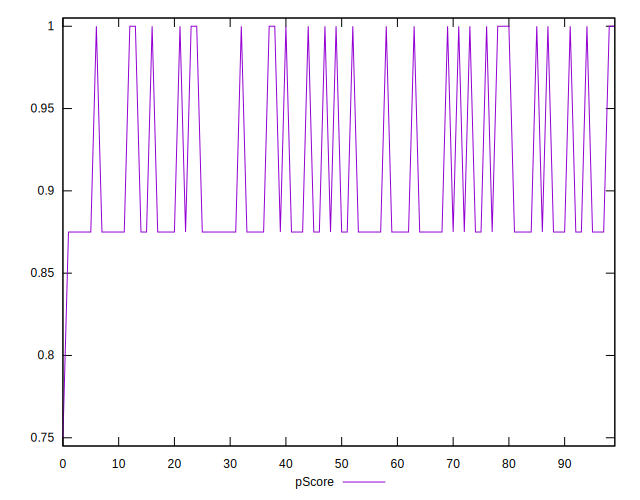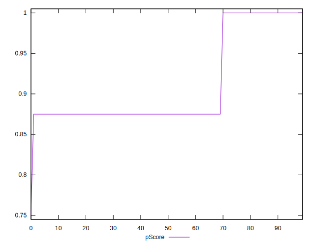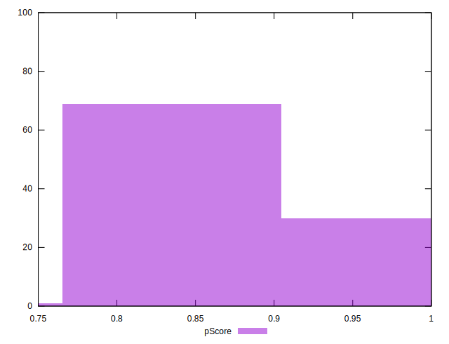
## Score Difference


```yaml
p90min: 0
p90max: 0
p90range: 0
p90mean: 0
median: 0
p90stdev: 0
mad: 0
stdevBySn: 0
lfitCenter: 0
lfitStdev: 0
mfitCenter: 0
mfitStdev: 0
mfitConfidence: 0
p90skewness: .nan
p90eccentricity: .nan
p90discretization: 94
outlandishness: .nan

```


## P Score Difference


```yaml
p90min: -0.0050000000000000044
p90max: 0
p90range: 0.0050000000000000044
p90mean: -0.0035106382978723435
median: -0.0050000000000000044
p90stdev: 0.0022866154532132643
mad: 0
stdevBySn: 0
lfitCenter: -0.003870246745720162
lfitStdev: 0.0021920082553512853
mfitCenter: -0.003870246745720162
mfitStdev: 0.0027472749383084757
mfitConfidence: 0.0002747274938308476
p90skewness: 0.8839599998785492
p90eccentricity: 1.0000000000000004
p90discretization: 47
outlandishness: 0.9657528925619834

```

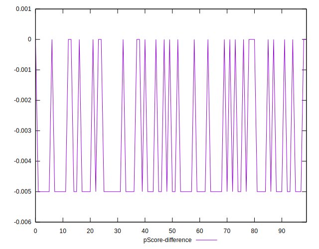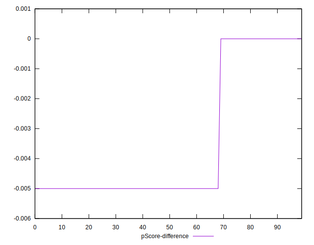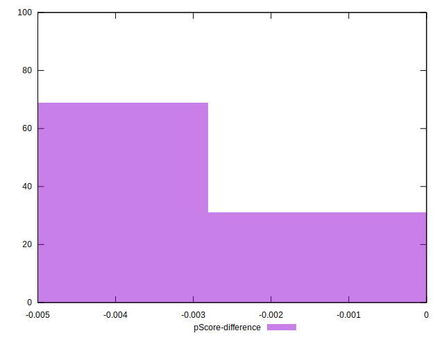