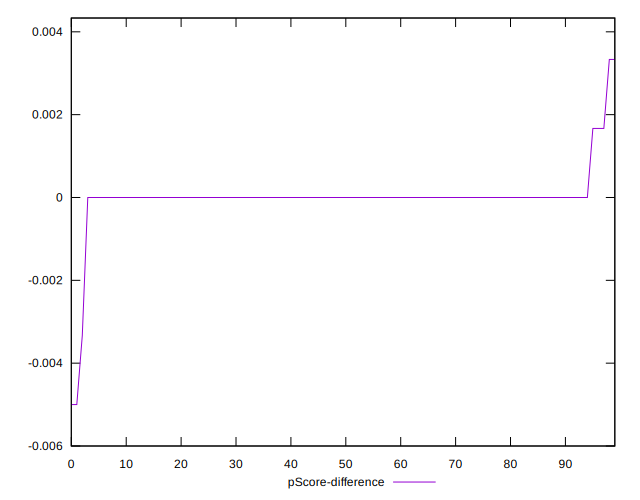

# //unminified-javascript/samples/card

[→ Parent](../..)


## Raw


```yaml
p90min: 0
p90max: 60
p90range: 60
p90mean: 3.8297872340425534
median: 0
p90stdev: 12.97349039951159
mad: 0
stdevBySn: 0
lfitCenter: 3.063316554987699
lfitStdev: 7.129723051169295
mfitCenter: 3.063316554987699
mfitStdev: 8.935782704166245
mfitConfidence: 0.8935782704166245
p90skewness: 3.648804944244064
p90eccentricity: 1.000000000000004
p90discretization: 18.8
outlandishness: 2.3733114197530867

```


## Score


```yaml
p90min: 0.95
p90max: 1
p90range: 0.050000000000000044
p90mean: 0.9968085106382979
median: 1
p90stdev: 0.010739939969467208
mad: 0
stdevBySn: 0
lfitCenter: 0.9974503866070771
lfitStdev: 0.005934103463612202
mfitCenter: 0.9974503866070771
mfitStdev: 0.007437295770721772
mfitConfidence: 0.0007437295770721772
p90skewness: -3.668000142587839
p90eccentricity: 0.9999999999999994
p90discretization: 23.5
outlandishness: 0.9965749761506387

```


## Raw Estimate


## Score Estimate


## P Score


```yaml
p90min: 0.95
p90max: 1
p90range: 0.050000000000000044
p90mean: 0.9968085106382979
median: 1
p90stdev: 0.010811241999593013
mad: 0
stdevBySn: 0
lfitCenter: 0.9974472362041771
lfitStdev: 0.005941435875974241
mfitCenter: 0.9974472362041771
mfitStdev: 0.00744648558680499
mfitConfidence: 0.000744648558680499
p90skewness: -3.648804944244059
p90eccentricity: 1.0000000000000029
p90discretization: 18.8
outlandishness: 0.996541593688894

```


## Score Difference


```yaml
p90min: 0
p90max: 1.1102230246251565e-16
p90range: 1.1102230246251565e-16
p90mean: 3.543264972207946e-18
median: 0
p90stdev: 1.9514781802162948e-17
mad: 0
stdevBySn: 0
lfitCenter: 3.3158666172059827e-18
lfitStdev: 8.063403855810743e-18
mfitCenter: 3.3158666172059827e-18
mfitStdev: 1.0105978057540984e-17
mfitConfidence: 1.0105978057540984e-18
p90skewness: 5.326002287485505
p90eccentricity: 1.0000000000000056
p90discretization: 47
outlandishness: 3.5344000000000007

```


## P Score Difference


```yaml
p90min: 0
p90max: 0.0016666666666667052
p90range: 0.0016666666666667052
p90mean: 0.00003546099290780224
median: 0
p90stdev: 0.00024050815542997942
mad: 0
stdevBySn: 0
lfitCenter: -0.000006872497019352791
lfitStdev: 0.00015894248877102463
mfitCenter: -0.000006872497019352791
mfitStdev: 0.00019920486839728371
mfitConfidence: 0.00001992048683972837
p90skewness: 6.6348880269703905
p90eccentricity: 1.000000000000001
p90discretization: 47
outlandishness: 0.22089999999999999

```

