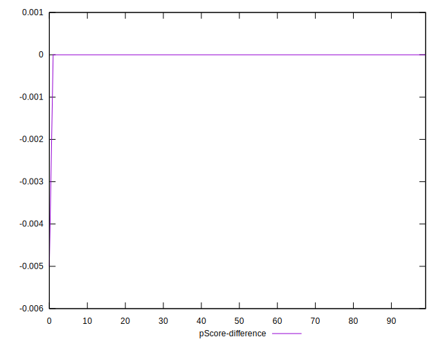
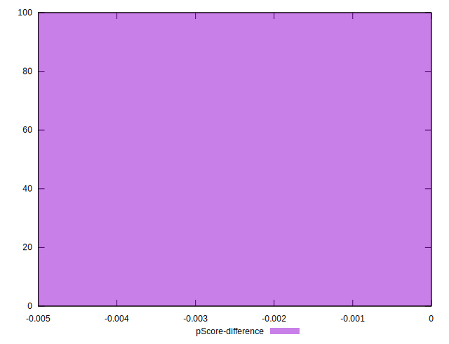

# //unminified-javascript/samples/music

[→ Parent](../..)


## Raw


```yaml
p90min: 0
p90max: 0
p90range: 0
p90mean: 0
median: 0
p90stdev: 0
mad: 0
stdevBySn: 0
lfitCenter: 0.6980402028822874
lfitStdev: 1.7415847777528646
mfitCenter: 0.6980402028822874
mfitStdev: 2.1827528254875173
mfitConfidence: 0.21827528254875173
p90skewness: .nan
p90eccentricity: .nan
p90discretization: 94
outlandishness: .inf

```


## Score


```yaml
p90min: 1
p90max: 1
p90range: 0
p90mean: 1
median: 1
p90stdev: 0
mad: 0
stdevBySn: 0
lfitCenter: 0.9994415678376942
lfitStdev: 0.0013932678222022268
mfitCenter: 0.9994415678376942
mfitStdev: 0.0017462022603899326
mfitConfidence: 0.00017462022603899325
p90skewness: .nan
p90eccentricity: .nan
p90discretization: 94
outlandishness: 0.9976014399999998

```


## Raw Estimate


## Score Estimate


## P Score


```yaml
p90min: 1
p90max: 1
p90range: 0
p90mean: 1
median: 1
p90stdev: 0
mad: 0
stdevBySn: 0
lfitCenter: 0.9994182998309314
lfitStdev: 0.0014513206481273659
mfitCenter: 0.9994182998309314
mfitStdev: 0.0018189606879062377
mfitConfidence: 0.00018189606879062377
p90skewness: .nan
p90eccentricity: .nan
p90discretization: 94
outlandishness: 0.9975015625000001

```


## Score Difference


```yaml
p90min: 0
p90max: 0
p90range: 0
p90mean: 0
median: 0
p90stdev: 0
mad: 0
stdevBySn: 0
lfitCenter: 0
lfitStdev: 0
mfitCenter: 0
mfitStdev: 0
mfitConfidence: 0
p90skewness: .nan
p90eccentricity: .nan
p90discretization: 94
outlandishness: .nan

```


## P Score Difference


```yaml
p90min: 0
p90max: 0
p90range: 0
p90mean: 0
median: 0
p90stdev: 0
mad: 0
stdevBySn: 0
lfitCenter: -0.000023268006762742938
lfitStdev: 0.000058052825925095554
mfitCenter: -0.000023268006762742938
mfitStdev: 0.00007275842751625067
mfitConfidence: 0.000007275842751625067
p90skewness: .nan
p90eccentricity: .nan
p90discretization: 94
outlandishness: .inf

```

