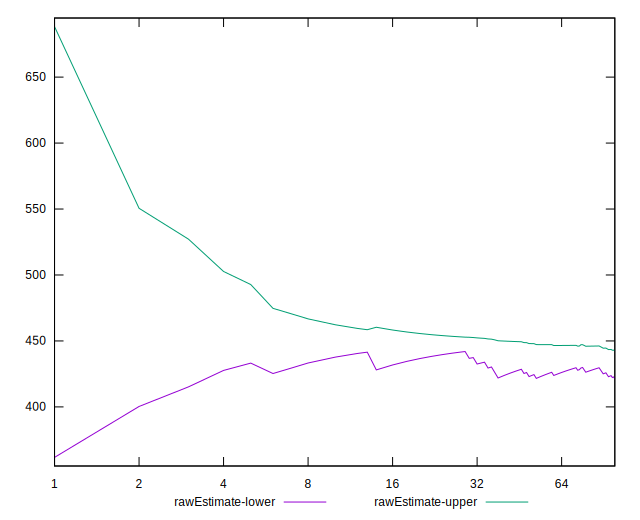
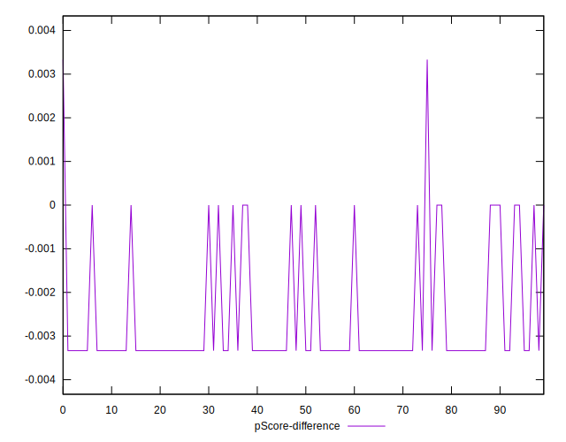

# //unused-css-rules/samples/astro

[→ Parent](../..)


## Raw


```yaml
p90min: 300
p90max: 450
p90range: 150
p90mean: 421.27659574468083
median: 450
p90stdev: 59.02098513480931
mad: 0
stdevBySn: 0
lfitCenter: 431.8657936501133
lfitStdev: 43.077696218277346
mfitCenter: 431.8657936501133
mfitStdev: 53.98988572767638
mfitConfidence: 5.398988572767638
p90skewness: -1.5681404042640399
p90eccentricity: 1.0000000000000024
p90discretization: 47
outlandishness: 1.00106088728191

```


## Score


```yaml
p90min: 0.67
p90max: 0.75
p90range: 0.07999999999999996
p90mean: 0.6853191489361712
median: 0.67
p90stdev: 0.031477858738565005
mad: 0
stdevBySn: 0
lfitCenter: 0.6795772658632911
lfitStdev: 0.023005580628825257
mfitCenter: 0.6795772658632911
mfitStdev: 0.028833219468271522
mfitConfidence: 0.002883321946827152
p90skewness: 1.5681404042639322
p90eccentricity: 0.9999999999999976
p90discretization: 47
outlandishness: 0.9990688291030193

```


## Raw Estimate


## Score Estimate


## P Score


```yaml
p90min: 0.6666666666666666
p90max: 0.75
p90range: 0.08333333333333337
p90mean: 0.6826241134751766
median: 0.6666666666666666
p90stdev: 0.032789436186005216
mad: 0
stdevBySn: 0
lfitCenter: 0.6767412257499372
lfitStdev: 0.023932053454598735
mfitCenter: 0.6767412257499372
mfitStdev: 0.029994380959820474
mfitConfidence: 0.0029994380959820475
p90skewness: 1.5681404042641078
p90eccentricity: 0.9999999999999987
p90discretization: 47
outlandishness: 0.9996363966942156

```


## Score Difference


```yaml
p90min: 0
p90max: 0
p90range: 0
p90mean: 0
median: 0
p90stdev: 0
mad: 0
stdevBySn: 0
lfitCenter: 0
lfitStdev: 0
mfitCenter: 0
mfitStdev: 0
mfitConfidence: 0
p90skewness: .nan
p90eccentricity: .nan
p90discretization: 94
outlandishness: .nan

```


## P Score Difference


```yaml
p90min: -0.0033333333333334103
p90max: 0
p90range: 0.0033333333333334103
p90mean: -0.0026241134751773657
median: -0.0033333333333334103
p90stdev: 0.0013642116355795611
mad: 0
stdevBySn: 0
lfitCenter: -0.0028109270325812185
lfitStdev: 0.0011166042777085092
mfitCenter: -0.0028109270325812185
mfitStdev: 0.0013994559284472294
mfitConfidence: 0.00013994559284472295
p90skewness: 1.4036631612570944
p90eccentricity: 0.999999999999997
p90discretization: 47
outlandishness: 0.9076424397370342

```

