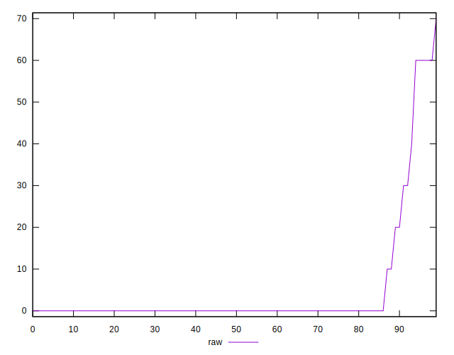

# //unused-css-rules/samples/card

[→ Parent](../..)


## Raw


```yaml
p90min: 0
p90max: 60
p90range: 60
p90mean: 3.617021276595745
median: 0
p90stdev: 12.190950936831307
mad: 0
stdevBySn: 0
lfitCenter: 2.766666205932043
lfitStdev: 6.439283524651599
mfitCenter: 2.766666205932043
mfitStdev: 8.070445083749458
mfitConfidence: 0.8070445083749458
p90skewness: 3.6871558050361153
p90eccentricity: 0.9999999999999996
p90discretization: 15.666666666666666
outlandishness: 2.147086851211072

```


## Score


```yaml
p90min: 0.95
p90max: 1
p90range: 0.050000000000000044
p90mean: 0.9970212765957447
median: 1
p90stdev: 0.009981875834672268
mad: 0
stdevBySn: 0
lfitCenter: 0.9977005009426073
lfitStdev: 0.005351974287130558
mfitCenter: 0.9977005009426073
mfitStdev: 0.006707705043359352
mfitConfidence: 0.0006707705043359352
p90skewness: -3.7417957576669583
p90eccentricity: 0.9999999999999982
p90discretization: 18.8
outlandishness: 0.9971509864474033

```


## Raw Estimate


## Score Estimate


## P Score


```yaml
p90min: 0.95
p90max: 1
p90range: 0.050000000000000044
p90mean: 0.9969858156028369
median: 1
p90stdev: 0.010159125780692772
mad: 0
stdevBySn: 0
lfitCenter: 0.9976944448283901
lfitStdev: 0.005366069603876197
mfitCenter: 0.9976944448283901
mfitStdev: 0.006725370903124378
mfitConfidence: 0.0006725370903124378
p90skewness: -3.6871558050361575
p90eccentricity: 0.999999999999998
p90discretization: 15.666666666666666
outlandishness: 0.9971885340875165

```


## Score Difference


```yaml
p90min: 0
p90max: 1.1102230246251565e-16
p90range: 1.1102230246251565e-16
p90mean: 3.543264972207946e-18
median: 0
p90stdev: 1.9514781802162948e-17
mad: 0
stdevBySn: 0
lfitCenter: 3.3158666172059827e-18
lfitStdev: 8.063403855810743e-18
mfitCenter: 3.3158666172059827e-18
mfitStdev: 1.0105978057540984e-17
mfitConfidence: 1.0105978057540984e-18
p90skewness: 5.326002287485505
p90eccentricity: 1.0000000000000056
p90discretization: 47
outlandishness: 3.5344000000000007

```


## P Score Difference


```yaml
p90min: 0
p90max: 0.0016666666666667052
p90range: 0.0016666666666667052
p90mean: 0.00003546099290780224
median: 0
p90stdev: 0.00024050815542997942
mad: 0
stdevBySn: 0
lfitCenter: -0.000006872497019352241
lfitStdev: 0.00015894248877102327
mfitCenter: -0.000006872497019352241
mfitStdev: 0.00019920486839728203
mfitConfidence: 0.000019920486839728205
p90skewness: 6.6348880269703905
p90eccentricity: 1.000000000000001
p90discretization: 47
outlandishness: 0.2208999999999706

```

