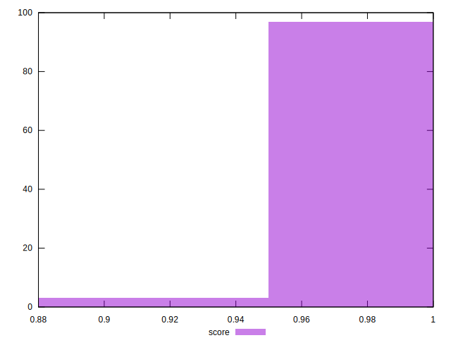
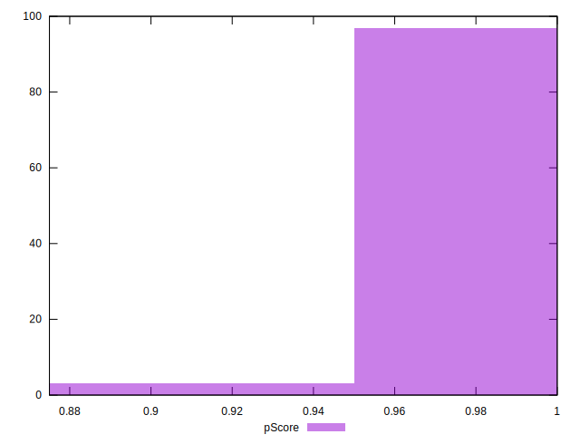

# //unused-css-rules/samples/music

[→ Parent](../..)


## Raw


```yaml
p90min: 0
p90max: 0
p90range: 0
p90mean: 0
median: 0
p90stdev: 0
mad: 0
stdevBySn: 0
lfitCenter: 2.1505019192060884
lfitStdev: 5.31322692222384
mfitCenter: 2.1505019192060884
mfitStdev: 6.6591424230891745
mfitConfidence: 0.6659142423089175
p90skewness: .nan
p90eccentricity: .nan
p90discretization: 94
outlandishness: .inf

```


## Score


```yaml
p90min: 1
p90max: 1
p90range: 0
p90mean: 1
median: 1
p90stdev: 0
mad: 0
stdevBySn: 0
lfitCenter: 0.9982795984646352
lfitStdev: 0.004250581537778973
mfitCenter: 0.9982795984646352
mfitStdev: 0.005327313938471216
mfitConfidence: 0.0005327313938471216
p90skewness: .nan
p90eccentricity: .nan
p90discretization: 94
outlandishness: 0.9928129599999996

```


## Raw Estimate


## Score Estimate


## P Score


```yaml
p90min: 1
p90max: 1
p90range: 0
p90mean: 1
median: 1
p90stdev: 0
mad: 0
stdevBySn: 0
lfitCenter: 0.9982079150673283
lfitStdev: 0.004427689101853138
mfitCenter: 0.9982079150673283
mfitStdev: 0.005549285352574235
mfitConfidence: 0.0005549285352574235
p90skewness: .nan
p90eccentricity: .nan
p90discretization: 94
outlandishness: 0.9925140625

```


## Score Difference


```yaml
p90min: 0
p90max: 0
p90range: 0
p90mean: 0
median: 0
p90stdev: 0
mad: 0
stdevBySn: 0
lfitCenter: 0
lfitStdev: 0
mfitCenter: 0
mfitStdev: 0
mfitConfidence: 0
p90skewness: .nan
p90eccentricity: .nan
p90discretization: 94
outlandishness: .nan

```


## P Score Difference


```yaml
p90min: 0
p90max: 0
p90range: 0
p90mean: 0
median: 0
p90stdev: 0
mad: 0
stdevBySn: 0
lfitCenter: -0.00007168339730686968
lfitStdev: 0.00017710756407412825
mfitCenter: -0.00007168339730686968
mfitStdev: 0.0002219714141029728
mfitConfidence: 0.00002219714141029728
p90skewness: .nan
p90eccentricity: .nan
p90discretization: 94
outlandishness: .inf

```

