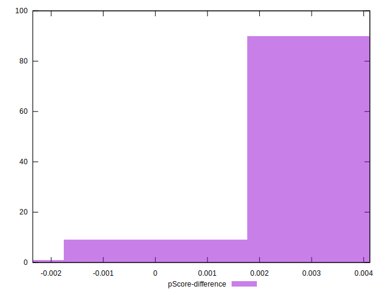

# //unused-javascript/samples/astro

[→ Parent](../..)


## Raw


```yaml
p90min: 3900
p90max: 4200
p90range: 300
p90mean: 4130
median: 4200
p90stdev: 89.2402923977395
mad: 0
stdevBySn: 0
lfitCenter: 4135.521320029361
lfitStdev: 102.28025880565369
mfitCenter: 4135.521320029361
mfitStdev: 128.18929445840345
mfitConfidence: 12.818929445840345
p90skewness: -0.883762442831711
p90eccentricity: 0.9999999999999987
p90discretization: 23.5
outlandishness: 0.99410073577262

```


## Score


```yaml
p90min: 0.09
p90max: 0.13
p90range: 0.04000000000000001
p90mean: 0.09936170212765952
median: 0.09
p90stdev: 0.011922489979678211
mad: 0
stdevBySn: 0
lfitCenter: 0.09859559689272544
lfitStdev: 0.013619342266327215
mfitCenter: 0.09859559689272544
mfitStdev: 0.017069314220502292
mfitConfidence: 0.0017069314220502293
p90skewness: 0.8763748415627507
p90eccentricity: 1.0000000000000004
p90discretization: 31.333333333333332
outlandishness: 1.0312032835218647

```


## Raw Estimate


## Score Estimate


## P Score


```yaml
p90min: 0.09411764705882353
p90max: 0.12941176470588234
p90range: 0.03529411764705881
p90mean: 0.1023529411764704
median: 0.09411764705882353
p90stdev: 0.01049885792914582
mad: 0
stdevBySn: 0
lfitCenter: 0.10170337411419288
lfitStdev: 0.012032971624194571
mfitCenter: 0.10170337411419288
mfitStdev: 0.01508109346569455
mfitConfidence: 0.0015081093465694549
p90skewness: 0.8837624428317645
p90eccentricity: 0.9999999999999984
p90discretization: 23.5
outlandishness: 1.0282426212181268

```


## Score Difference


```yaml
p90min: 0
p90max: 0
p90range: 0
p90mean: 0
median: 0
p90stdev: 0
mad: 0
stdevBySn: 0
lfitCenter: 0
lfitStdev: 0
mfitCenter: 0
mfitStdev: 0
mfitConfidence: 0
p90skewness: .nan
p90eccentricity: .nan
p90discretization: 94
outlandishness: .nan

```


## P Score Difference


```yaml
p90min: -0.0005882352941176672
p90max: 0.0041176470588235314
p90range: 0.004705882352941199
p90mean: 0.0029787234042553176
median: 0.0041176470588235314
p90stdev: 0.0014301280431559618
mad: 0
stdevBySn: 0
lfitCenter: 0.003115903703848097
lfitStdev: 0.0015492551151220497
mfitCenter: 0.003115903703848097
mfitStdev: 0.001941703340044642
mfitConfidence: 0.00019417033400446422
p90skewness: -0.842757883066514
p90eccentricity: 1.0000000000000007
p90discretization: 18.8
outlandishness: 0.9401665295529976

```

