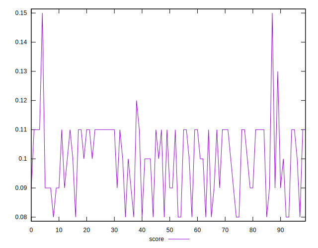
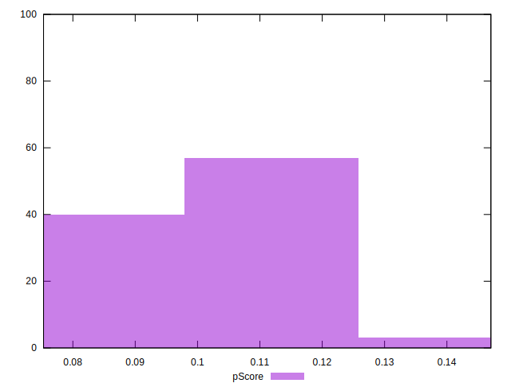

# //unused-javascript/samples/music

[→ Parent](../..)


## Raw


```yaml
p90min: 3960
p90max: 4360
p90range: 400
p90mean: 4159.468085106383
median: 4110
p90stdev: 96.58385201886118
mad: 40
stdevBySn: 65.593
lfitCenter: 4145.4675624974425
lfitStdev: 87.04841501352196
mfitCenter: 4145.4675624974425
mfitStdev: 109.09900927713397
mfitConfidence: 10.909900927713398
p90skewness: 0.9505556577028543
p90eccentricity: 0.9999999999999997
p90discretization: 5.875
outlandishness: 0.9975645936403199

```


## Score


```yaml
p90min: 0.08
p90max: 0.12
p90range: 0.039999999999999994
p90mean: 0.09946808510638294
median: 0.1
p90stdev: 0.01151936586580197
mad: 0.009999999999999995
stdevBySn: 0.011925999999999996
lfitCenter: 0.10078635038831378
lfitStdev: 0.01126576639778766
mfitCenter: 0.10078635038831378
mfitStdev: 0.014119544308248877
mfitConfidence: 0.0014119544308248877
p90skewness: -0.4807818827397207
p90eccentricity: 1.0000000000000013
p90discretization: 18.8
outlandishness: 1.0147707219537307

```


## Raw Estimate


## Score Estimate


## P Score


```yaml
p90min: 0.07529411764705879
p90max: 0.12235294117647055
p90range: 0.047058823529411764
p90mean: 0.09888610763454311
median: 0.10470588235294115
p90stdev: 0.011362806119866014
mad: 0.004705882352941171
stdevBySn: 0.007716823529411798
lfitCenter: 0.10053322794147751
lfitStdev: 0.01024099000159075
mfitCenter: 0.10053322794147751
mfitStdev: 0.012835177562015675
mfitConfidence: 0.0012835177562015676
p90skewness: -0.9505556577028392
p90eccentricity: 0.9999999999999999
p90discretization: 5.875
outlandishness: 1.0120955892836685

```


## Score Difference


```yaml
p90min: 0
p90max: 0
p90range: 0
p90mean: 0
median: 0
p90stdev: 0
mad: 0
stdevBySn: 0
lfitCenter: 0
lfitStdev: 0
mfitCenter: 0
mfitStdev: 0
mfitConfidence: 0
p90skewness: .nan
p90eccentricity: .nan
p90discretization: 94
outlandishness: .nan

```


## P Score Difference


```yaml
p90min: -0.0047058823529412125
p90max: 0.004705882352941143
p90range: 0.009411764705882356
p90mean: -0.0007634543178973743
median: -0.0029411764705882387
p90stdev: 0.003526103776465778
mad: 0.0014705882352941263
stdevBySn: 0.0021045882352941484
lfitCenter: -0.0010899190297501248
lfitStdev: 0.0036033711856860388
mfitCenter: -0.0010899190297501248
mfitStdev: 0.004516156053559977
mfitConfidence: 0.0004516156053559977
p90skewness: 0.4568990673787934
p90eccentricity: 1
p90discretization: 4.947368421052632
outlandishness: 0.8836000000000054

```

