# //uses-http2/samples/agenda

[→ Parent](../..)


## Raw


```yaml
p90min: 1220
p90max: 1280
p90range: 60
p90mean: 1253.5106382978724
median: 1260
p90stdev: 14.925876916289887
mad: 10
stdevBySn: 11.926000000000002
lfitCenter: 1254.0502358106066
lfitStdev: 13.695134740961985
mfitCenter: 1254.0502358106066
mfitStdev: 17.164306000559762
mfitConfidence: 1.7164306000559761
p90skewness: -0.7474198619988726
p90eccentricity: 1
p90discretization: 13.428571428571429
outlandishness: 0.9971131786985434

```

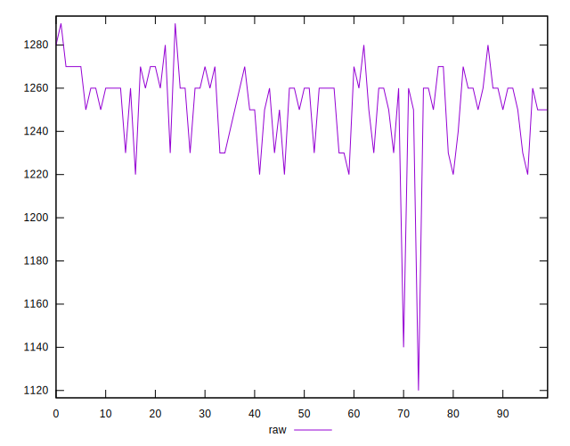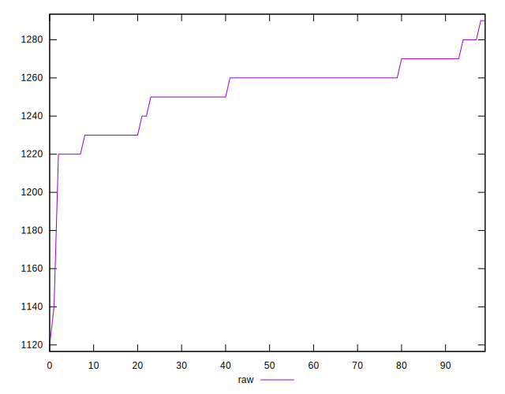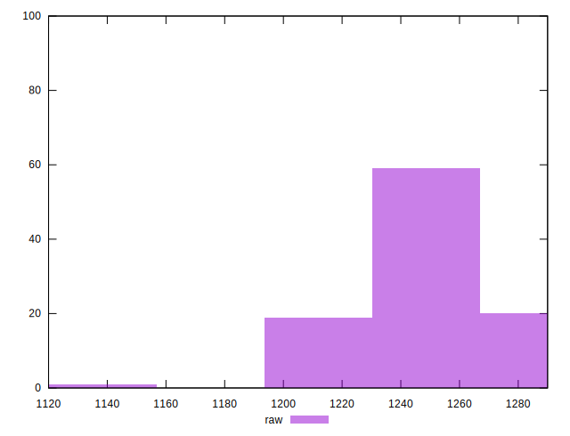
## Score


```yaml
p90min: 0.44
p90max: 0.44
p90range: 0
p90mean: 0.4399999999999999
median: 0.44
p90stdev: 1.1102230246251565e-16
mad: 0
stdevBySn: 0
lfitCenter: 0.4401408468701742
lfitStdev: 0.0003497210956833366
mfitCenter: 0.4401408468701742
mfitStdev: 0.000438310393778439
mfitConfidence: 0.0000438310393778439
p90skewness: 1
p90eccentricity: 1
p90discretization: 94
outlandishness: 1.001364101239669

```

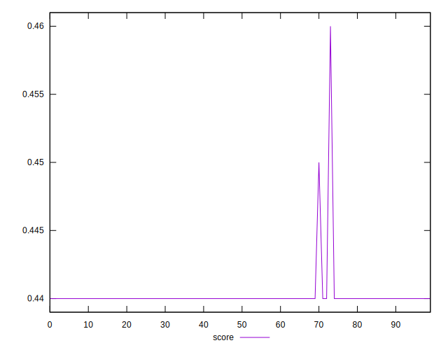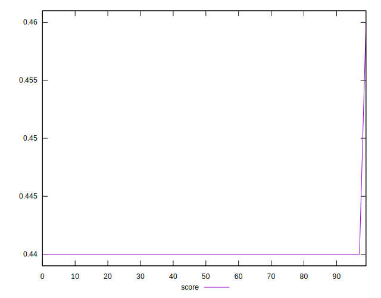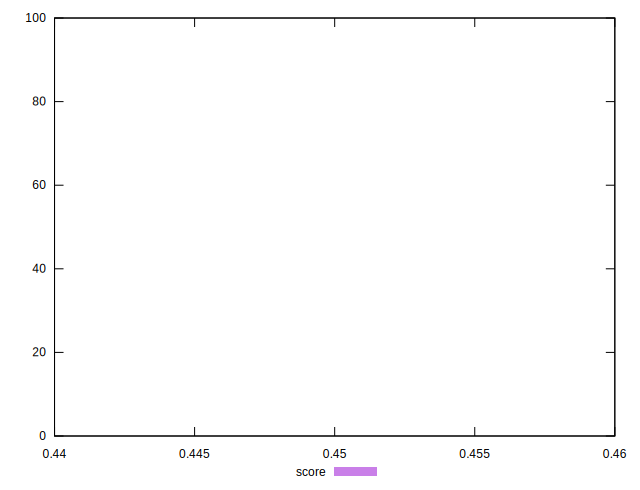
## Raw Estimate

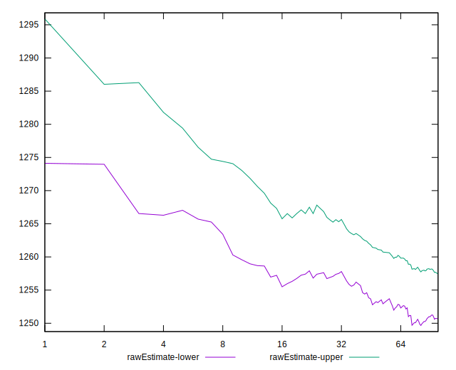
## Score Estimate

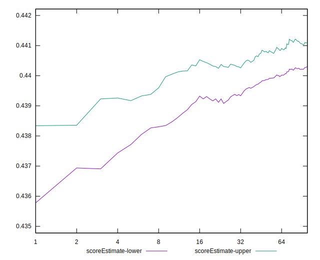
## P Score


```yaml
p90min: 0.4376470588235294
p90max: 0.4447058823529412
p90range: 0.007058823529411784
p90mean: 0.4407634543178974
median: 0.44
p90stdev: 0.0017559855195635168
mad: 0.0011764705882352788
stdevBySn: 0.0014030588235293938
lfitCenter: 0.4406999722575757
lfitStdev: 0.0016111923224661076
mfitCenter: 0.4406999722575757
mfitStdev: 0.002019330117712903
mfitConfidence: 0.0002019330117712903
p90skewness: 0.7474198619990435
p90eccentricity: 0.9999999999999991
p90discretization: 13.428571428571429
outlandishness: 1.0009668122095638

```

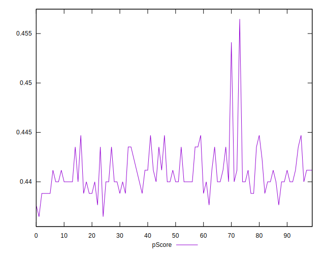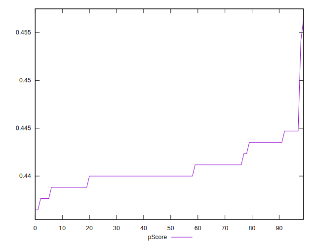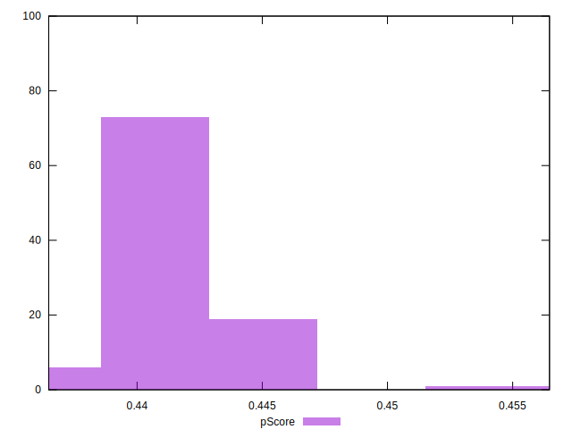
## Score Difference


```yaml
p90min: 0
p90max: 0
p90range: 0
p90mean: 0
median: 0
p90stdev: 0
mad: 0
stdevBySn: 0
lfitCenter: 0
lfitStdev: 0
mfitCenter: 0
mfitStdev: 0
mfitConfidence: 0
p90skewness: .nan
p90eccentricity: .nan
p90discretization: 94
outlandishness: .nan

```


## P Score Difference


```yaml
p90min: -0.002352941176470613
p90max: 0.004705882352941171
p90range: 0.007058823529411784
p90mean: 0.0006821026282853564
median: 0
p90stdev: 0.0017231297436484394
mad: 0.0011764705882352788
stdevBySn: 0.0014030588235293938
lfitCenter: 0.0005321323799931979
lfitStdev: 0.001412719539834029
mfitCenter: 0.0005321323799931979
mfitStdev: 0.0017705813731174708
mfitConfidence: 0.00017705813731174708
p90skewness: 0.6934445055326008
p90eccentricity: 1.0000000000000009
p90discretization: 11.75
outlandishness: 0.9835544146115632

```

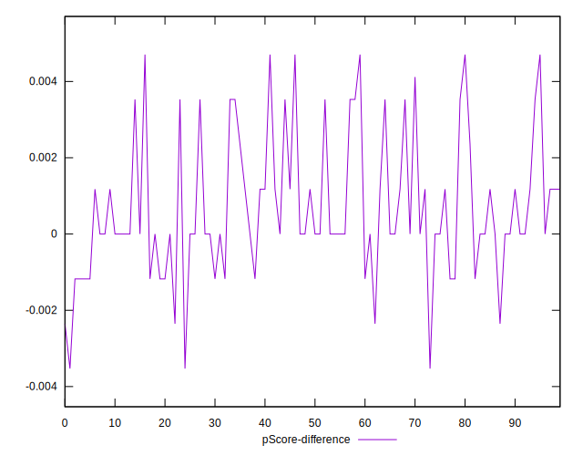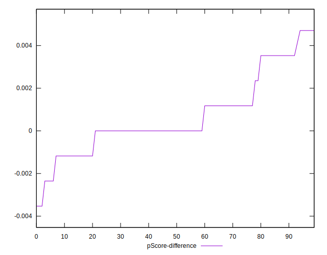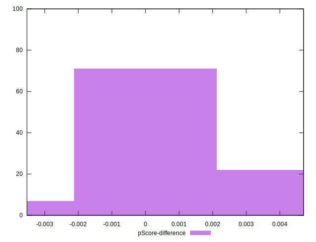