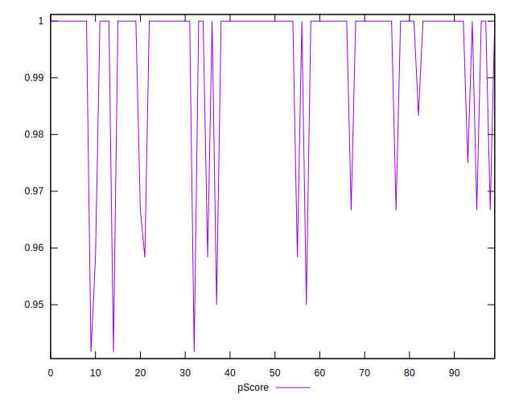

# //uses-http2/samples/astro

[→ Parent](../..)


## Raw


```yaml
p90min: 0
p90max: 60
p90range: 60
p90mean: 6.0638297872340425
median: 0
p90stdev: 15.657102603242853
mad: 0
stdevBySn: 0
lfitCenter: 4.326335623702743
lfitStdev: 9.84704118277877
mfitCenter: 4.326335623702743
mfitStdev: 12.341435937523055
mfitConfidence: 1.2341435937523055
p90skewness: 2.3471510773516915
p90eccentricity: 1.0000000000000007
p90discretization: 15.666666666666666
outlandishness: 1.6546083102493072

```


## Score


```yaml
p90min: 0.95
p90max: 1
p90range: 0.050000000000000044
p90mean: 0.9952127659574469
median: 1
p90stdev: 0.012439532334051193
mad: 0
stdevBySn: 0
lfitCenter: 0.9965231738977929
lfitStdev: 0.00791349834863083
mfitCenter: 0.9965231738977929
mfitStdev: 0.009918099365941898
mfitConfidence: 0.0009918099365941898
p90skewness: -2.4194758049932155
p90eccentricity: 0.9999999999999992
p90discretization: 18.8
outlandishness: 0.9969622250142187

```


## Raw Estimate


## Score Estimate


## P Score


```yaml
p90min: 0.95
p90max: 1
p90range: 0.050000000000000044
p90mean: 0.9949468085106383
median: 1
p90stdev: 0.013047585502702394
mad: 0
stdevBySn: 0
lfitCenter: 0.9963947203135811
lfitStdev: 0.008205867652315572
mfitCenter: 0.9963947203135811
mfitStdev: 0.010284529947935791
mfitConfidence: 0.0010284529947935791
p90skewness: -2.347151077351662
p90eccentricity: 0.9999999999999984
p90discretization: 15.666666666666666
outlandishness: 0.9970938012863233

```


## Score Difference


```yaml
p90min: 0
p90max: 1.1102230246251565e-16
p90range: 1.1102230246251565e-16
p90mean: 2.362176648138631e-18
median: 0
p90stdev: 1.6021061506108986e-17
mad: 0
stdevBySn: 0
lfitCenter: 2.7255820612844e-18
lfitStdev: 6.664295900958648e-18
mfitCenter: 2.7255820612844e-18
mfitStdev: 8.352456276329808e-18
mfitConfidence: 8.352456276329809e-19
p90skewness: 6.634888026970373
p90eccentricity: 0.9999999999999988
p90discretization: 47
outlandishness: 5.522500000000001

```


## P Score Difference


```yaml
p90min: -0.0033333333333332993
p90max: 0.0016666666666667052
p90range: 0.0050000000000000044
p90mean: -0.0001595744680851018
median: 0
p90stdev: 0.0006905795068847573
mad: 0
stdevBySn: 0
lfitCenter: -0.00010523743569240693
lfitStdev: 0.00035028600194358364
mfitCenter: -0.00010523743569240693
mfitStdev: 0.00043901839878137717
mfitConfidence: 0.00004390183987813772
p90skewness: -3.332207618308443
p90eccentricity: 0.9999999999999991
p90discretization: 23.5
outlandishness: 1.5708444444444503

```

