# //uses-http2/samples/card

[→ Parent](../..)


## Raw


```yaml
p90min: 1100
p90max: 1440
p90range: 340
p90mean: 1361.595744680851
median: 1410
p90stdev: 82.77505009398949
mad: 10
stdevBySn: 23.852000000000004
lfitCenter: 1371.5330006535967
lfitStdev: 74.65929005631081
mfitCenter: 1371.5330006535967
mfitStdev: 93.57154380366855
mfitConfidence: 9.357154380366854
p90skewness: -1.2416428335437606
p90eccentricity: 0.9999999999999991
p90discretization: 5.222222222222222
outlandishness: 0.991358697556755

```

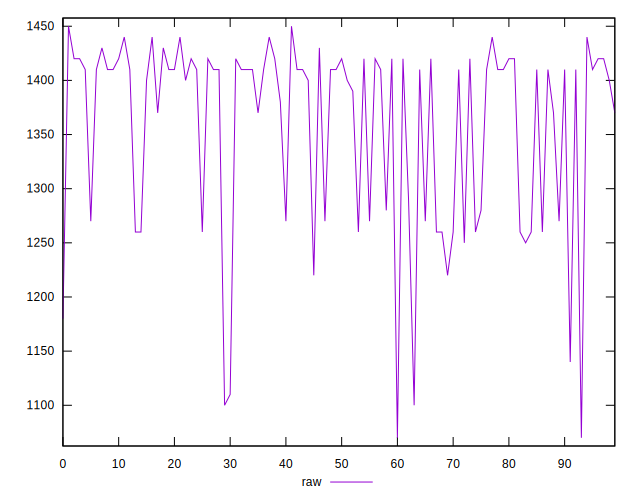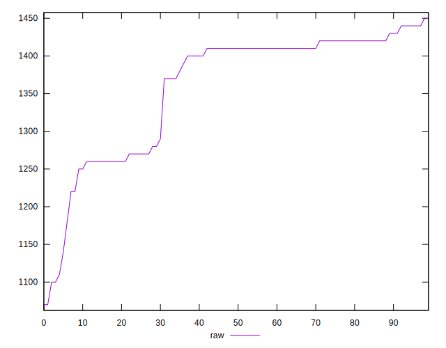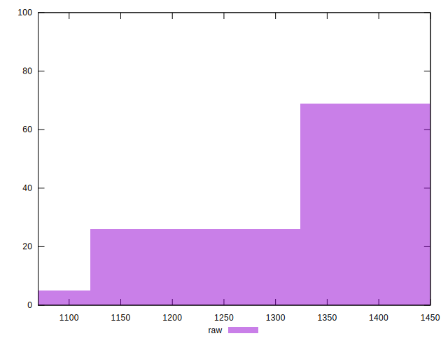
## Score


```yaml
p90min: 0.42
p90max: 0.46
p90range: 0.040000000000000036
p90mean: 0.42712765957446874
median: 0.42
p90stdev: 0.010480208340621567
mad: 0
stdevBySn: 0
lfitCenter: 0.42570977859987924
lfitStdev: 0.010231180878244109
mfitCenter: 0.42570977859987924
mfitStdev: 0.012822883649038289
mfitConfidence: 0.0012822883649038289
p90skewness: 1.1477892375851275
p90eccentricity: 1.000000000000001
p90discretization: 18.8
outlandishness: 1.0036197080127607

```

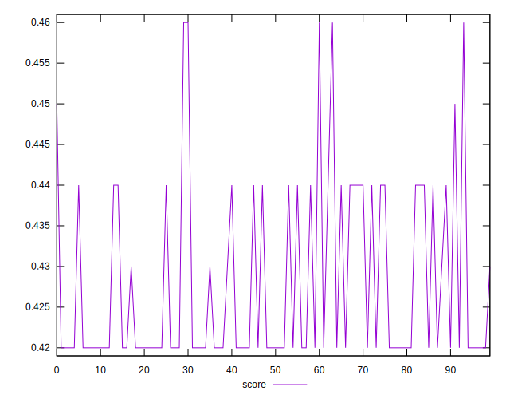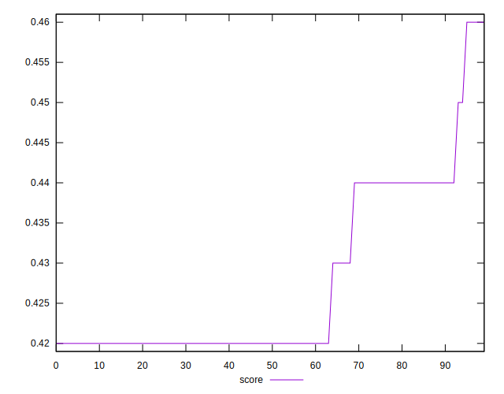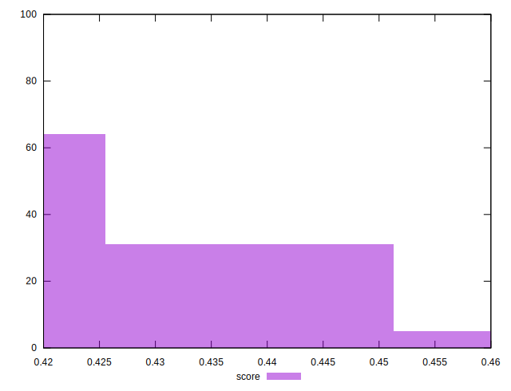
## Raw Estimate

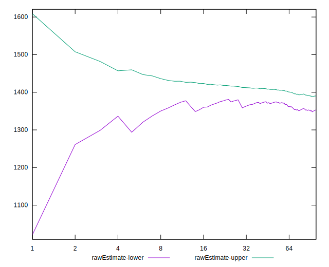
## Score Estimate

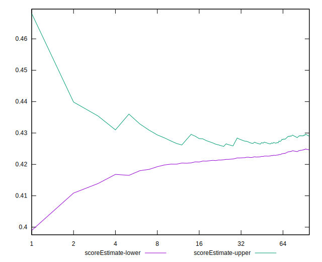
## P Score


```yaml
p90min: 0.4188235294117647
p90max: 0.4588235294117647
p90range: 0.03999999999999998
p90mean: 0.42804755944931155
median: 0.4223529411764706
p90stdev: 0.009738241187528182
mad: 0.0011764705882353343
stdevBySn: 0.0028061176470588534
lfitCenter: 0.4268784705113417
lfitStdev: 0.008783445888977823
mfitCenter: 0.4268784705113417
mfitStdev: 0.011008416918078754
mfitConfidence: 0.0011008416918078753
p90skewness: 1.2416428335437646
p90eccentricity: 0.9999999999999989
p90discretization: 5.222222222222222
outlandishness: 1.0032434666735375

```

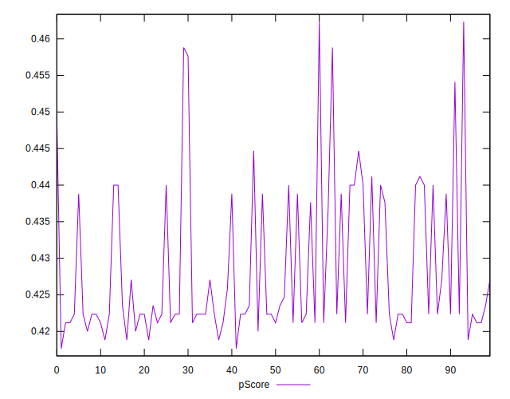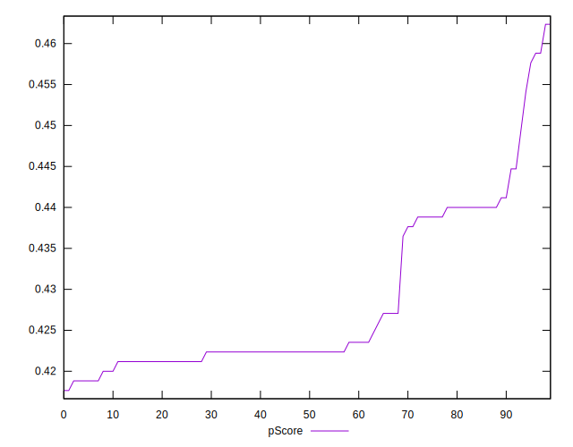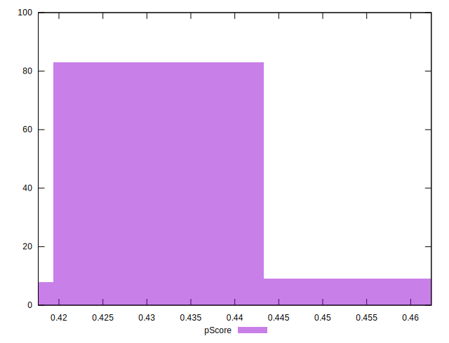
## Score Difference


```yaml
p90min: 0
p90max: 0
p90range: 0
p90mean: 0
median: 0
p90stdev: 0
mad: 0
stdevBySn: 0
lfitCenter: 0
lfitStdev: 0
mfitCenter: 0
mfitStdev: 0
mfitConfidence: 0
p90skewness: .nan
p90eccentricity: .nan
p90discretization: 94
outlandishness: .nan

```


## P Score Difference


```yaml
p90min: -0.002941176470588225
p90max: 0.004117647058823504
p90range: 0.0070588235294117285
p90mean: 0.0008573216520650865
median: 0.0011764705882352788
p90stdev: 0.0017345459739725449
mad: 0.0011764705882353343
stdevBySn: 0.00140305882352946
lfitCenter: 0.0009563229279118606
lfitStdev: 0.0015514922311005847
mfitCenter: 0.0009563229279118606
mfitStdev: 0.0019445071491301757
mfitConfidence: 0.00019445071491301758
p90skewness: -0.4587612213670781
p90eccentricity: 0.9999999999999991
p90discretization: 7.833333333333333
outlandishness: 0.9626904150460863

```

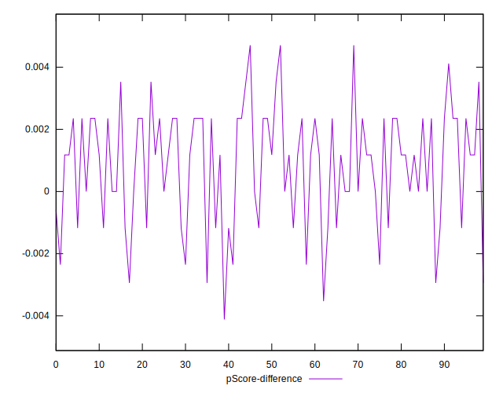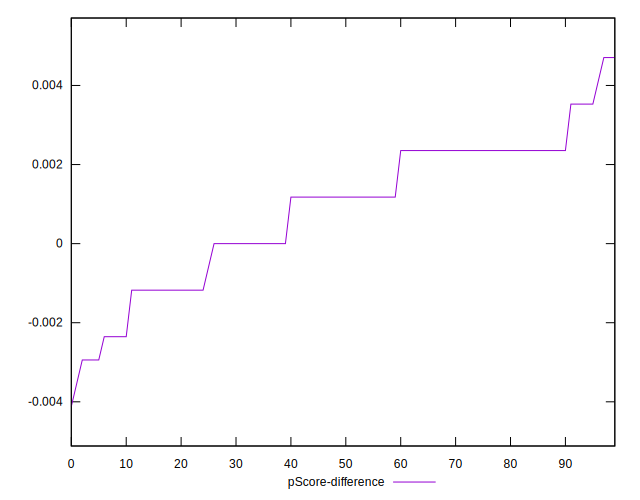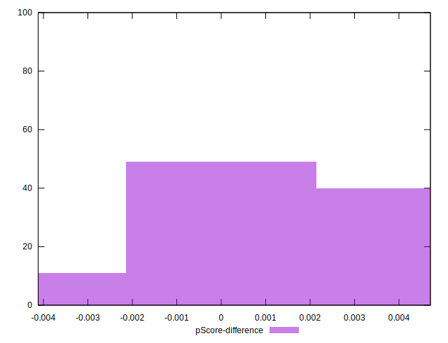