# //uses-http2/samples/music

[→ Parent](../..)


## Raw


```yaml
p90min: 560
p90max: 740
p90range: 180
p90mean: 712.3404255319149
median: 720
p90stdev: 19.755178793942214
mad: 0
stdevBySn: 0
lfitCenter: 709.6953755967376
lfitStdev: 20.92257385831598
mfitCenter: 709.6953755967376
mfitStdev: 26.222557632041383
mfitConfidence: 2.622255763204138
p90skewness: -4.979546842595951
p90eccentricity: 1.0000000000000013
p90discretization: 11.75
outlandishness: 0.9717319168061963

```

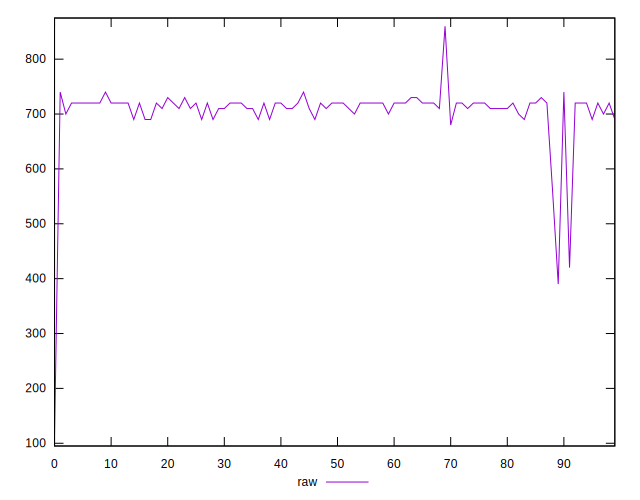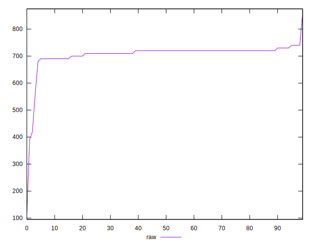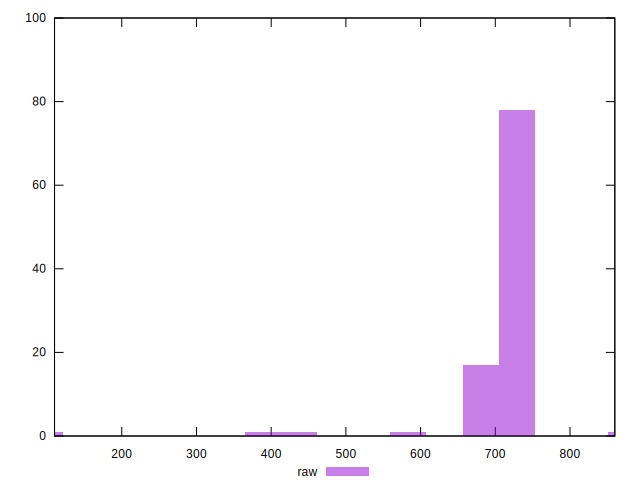
## Score


```yaml
p90min: 0.51
p90max: 0.61
p90range: 0.09999999999999998
p90mean: 0.5221276595744687
median: 0.52
p90stdev: 0.010505554804790224
mad: 0
stdevBySn: 0
lfitCenter: 0.5244548578059149
lfitStdev: 0.011264417633631297
mfitCenter: 0.5244548578059149
mfitStdev: 0.014117853883062102
mfitConfidence: 0.0014117853883062101
p90skewness: 6.2288049382178965
p90eccentricity: 0.9999999999999984
p90discretization: 18.8
outlandishness: 1.025721578528212

```

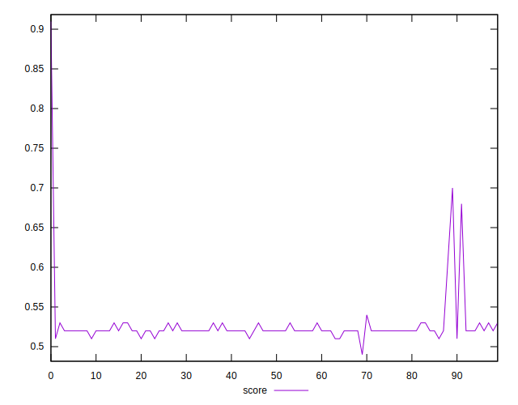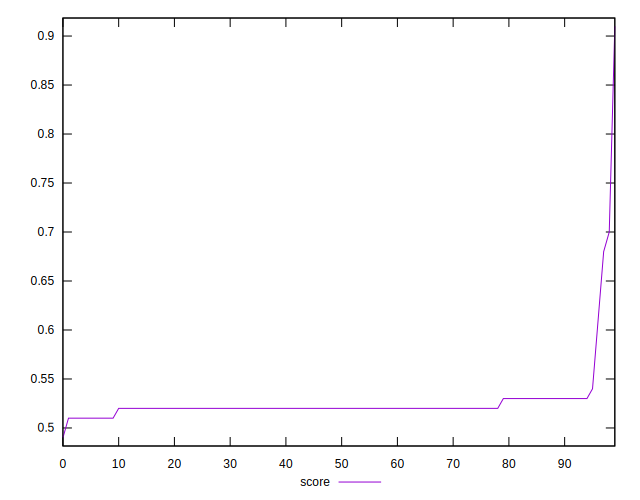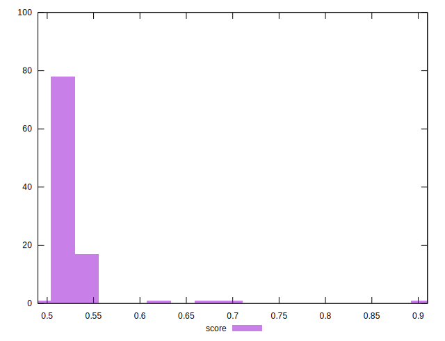
## Raw Estimate

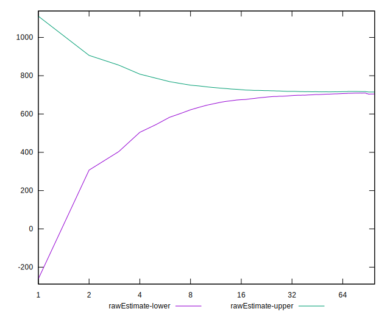
## Score Estimate

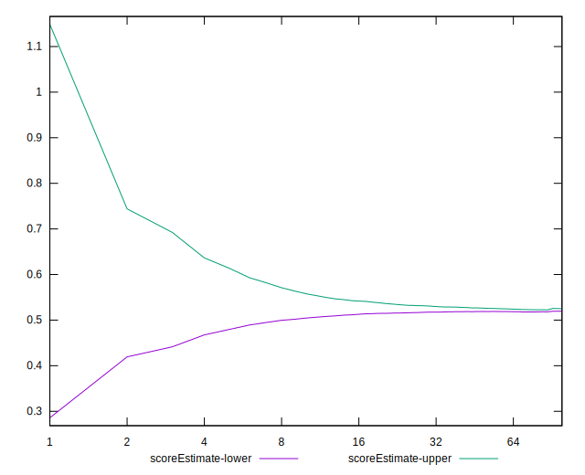
## P Score


```yaml
p90min: 0.5055555555555555
p90max: 0.6055555555555556
p90range: 0.10000000000000009
p90mean: 0.5209219858156028
median: 0.5166666666666666
p90stdev: 0.010975099329967911
mad: 0
stdevBySn: 0
lfitCenter: 0.5228612284128589
lfitStdev: 0.01208583312849205
mfitCenter: 0.5228612284128589
mfitStdev: 0.01514734553641701
mfitConfidence: 0.0015147345536417008
p90skewness: 4.979546842596018
p90eccentricity: 1.000000000000002
p90discretization: 11.75
outlandishness: 1.0256675844181453

```

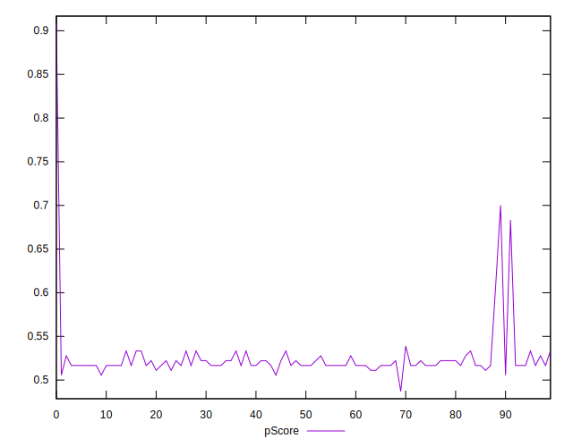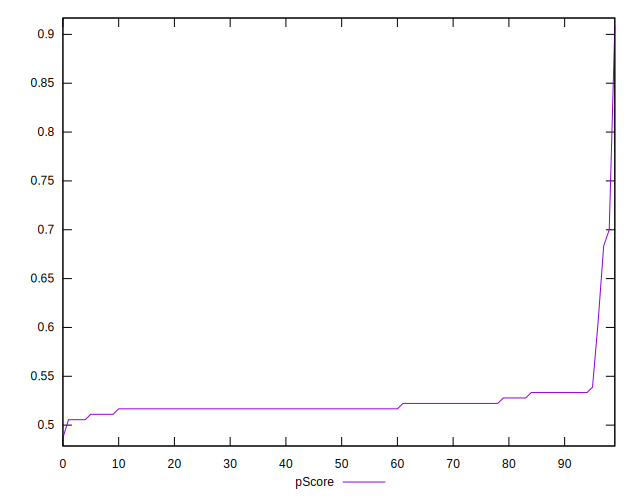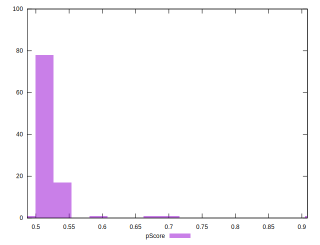
## Score Difference


```yaml
p90min: 0
p90max: 0
p90range: 0
p90mean: 0
median: 0
p90stdev: 0
mad: 0
stdevBySn: 0
lfitCenter: 5.166535369026208e-19
lfitStdev: 1.2890316797319448e-18
mfitCenter: 5.166535369026208e-19
mfitStdev: 1.6155616292812394e-18
mfitConfidence: 1.6155616292812395e-19
p90skewness: .nan
p90eccentricity: .nan
p90discretization: 94
outlandishness: .inf

```

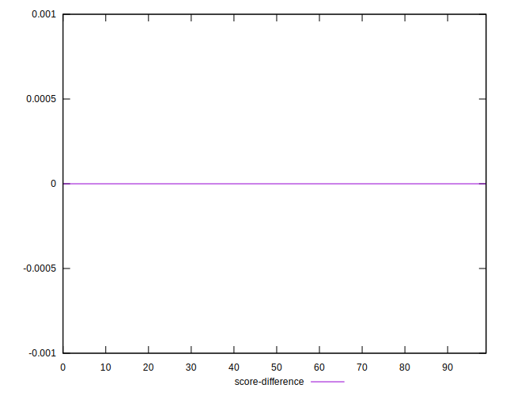
## P Score Difference


```yaml
p90min: -0.004444444444444473
p90max: 0.0033333333333332993
p90range: 0.007777777777777772
p90mean: -0.0012783340286469658
median: -0.0033333333333334103
p90stdev: 0.00269944799142266
mad: 0
stdevBySn: 0
lfitCenter: -0.0016594823994866234
lfitStdev: 0.0027433029654580325
mfitCenter: -0.0016594823994866234
mfitStdev: 0.003438220393007771
mfitConfidence: 0.00034382203930077707
p90skewness: 0.6544920374403222
p90eccentricity: 0.9999999999999996
p90discretization: 8.545454545454545
outlandishness: 0.9333020747941871

```

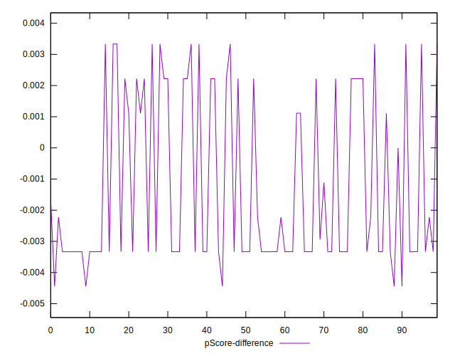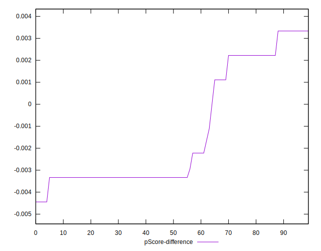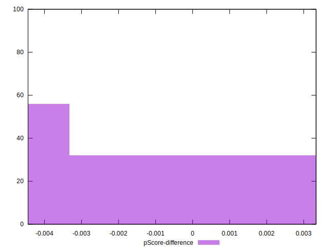