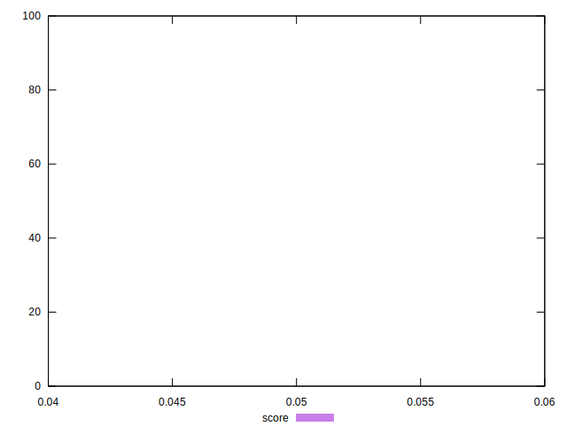

# //uses-long-cache-ttl/samples/astro

[→ Parent](../..)


## Raw


```yaml
p90min: 957198.8822777778
p90max: 970107.6516736111
p90range: 12908.76939583337
p90mean: 964031.8147642582
median: 964291.4919583334
p90stdev: 3205.921542666391
mad: 2596.654795138922
stdevBySn: 3857.743391571451
lfitCenter: 964104.7726173057
lfitStdev: 2820.395092920935
mfitCenter: 964104.7726173057
mfitStdev: 3534.8410463299792
mfitConfidence: 353.4841046329979
p90skewness: -0.19408639643847878
p90eccentricity: 0.9999999999999997
p90discretization: 1
outlandishness: 1.000032256512402

```


## Score


```yaml
p90min: 0.05
p90max: 0.05
p90range: 0
p90mean: 0.049999999999999906
median: 0.05
p90stdev: 9.71445146547012e-17
mad: 0
stdevBySn: 0
lfitCenter: 0.049999999999999906
lfitStdev: 0
mfitCenter: 0.049999999999999906
mfitStdev: 0
mfitConfidence: 0
p90skewness: 1
p90eccentricity: 1
p90discretization: 94
outlandishness: 1

```


## Raw Estimate


## Score Estimate


## P Score


```yaml
p90min: 0.045720433434207286
p90max: 0.04681526573664763
p90range: 0.0010948323024403406
p90mean: 0.046232420424625505
median: 0.04620933266937022
p90stdev: 0.00027185287712363566
mad: 0.00022058206281735937
stdevBySn: 0.00032490362687922684
lfitCenter: 0.04622604801583751
lfitStdev: 0.00023906742436464217
mfitCenter: 0.04622604801583751
mfitStdev: 0.0002996265830293071
mfitConfidence: 0.00002996265830293071
p90skewness: 0.20696653953031932
p90eccentricity: 1.0000000000000007
p90discretization: 1
outlandishness: 0.9999574808245825

```


## Score Difference


```yaml
p90min: 0
p90max: 0
p90range: 0
p90mean: 0
median: 0
p90stdev: 0
mad: 0
stdevBySn: 0
lfitCenter: 0
lfitStdev: 0
mfitCenter: 0
mfitStdev: 0
mfitConfidence: 0
p90skewness: .nan
p90eccentricity: .nan
p90discretization: 94
outlandishness: .nan

```


## P Score Difference


```yaml
p90min: -0.004279566565792717
p90max: -0.003184734263352376
p90range: 0.0010948323024403406
p90mean: -0.0037675795753744907
median: -0.003790667330629785
p90stdev: 0.00027185287712363566
mad: 0.00022058206281735937
stdevBySn: 0.00032490362687922684
lfitCenter: -0.0037739519841625034
lfitStdev: 0.00023906742436464128
mfitCenter: -0.0037739519841625034
mfitStdev: 0.000299626583029306
mfitConfidence: 0.0000299626583029306
p90skewness: 0.20696653952999844
p90eccentricity: 1
p90discretization: 1
outlandishness: 1.000521831502018

```

