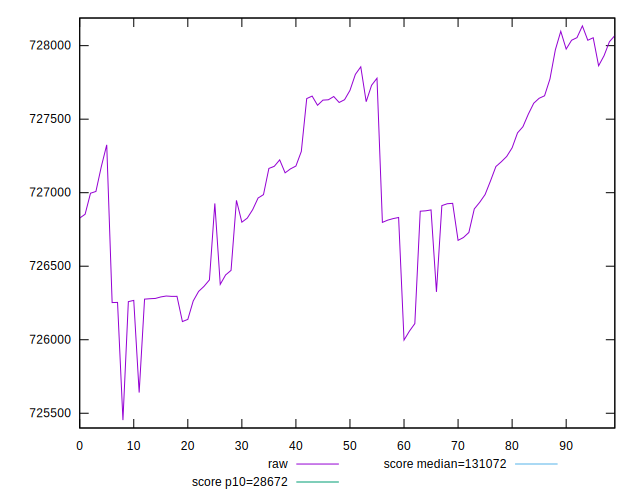

# //uses-long-cache-ttl/samples/music

[→ Parent](../..)


## Raw


```yaml
p90min: 726058.5563541667
p90max: 728054.4727777777
p90range: 1995.9164236109937
p90mean: 727058.1265255614
median: 726987.0109930555
p90stdev: 574.8630925551518
mad: 622.6241701387917
stdevBySn: 750.278093313888
lfitCenter: 727048.2181253933
lfitStdev: 499.9077790402074
mfitCenter: 727048.2181253933
mfitStdev: 626.5414874555379
mfitConfidence: 62.65414874555379
p90skewness: 0.03524123841311617
p90eccentricity: 1.0000000000000004
p90discretization: 1
outlandishness: 0.9999736963758507

```


## Score


```yaml
p90min: 0.07
p90max: 0.07
p90range: 0
p90mean: 0.07000000000000008
median: 0.07
p90stdev: 6.938893903907228e-17
mad: 0
stdevBySn: 0
lfitCenter: 0.07000000000000009
lfitStdev: 0
mfitCenter: 0.07000000000000009
mfitStdev: 0
mfitConfidence: 0
p90skewness: -1
p90eccentricity: 1
p90discretization: 94
outlandishness: 1.0000000000000004

```


## Raw Estimate


## Score Estimate


## P Score


```yaml
p90min: 0.0741147122045887
p90max: 0.07443997485295567
p90range: 0.00032526264836696406
p90mean: 0.07427691540963187
median: 0.07428842371399741
p90stdev: 0.00009367863102732805
mad: 0.0001014871333302747
stdevBySn: 0.00012223703867553126
lfitCenter: 0.07427851292699203
lfitStdev: 0.00008146038982324021
mfitCenter: 0.07427851292699203
mfitStdev: 0.00010209545829943145
mfitConfidence: 0.000010209545829943145
p90skewness: -0.03288951912557454
p90eccentricity: 0.9999999999999997
p90discretization: 1
outlandishness: 1.0000424272898838

```


## Score Difference


```yaml
p90min: 0
p90max: 0
p90range: 0
p90mean: 0
median: 0
p90stdev: 0
mad: 0
stdevBySn: 0
lfitCenter: 0
lfitStdev: 0
mfitCenter: 0
mfitStdev: 0
mfitConfidence: 0
p90skewness: .nan
p90eccentricity: .nan
p90discretization: 94
outlandishness: .nan

```


## P Score Difference


```yaml
p90min: 0.0041147122045887
p90max: 0.004439974852955664
p90range: 0.00032526264836696406
p90mean: 0.00427691540963187
median: 0.004288423713997402
p90stdev: 0.00009367863102732805
mad: 0.0001014871333302747
stdevBySn: 0.00012223703867553126
lfitCenter: 0.004278512926992021
lfitStdev: 0.00008146038982324048
mfitCenter: 0.004278512926992021
mfitStdev: 0.00010209545829943179
mfitConfidence: 0.00001020954582994318
p90skewness: -0.03288951912493577
p90eccentricity: 0.9999999999999999
p90discretization: 1
outlandishness: 1.000736959932453

```

