# //uses-rel-preconnect/samples/astro

[→ Parent](../..)


## Raw


```yaml
p90min: 300
p90max: 302.386
p90range: 2.386000000000024
p90mean: 300.62921276595745
median: 300.495
p90stdev: 0.4991865909687364
mad: 0.22799999999998022
stdevBySn: 0.36493560000001385
lfitCenter: 300.59971678376036
lfitStdev: 0.3746238721481947
mfitCenter: 300.59971678376036
mfitStdev: 0.4695213956116593
mfitConfidence: 0.04695213956116593
p90skewness: 1.7058649396335674
p90eccentricity: 0.9999999999999991
p90discretization: 1.0804597701149425
outlandishness: 1.0002926559326417

```

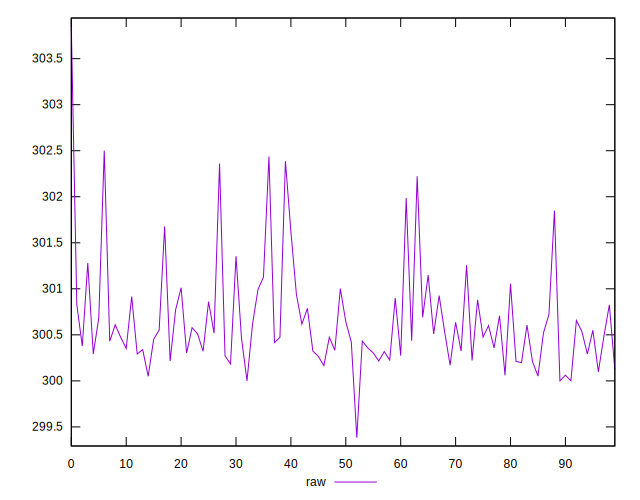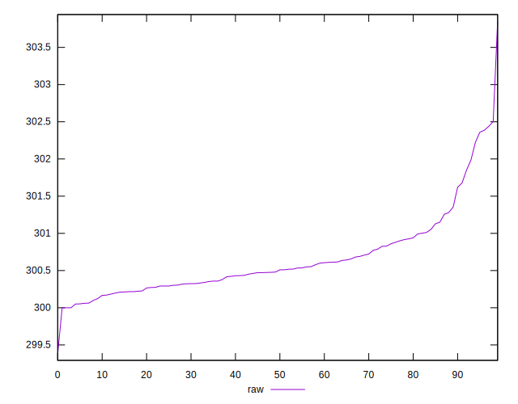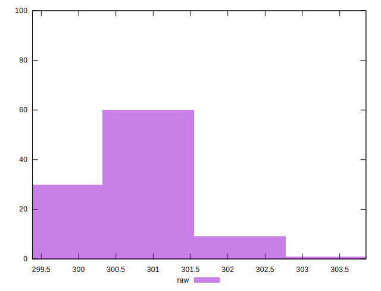
## Score


```yaml
p90min: 0.75
p90max: 0.75
p90range: 0
p90mean: 0.75
median: 0.75
p90stdev: 0
mad: 0
stdevBySn: 0
lfitCenter: 0.75
lfitStdev: 0
mfitCenter: 0.75
mfitStdev: 0
mfitConfidence: 0
p90skewness: .nan
p90eccentricity: .nan
p90discretization: 94
outlandishness: 1

```

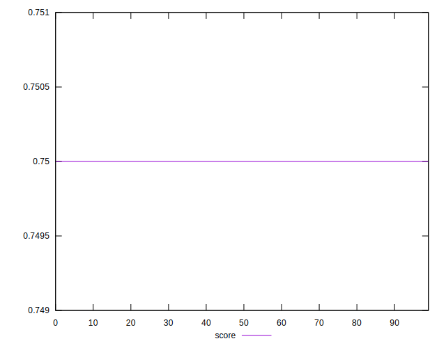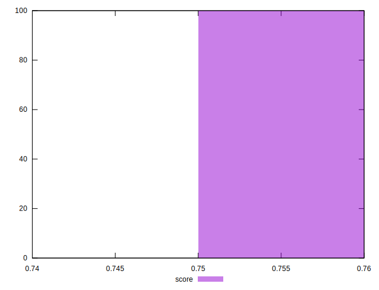
## Raw Estimate

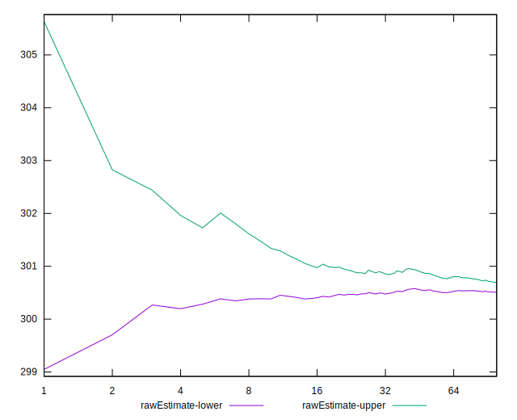
## Score Estimate

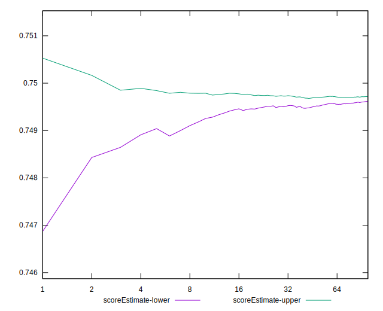
## P Score


```yaml
p90min: 0.7486744444444444
p90max: 0.75
p90range: 0.0013255555555555798
p90mean: 0.7496504373522461
median: 0.749725
p90stdev: 0.0002773258838715256
mad: 0.00012666666666666382
stdevBySn: 0.00020274200000000418
lfitCenter: 0.7496676228760611
lfitStdev: 0.00020883156915350732
mfitCenter: 0.7496676228760611
mfitStdev: 0.0002617315582012357
mfitConfidence: 0.00002617315582012357
p90skewness: -1.7058649396342667
p90eccentricity: 0.9999999999999984
p90discretization: 1.0804597701149425
outlandishness: 0.9999393841507282

```

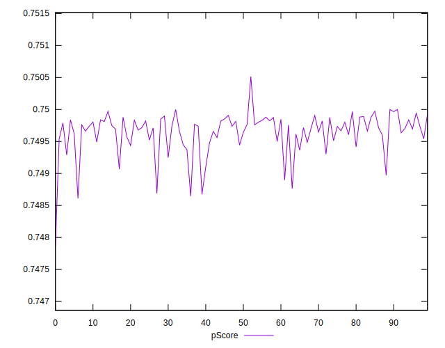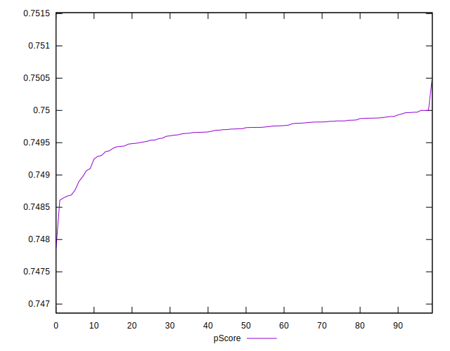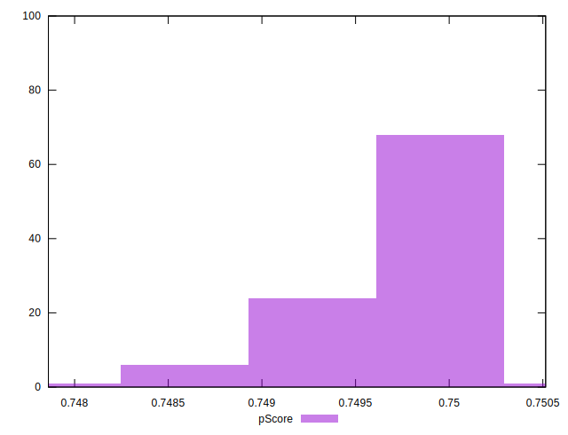
## Score Difference


```yaml
p90min: 0
p90max: 0
p90range: 0
p90mean: 0
median: 0
p90stdev: 0
mad: 0
stdevBySn: 0
lfitCenter: 0
lfitStdev: 0
mfitCenter: 0
mfitStdev: 0
mfitConfidence: 0
p90skewness: .nan
p90eccentricity: .nan
p90discretization: 94
outlandishness: .nan

```


## P Score Difference


```yaml
p90min: -0.0013255555555555798
p90max: 0
p90range: 0.0013255555555555798
p90mean: -0.00034956264775412994
median: -0.0002749999999999697
p90stdev: 0.00027732588387152554
mad: 0.00012666666666666382
stdevBySn: 0.00020274200000000418
lfitCenter: -0.00033237712393908514
lfitStdev: 0.00020883156915359226
mfitCenter: -0.00033237712393908514
mfitStdev: 0.00026173155820134216
mfitConfidence: 0.000026173155820134216
p90skewness: -1.7058649396339245
p90eccentricity: 0.9999999999999996
p90discretization: 1.0804597701149425
outlandishness: 1.134219644995279

```

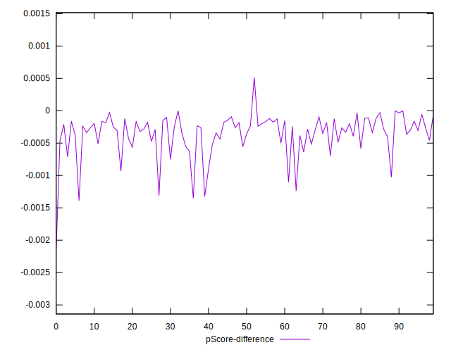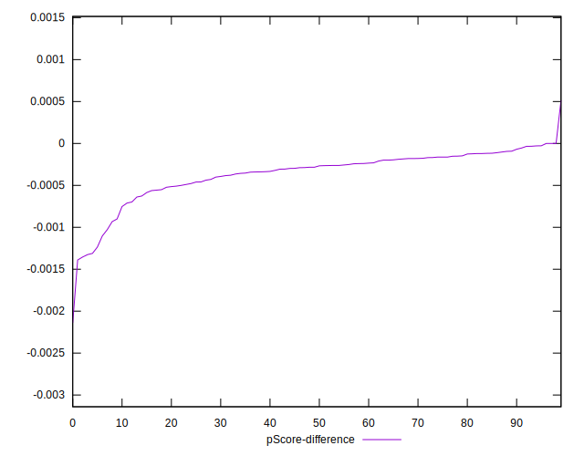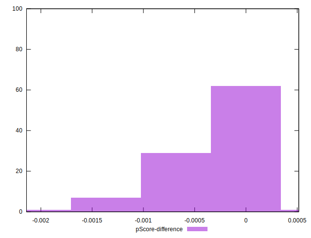