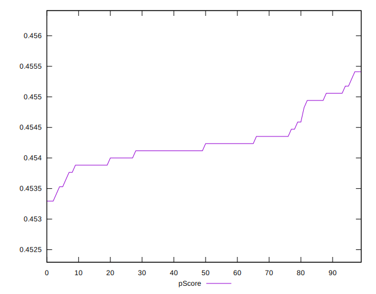

# //uses-rel-preload/samples/agenda

[→ Parent](../..)


## Raw


```yaml
p90min: 1130
p90max: 1146
p90range: 16
p90mean: 1138.723404255319
median: 1139.5
p90stdev: 3.428305999771167
mad: 1.5
stdevBySn: 2.3852
lfitCenter: 1138.9601485030116
lfitStdev: 2.4855610551484615
mfitCenter: 1138.9601485030116
mfitStdev: 3.115188812713034
mfitConfidence: 0.3115188812713034
p90skewness: -0.7876327536319504
p90eccentricity: 1.0000000000000018
p90discretization: 5.875
outlandishness: 0.9999237682690182

```


## Score


```yaml
p90min: 0.45
p90max: 0.46
p90range: 0.010000000000000009
p90mean: 0.450957446808511
median: 0.45
p90stdev: 0.0029424078055190067
mad: 0
stdevBySn: 0
lfitCenter: 0.45065026851638806
lfitStdev: 0.001523988888937865
mfitCenter: 0.45065026851638806
mfitStdev: 0.0019100368215395282
mfitConfidence: 0.00019100368215395282
p90skewness: 2.7477857990358836
p90eccentricity: 1.0000000000000027
p90discretization: 47
outlandishness: 1.0010760147032243

```


## Raw Estimate


## Score Estimate


## P Score


```yaml
p90min: 0.45341176470588235
p90max: 0.45529411764705885
p90range: 0.0018823529411765016
p90mean: 0.45426783479349186
median: 0.4541764705882353
p90stdev: 0.0004033301176201344
mad: 0.00017647058823527795
stdevBySn: 0.00028061176470587875
lfitCenter: 0.45423998252905745
lfitStdev: 0.00029241894766451887
mfitCenter: 0.45423998252905745
mfitStdev: 0.0003664928014956435
mfitConfidence: 0.00003664928014956435
p90skewness: 0.7876327536307269
p90eccentricity: 1.0000000000000004
p90discretization: 5.875
outlandishness: 1.0000224819425365

```


## Score Difference


```yaml
p90min: 0
p90max: 0
p90range: 0
p90mean: 0
median: 0
p90stdev: 0
mad: 0
stdevBySn: 0
lfitCenter: 0
lfitStdev: 0
mfitCenter: 0
mfitStdev: 0
mfitConfidence: 0
p90skewness: .nan
p90eccentricity: .nan
p90discretization: 94
outlandishness: .nan

```


## P Score Difference


```yaml
p90min: -0.004941176470588282
p90max: 0.004941176470588227
p90range: 0.009882352941176509
p90mean: 0.003269086357947419
median: 0.004117647058823504
p90stdev: 0.0026338495247412654
mad: 0.00023529411764705577
stdevBySn: 0.00028061176470587875
lfitCenter: 0.0035385208956806515
lfitStdev: 0.0013740794095772248
mfitCenter: 0.0035385208956806515
mfitStdev: 0.0017221531515501751
mfitConfidence: 0.0001722153151550175
p90skewness: -2.683565311986174
p90eccentricity: 0.9999999999999979
p90discretization: 5.222222222222222
outlandishness: 0.8835999999999988

```

