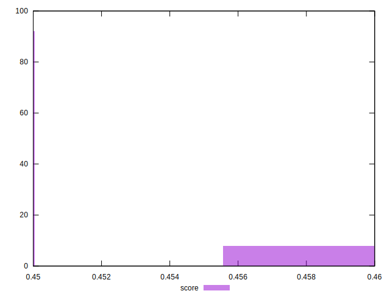
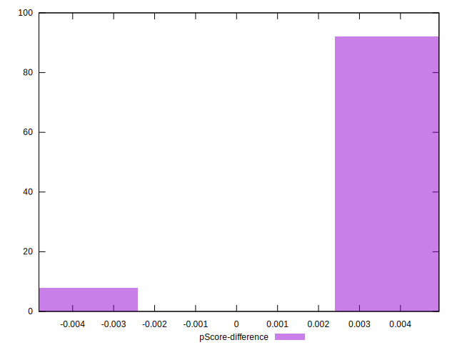

# //uses-rel-preload/samples/card

[→ Parent](../..)


## Raw


```yaml
p90min: 1130
p90max: 1148
p90range: 18
p90mean: 1140.468085106383
median: 1141
p90stdev: 3.5240877125183556
mad: 2
stdevBySn: 2.3852
lfitCenter: 1140.5397329161683
lfitStdev: 2.3773769515652616
mfitCenter: 1140.5397329161683
mfitStdev: 2.97960014612297
mfitConfidence: 0.29796001461229704
p90skewness: -0.8013967317027593
p90eccentricity: 0.9999999999999992
p90discretization: 5.529411764705882
outlandishness: 0.9998455341173229

```


## Score


```yaml
p90min: 0.45
p90max: 0.46
p90range: 0.010000000000000009
p90mean: 0.45053191489361727
median: 0.45
p90stdev: 0.002244151394652018
mad: 0
stdevBySn: 0
lfitCenter: 0.45040944997612226
lfitStdev: 0.0009843154448999469
mfitCenter: 0.45040944997612226
mfitStdev: 0.0012336564639124574
mfitConfidence: 0.00012336564639124574
p90skewness: 3.9819818903754403
p90eccentricity: 1.0000000000000044
p90discretization: 47
outlandishness: 1.0011904367188045

```


## Raw Estimate


## Score Estimate


## P Score


```yaml
p90min: 0.4531764705882353
p90max: 0.45529411764705885
p90range: 0.0021176470588235574
p90mean: 0.4540625782227785
median: 0.454
p90stdev: 0.00041459855441392435
mad: 0.00023529411764705577
stdevBySn: 0.00028061176470587875
lfitCenter: 0.45405414906868624
lfitStdev: 0.0002796914060665345
mfitCenter: 0.45405414906868624
mfitStdev: 0.0003505411936615674
mfitConfidence: 0.00003505411936615674
p90skewness: 0.8013967317037923
p90eccentricity: 1.0000000000000007
p90discretization: 5.529411764705882
outlandishness: 1.0000456460075968

```


## Score Difference


```yaml
p90min: 0
p90max: 0
p90range: 0
p90mean: 0
median: 0
p90stdev: 0
mad: 0
stdevBySn: 0
lfitCenter: 0
lfitStdev: 0
mfitCenter: 0
mfitStdev: 0
mfitConfidence: 0
p90skewness: .nan
p90eccentricity: .nan
p90discretization: 94
outlandishness: .nan

```


## P Score Difference


```yaml
p90min: -0.004705882352941171
p90max: 0.004470588235294115
p90range: 0.009176470588235286
p90mean: 0.0034831038798498032
median: 0.0040000000000000036
p90stdev: 0.0019551940565830177
mad: 0.00023529411764705577
stdevBySn: 0.00028061176470587875
lfitCenter: 0.0036088289756905107
lfitStdev: 0.0009172789817364724
mfitCenter: 0.0036088289756905107
mfitStdev: 0.0011496387168295028
mfitConfidence: 0.00011496387168295028
p90skewness: -3.815671383020222
p90eccentricity: 1.0000000000000004
p90discretization: 6.266666666666667
outlandishness: 0.8829651158818181

```

