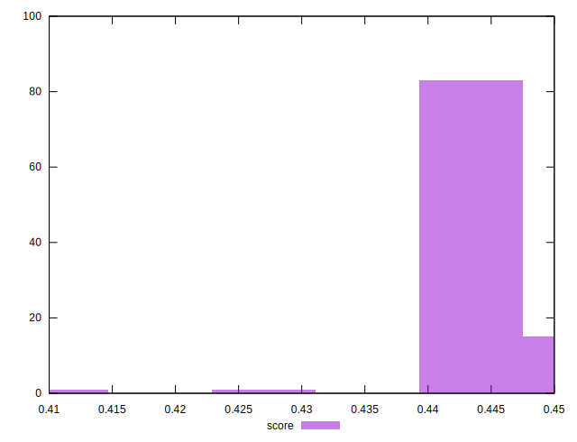

# //uses-rel-preload/samples/music

[→ Parent](../..)


## Raw


```yaml
p90min: 1208
p90max: 1242
p90range: 34
p90mean: 1226.8617021276596
median: 1228
p90stdev: 7.405577345903948
mad: 3
stdevBySn: 4.7704
lfitCenter: 1229.2237458510729
lfitStdev: 7.363609064260411
mfitCenter: 1229.2237458510729
mfitStdev: 9.228915351188661
mfitConfidence: 0.9228915351188661
p90skewness: -1.0153662938020793
p90eccentricity: 0.9999999999999987
p90discretization: 3.4814814814814814
outlandishness: 1.0063813598776865

```


## Score


```yaml
p90min: 0.44
p90max: 0.45
p90range: 0.010000000000000009
p90mean: 0.44127659574468087
median: 0.44
p90stdev: 0.003337103647097475
mad: 0
stdevBySn: 0
lfitCenter: 0.44066212663779564
lfitStdev: 0.0019884110382362924
mfitCenter: 0.44066212663779564
mfitStdev: 0.0024921036675233975
mfitConfidence: 0.00024921036675233974
p90skewness: 2.2315184957219225
p90eccentricity: 1.000000000000001
p90discretization: 47
outlandishness: 0.9991997744262664

```


## Raw Estimate


## Score Estimate


## P Score


```yaml
p90min: 0.4421176470588235
p90max: 0.4461176470588235
p90range: 0.0040000000000000036
p90mean: 0.44389862327909874
median: 0.44376470588235295
p90stdev: 0.0008712443936357562
mad: 0.0003529411764706114
stdevBySn: 0.0005612235294117575
lfitCenter: 0.4436207357822267
lfitStdev: 0.0008663069487365153
mfitCenter: 0.4436207357822267
mfitStdev: 0.0010857547471986616
mfitConfidence: 0.00010857547471986617
p90skewness: 1.0153662938023542
p90eccentricity: 1.0000000000000009
p90discretization: 3.4814814814814814
outlandishness: 0.997929429872736

```


## Score Difference


```yaml
p90min: 0
p90max: 0
p90range: 0
p90mean: 0
median: 0
p90stdev: 0
mad: 0
stdevBySn: 0
lfitCenter: 2.583267684513104e-19
lfitStdev: 6.445158398659724e-19
mfitCenter: 2.583267684513104e-19
mfitStdev: 8.077808146406197e-19
mfitConfidence: 8.077808146406197e-20
p90skewness: .nan
p90eccentricity: .nan
p90discretization: 94
outlandishness: .inf

```


## P Score Difference


```yaml
p90min: -0.004235294117647059
p90max: 0.004352941176470615
p90range: 0.008588235294117674
p90mean: 0.0024893617021276536
median: 0.003529411764705892
p90stdev: 0.0026182863019154983
mad: 0.0003529411764705559
stdevBySn: 0.0005612235294117575
lfitCenter: 0.002830797202437244
lfitStdev: 0.0016976973377663452
mfitCenter: 0.002830797202437244
mfitStdev: 0.002127748076446479
mfitConfidence: 0.0002127748076446479
p90skewness: -1.904592177027245
p90eccentricity: 0.9999999999999992
p90discretization: 3.6153846153846154
outlandishness: 0.8827117366733723

```

