# //uses-text-compression/samples/agenda

[→ Parent](../..)


## Raw


```yaml
p90min: 0
p90max: 0
p90range: 0
p90mean: 0
median: 0
p90stdev: 0
mad: 0
stdevBySn: 0
lfitCenter: 1.414662849732526
lfitStdev: 3.512590952279538
mfitCenter: 1.414662849732526
mfitStdev: 4.402379903528323
mfitConfidence: 0.4402379903528323
p90skewness: .nan
p90eccentricity: .nan
p90discretization: 94
outlandishness: .inf

```

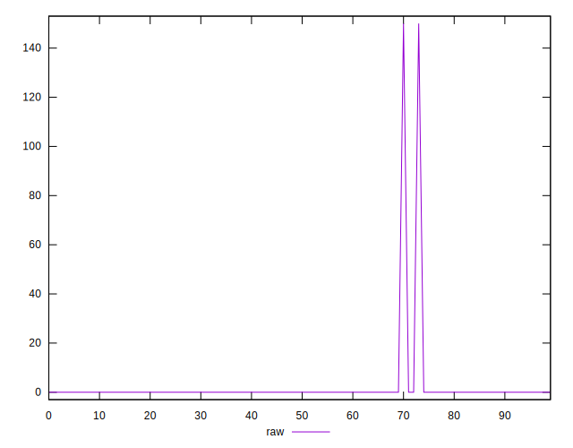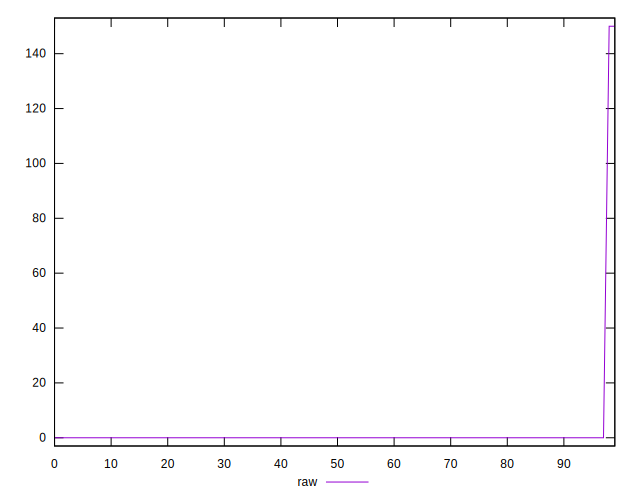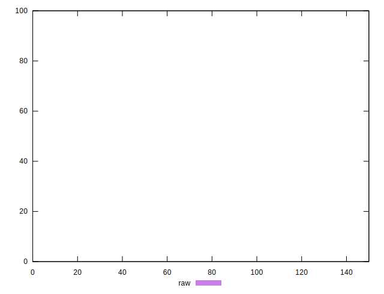
## Score


```yaml
p90min: 1
p90max: 1
p90range: 0
p90mean: 1
median: 1
p90stdev: 0
mad: 0
stdevBySn: 0
lfitCenter: 0.998868269720214
lfitStdev: 0.00281007276182357
mfitCenter: 0.998868269720214
mfitStdev: 0.0035219039228225825
mfitConfidence: 0.00035219039228225827
p90skewness: .nan
p90eccentricity: .nan
p90discretization: 94
outlandishness: 0.9952057599999998

```

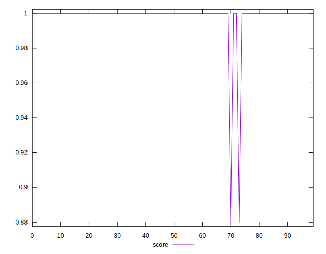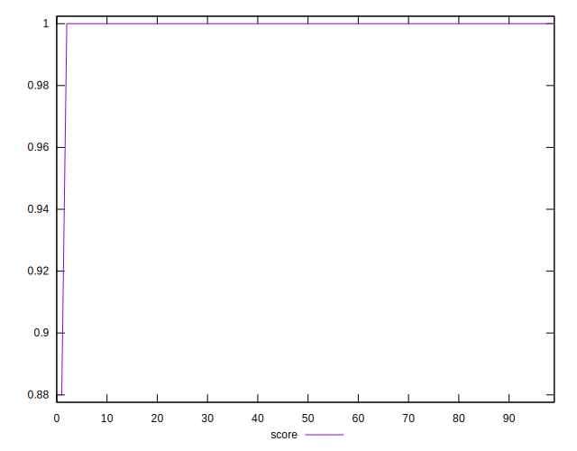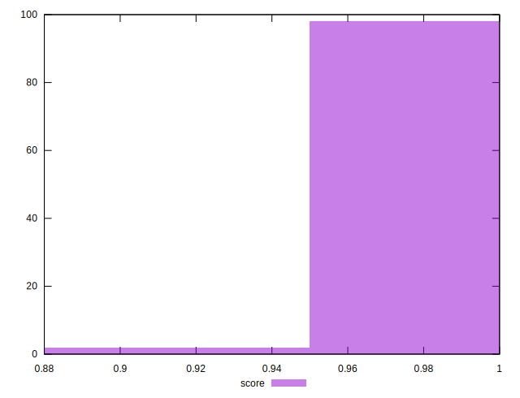
## Raw Estimate

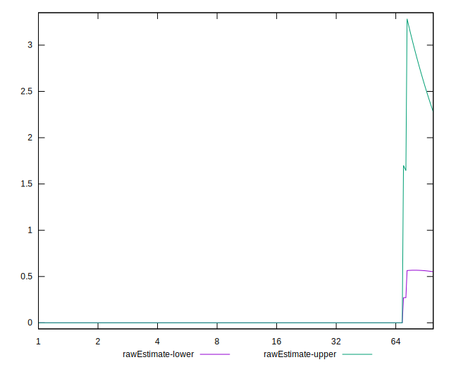
## Score Estimate

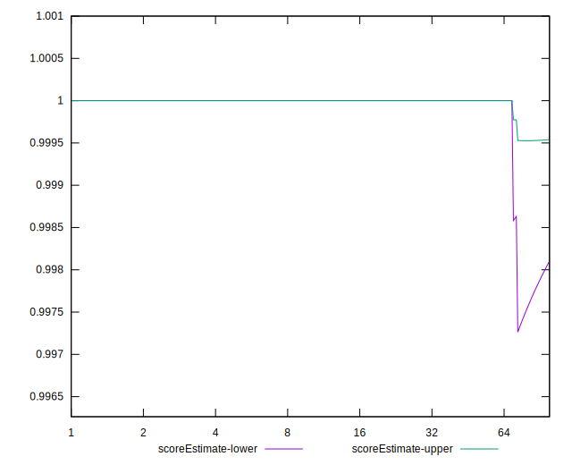
## P Score


```yaml
p90min: 1
p90max: 1
p90range: 0
p90mean: 1
median: 1
p90stdev: 0
mad: 0
stdevBySn: 0
lfitCenter: 0.9988211142918897
lfitStdev: 0.002927159126899459
mfitCenter: 0.9988211142918897
mfitStdev: 0.00366864991960674
mfitConfidence: 0.00036686499196067403
p90skewness: .nan
p90eccentricity: .nan
p90discretization: 94
outlandishness: 0.9950062500000001

```

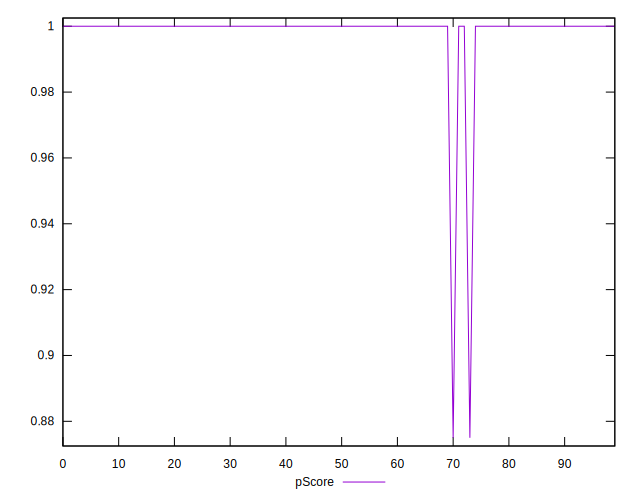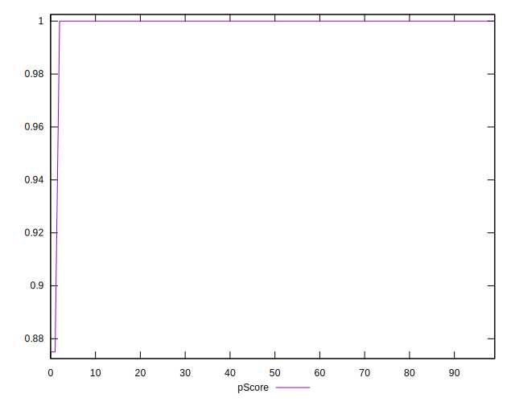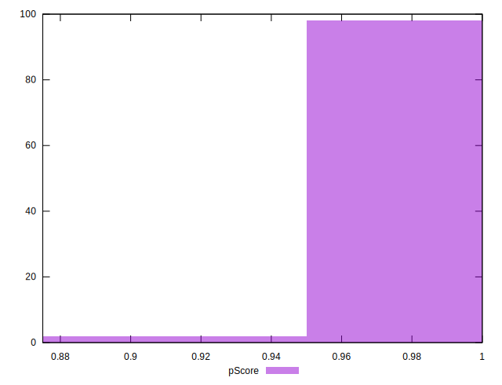
## Score Difference


```yaml
p90min: 0
p90max: 0
p90range: 0
p90mean: 0
median: 0
p90stdev: 0
mad: 0
stdevBySn: 0
lfitCenter: 0
lfitStdev: 0
mfitCenter: 0
mfitStdev: 0
mfitConfidence: 0
p90skewness: .nan
p90eccentricity: .nan
p90discretization: 94
outlandishness: .nan

```


## P Score Difference


```yaml
p90min: 0
p90max: 0
p90range: 0
p90mean: 0
median: 0
p90stdev: 0
mad: 0
stdevBySn: 0
lfitCenter: -0.00004715542832441758
lfitStdev: 0.00011708636507598477
mfitCenter: -0.00004715542832441758
mfitStdev: 0.00014674599678427761
mfitConfidence: 0.000014674599678427762
p90skewness: .nan
p90eccentricity: .nan
p90discretization: 94
outlandishness: .inf

```

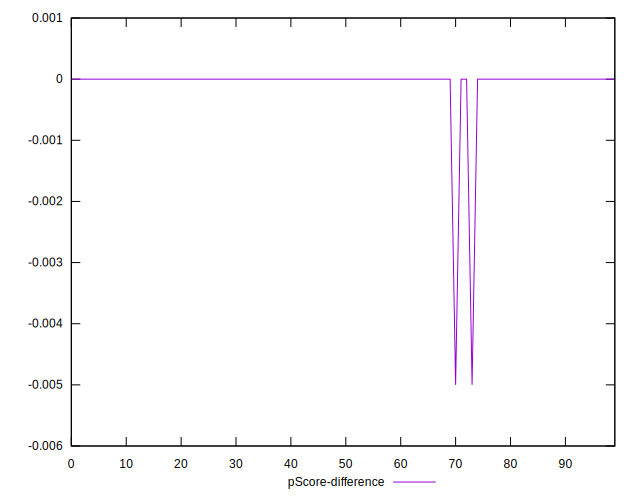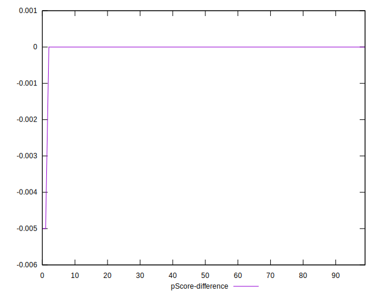