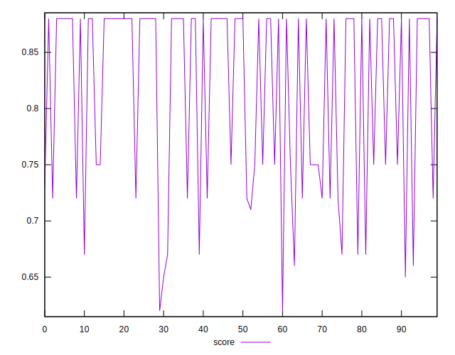

# //uses-text-compression/samples/card

[→ Parent](../..)


## Raw


```yaml
p90min: 150
p90max: 480
p90range: 330
p90mean: 228.93617021276594
median: 150
p90stdev: 109.14043349570588
mad: 0
stdevBySn: 0
lfitCenter: 213.5056847559723
lfitStdev: 109.63893357707572
mfitCenter: 213.5056847559723
mfitStdev: 137.41202559061392
mfitConfidence: 13.741202559061392
p90skewness: 0.9091498050232684
p90eccentricity: 1.0000000000000004
p90discretization: 9.4
outlandishness: 1.055469791738644

```


## Score


```yaml
p90min: 0.65
p90max: 0.88
p90range: 0.22999999999999998
p90mean: 0.8193617021276594
median: 0.88
p90stdev: 0.08130332633846238
mad: 0
stdevBySn: 0
lfitCenter: 0.83057941234469
lfitStdev: 0.08532181879624576
mfitCenter: 0.83057941234469
mfitStdev: 0.10693504182640877
mfitConfidence: 0.010693504182640878
p90skewness: -0.7312159743092945
p90eccentricity: 0.9999999999999984
p90discretization: 11.75
outlandishness: 0.9905960898641899

```


## Raw Estimate


## Score Estimate


## P Score


```yaml
p90min: 0.65
p90max: 0.875
p90range: 0.22499999999999998
p90mean: 0.8156323877068559
median: 0.875
p90stdev: 0.0798493377513
mad: 0
stdevBySn: 0
lfitCenter: 0.8267503571717335
lfitStdev: 0.0833002495051197
mfitCenter: 0.8267503571717335
mfitStdev: 0.10440138045172813
mfitConfidence: 0.010440138045172813
p90skewness: -0.7486396644807409
p90eccentricity: 0.9999999999999994
p90discretization: 9.4
outlandishness: 0.9907060906147503

```


## Score Difference


```yaml
p90min: 0
p90max: 0
p90range: 0
p90mean: 0
median: 0
p90stdev: 0
mad: 0
stdevBySn: 0
lfitCenter: 0
lfitStdev: 0
mfitCenter: 0
mfitStdev: 0
mfitConfidence: 0
p90skewness: .nan
p90eccentricity: .nan
p90discretization: 94
outlandishness: .nan

```


## P Score Difference


```yaml
p90min: -0.0050000000000000044
p90max: 0.0011111111111110628
p90range: 0.006111111111111067
p90mean: -0.00380023640661939
median: -0.0050000000000000044
p90stdev: 0.001880148026858088
mad: 0
stdevBySn: 0
lfitCenter: -0.00407411901496065
lfitStdev: 0.001610762320923726
mfitCenter: -0.00407411901496065
mfitStdev: 0.002018791190700226
mfitConfidence: 0.00020187911907002258
p90skewness: 1.3528723591293785
p90eccentricity: 0.9999999999999978
p90discretization: 13.428571428571429
outlandishness: 0.930939874083623

```

