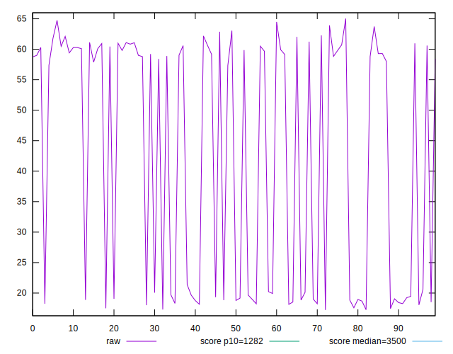
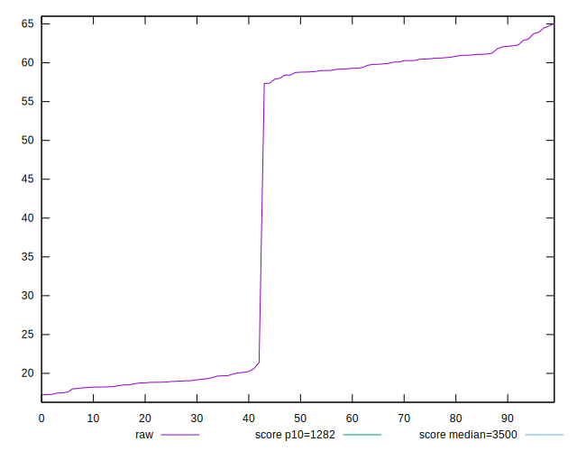
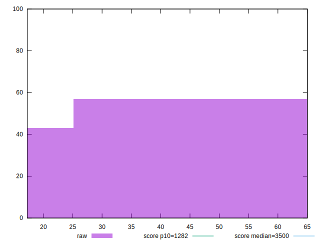
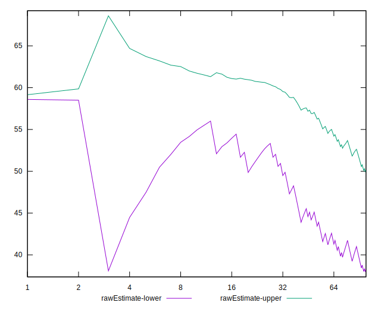
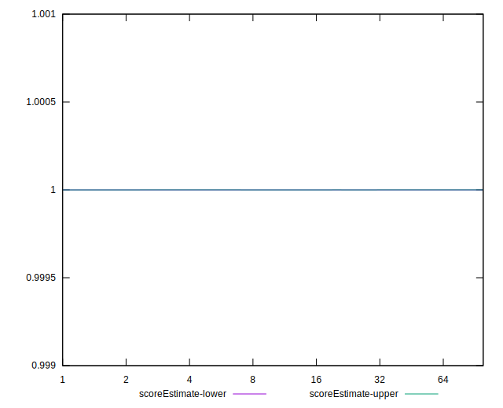
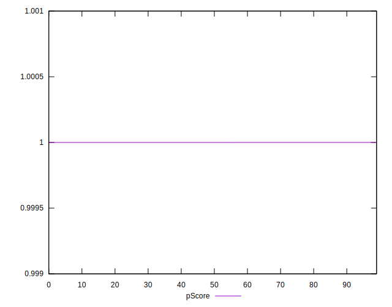
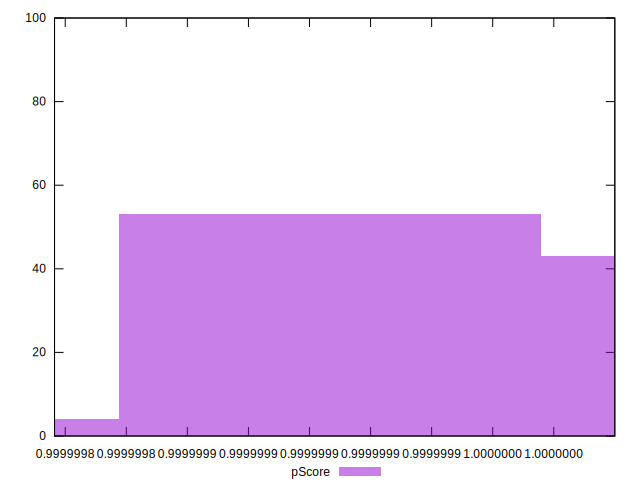
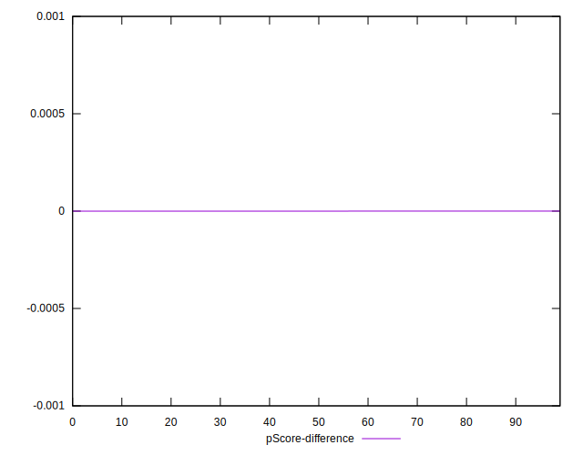
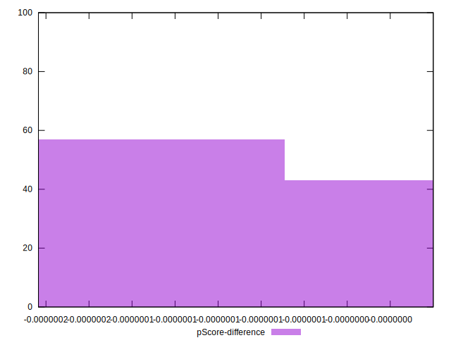

# //bootup-time/samples/agenda

[→ Parent](../..)


## Raw


```yaml
p90min: 17.451999999999998
p90max: 63.91999999999997
p90range: 46.467999999999975
p90mean: 42.63370212765955
median: 58.76999999999998
p90stdev: 20.443067217836315
mad: 3.805999999999994
stdevBySn: 5.763835799999986
lfitCenter: 44.21717626840607
lfitStdev: 24.09491769122483
mfitCenter: 44.21717626840607
mfitStdev: 30.198501010252446
mfitConfidence: 3.0198501010252445
p90skewness: -0.2941312171079561
p90eccentricity: 1.0000000000000002
p90discretization: 1.0217391304347827
outlandishness: 0.9954406449655697

```


## Score


```yaml
p90min: 1
p90max: 1
p90range: 0
p90mean: 1
median: 1
p90stdev: 0
mad: 0
stdevBySn: 0
lfitCenter: 1
lfitStdev: 0
mfitCenter: 1
mfitStdev: 0
mfitConfidence: 0
p90skewness: .nan
p90eccentricity: .nan
p90discretization: 94
outlandishness: 1

```


## Raw Estimate


## Score Estimate


## P Score


```yaml
p90min: 0.9999998366872669
p90max: 0.9999999999932601
p90range: 1.6330599317271322e-7
p90mean: 0.9999999368677317
median: 0.9999999078710227
p90stdev: 5.6217593316378466e-8
mad: 4.937127384696538e-8
stdevBySn: 7.275207232112502e-8
lfitCenter: 0.9999999351387462
lfitStdev: 6.225578929394218e-8
mfitCenter: 0.9999999351387462
mfitStdev: 7.802606093034583e-8
mfitConfidence: 7.802606093034582e-9
p90skewness: 0.08870266989736325
p90eccentricity: 0.9999999999999997
p90discretization: 1.032967032967033
outlandishness: 0.9999999968732616

```


## Score Difference


```yaml
p90min: 0
p90max: 0
p90range: 0
p90mean: 0
median: 0
p90stdev: 0
mad: 0
stdevBySn: 0
lfitCenter: 0
lfitStdev: 0
mfitCenter: 0
mfitStdev: 0
mfitConfidence: 0
p90skewness: .nan
p90eccentricity: .nan
p90discretization: 94
outlandishness: .nan

```


## P Score Difference


```yaml
p90min: -1.633127331146511e-7
p90max: -6.7399419378944e-12
p90range: 1.6330599317271322e-7
p90mean: -6.313226845909777e-8
median: -9.212897733590353e-8
p90stdev: 5.621759331637845e-8
mad: 4.937127384696538e-8
stdevBySn: 7.275207232112502e-8
lfitCenter: -6.486125395496115e-8
lfitStdev: 6.225578925211687e-8
mfitCenter: -6.486125395496115e-8
mfitStdev: 7.802606087792558e-8
mfitConfidence: 7.802606087792558e-9
p90skewness: 0.08870267235544324
p90eccentricity: 1.0000000000000002
p90discretization: 1.032967032967033
outlandishness: 1.050140010799053

```

